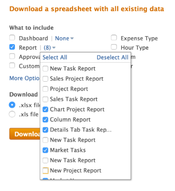
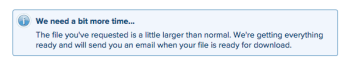

# Export data from Adobe Workfront via Kick-Starts

<!-- Audited: 2/2024 -->

<!--

***DON'T DELETE, DRAFT OR HIDE THIS ARTICLE. IT IS LINKED TO THE PRODUCT, THROUGH THE CONTEXT SENSITIVE HELP LINKS. **

-->

As an Adobe Workfront administrator, you can use the Kick-Starts data exporter to export data from Workfront. You can use it in other applications after you export it.

Exporting data through Kick-Starts is also helpful in understanding what fields are associated with each object, how these fields are coded, as well as how the values of these fields are formatted in the database.

## Access requirements

+++ Expand to view access requirements for the functionality in this article.

You must have the following access to perform the steps in this article: 

<table style="table-layout:auto"> 
 <col> 
 <col> 
 <tbody> 
  <tr> 
   <td role="rowheader">Adobe Workfront plan</td> 
   <td>Any</td> 
  </tr> 
  <tr> 
   <td role="rowheader">Adobe Workfront license</td> 
   <td>
   
New: Standard

   Or
   
Current: Plan

   </td> 
  </tr> 
  <tr> 
   <td role="rowheader">Access level configurations</td> 
   <td> 
You must be a Workfront administrator.
</td> 
  </tr> 
 </tbody> 
</table>

For more detail about the information in this table, see [Access requirements in Workfront documentation](/help/quicksilver/administration-and-setup/add-users/access-levels-and-object-permissions/access-level-requirements-in-documentation.md).

+++

## Advantages and disadvantages of using kick-starts to export data

There are two ways to export data within Workfront:

* Exporting data from a report or a list

  For more information about exporting data from a report or a list, see [Export data](../../../reports-and-dashboards/reports/creating-and-managing-reports/export-data.md).

* Exporting data via kick-starts

The following table shows the advantages and disadvantages of each method: 

<table style="table-layout:auto"> 
 <col> 
 <col> 
 <col> 
 <thead> 
  <tr> 
   <th>&nbsp; </th> 
   <th> 
Exported Data Includes Object and Field Values
 </th> 
   <th> 
Ability to Export Data around Multiple Object Types Simultaneously
 </th> 
  </tr> 
 </thead> 
 <tbody> 
  <tr> 
   <td> 
<strong>Exporting Data from a List View</strong> 
 
For more information about exporting data from a list, see <a href="../../../reports-and-dashboards/reports/creating-and-managing-reports/export-data.md" class="MCXref xref">Export data</a>
 </td> 
   <td> 
Yes
 
Both Workfront native fields and custom fields associated with the objects are exported.
 </td> 
   <td> 
No
 </td> 
  </tr> 
  <tr> 
   <td> 
<strong>Exporting Data via Kick-Starts</strong> 
 </td> 
   <td> 
Yes (limited)
 
Most Workfront native fields associated with objects are exported, but some are not. For example, you cannot export the Schedule, Project Owner, or Project Sponsor fields through a project kick-start export.
 
In a project that has a custom form attached, any data entered in the fields on the form is not exported.
 
But you can export a custom form. The resulting file lists the fields configured in the form, such as text boxes and radio buttons.
 </td> 
   <td> 
Yes
 
Using Kick-Starts to export Workfront data enables you to export data related to multiple object types in a single export. For example, you can include tasks, issues, and projects in a single export.
 </td> 
  </tr> 
 </tbody> 
</table>

## Export limits

The following limitations exist when exporting data via kick-starts (data is exported in an Excel file format): 

* **50,000 rows:** The number of rows allowed in the file.
* **65,530 hyperlinks:** This is a limit imposed by Excel on documents that contain more than 65,530 hyperlinks. These documents cannot be opened after they are exported. Note that an Excel document may have just 200 rows of data, but if there are more than 65,530 links inside the document, the document does not open.

## Export data via kick-starts

{{step-1-to-setup}}

1. Click **System** > **Kick-Starts,** then click **Export Data.**

1. Select the object you want to export. By default, the following objects are displayed under **What to include**:

   <table style="table-layout:auto"> 
    <col> 
    <col> 
    <col> 
    <thead> 
     <tr> 
      <th> 
<strong>Object</strong> 
 </th> 
      <th> 
<strong>Exported Sheets of the Excel File</strong> 
 </th> 
      <th> 
 <strong>Export Format</strong>
 </th> 
     </tr> 
    </thead> 
    <tbody> 
     <tr> 
      <td scope="col" valign="top"> 
Dashboard
 
&nbsp;
 
&nbsp;
 </td> 
      <td scope="col" valign="top"> 
Parameter Parameter Option Parameter Group Category Parameter Category Report Portal Tab Section Dashboard Preferences
 </td> 
      <td scope="col" valign="top">&nbsp;ZIP</td> 
     </tr> 
     <tr> 
      <td scope="col" valign="top"> 
Report
 
&nbsp;
 
&nbsp;
 </td> 
      <td scope="col" valign="top">Parameter Parameter Option Parameter Group Category Parameter Category Report Preferences</td> 
      <td scope="col" valign="top">&nbsp;ZIP </td> 
     </tr> 
     <tr> 
      <td scope="col" valign="top"> 
Approval
 </td> 
      <td scope="col" valign="top"> 
Step Approver Approval Step Approval Approval Process Preferences
 </td> 
      <td scope="col" valign="top"> 
&nbsp;Excel
 </td> 
     </tr> 
     <tr> 
      <td scope="col" valign="top"> 
Custom Data
 </td> 
      <td scope="col" valign="top"> 
Parameter Parameter Option Parameter Group Category Parameter Category Preferences
 </td> 
      <td scope="col" valign="top"> 
&nbsp;Excel
 </td> 
     </tr> 
     <tr> 
      <td scope="col" valign="top"> 
Expense Type
 </td> 
      <td valign="top"> 
Expense Type Preferences
 </td> 
      <td scope="col" valign="top"> 
Excel
 </td> 
     </tr> 
     <tr> 
      <td valign="top"> 
Hour Type
 </td> 
      <td valign="top"> 
Hour Type Preferences
 </td> 
      <td scope="col" valign="top"> 
Excel
 </td> 
     </tr> 
     <tr> 
      <td valign="top"> 
Team
 </td> 
      <td valign="top"> Team Member Team Preferences </td> 
      <td scope="col" valign="top"> 
&nbsp;Excel
 </td> 
     </tr> 
     <tr> 
      <td valign="top"> 
User
 </td> 
      <td valign="top"> 
User Preferences
 </td> 
      <td valign="top"> 
&nbsp;Excel
 </td> 
     </tr> 
    </tbody> 
   </table>

1. Click **More Options** to see the full list of objects.

   All of the objects listed here can be used to also import data into Workfront.

   The only exception is the **Access Levels** object. The Access Levels data sheet that is included in an export is provided for reference purposes only. It allows you to assign an access level to a new user account by ID.

   For more information about importing data into Workfront via kick-starts, see [Import data into Adobe Workfront using a Kick-Start template](../../../administration-and-setup/manage-workfront/using-kick-starts/import-data-via-kickstarts.md). The following is a list of all objects that can be exported through kick-starts:

   <table style="table-layout:auto"> 
    <col> 
    <col> 
    <col> 
    <thead> 
     <tr> 
      <th> 
Object
 </th> 
      <th> 
Exported Sheets of the Excel File
 </th> 
      <th> 
Export Format
 </th> 
     </tr> 
    </thead> 
    <tbody> 
     <tr> 
      <td scope="col" valign="top">Access Level</td> 
      <td scope="col" valign="top">Access Level Preferences</td> 
      <td scope="col" valign="top">Excel</td> 
     </tr> 
     <tr> 
      <td scope="col" valign="top">Assignment</td> 
      <td scope="col" valign="top">Assignment Preferences</td> 
      <td scope="col" valign="top">Excel</td> 
     </tr> 
     <tr> 
      <td scope="col" valign="top">Company</td> 
      <td scope="col" valign="top"> Company Preferences </td> 
      <td scope="col" valign="top">Excel</td> 
     </tr> 
     <tr> 
      <td scope="col" valign="top">Email Template</td> 
      <td scope="col" valign="top"> Email Template Preferences </td> 
      <td scope="col" valign="top">Excel</td> 
     </tr> 
     <tr> 
      <td scope="col" valign="top">Expense</td> 
      <td valign="top"> Expense Preferences </td> 
      <td scope="col" valign="top">&nbsp;Excel</td> 
     </tr> 
     <tr> 
      <td valign="top">External Page</td> 
      <td valign="top"> External Page Preferences </td> 
      <td scope="col" valign="top">Excel</td> 
     </tr> 
     <tr> 
      <td valign="top">Filter</td> 
      <td valign="top"> Filter Preferences </td> 
      <td valign="top">ZIP </td> 
     </tr> 
     <tr> 
      <td valign="top">Group</td> 
      <td valign="top"> Group Preferences  </td> 
      <td valign="top">Excel</td> 
     </tr> 
     <tr> 
      <td valign="top">Grouping</td> 
      <td valign="top"> Grouping Preferences </td> 
      <td valign="top">ZIP</td> 
     </tr> 
     <tr> 
      <td valign="top">Hour</td> 
      <td valign="top"> Hour Preferences </td> 
      <td valign="top">Excel</td> 
     </tr> 
     <tr> 
      <td valign="top">Issue</td> 
      <td valign="top"> Issue Preferences </td> 
      <td valign="top">Excel</td> 
     </tr> 
     <tr> 
      <td valign="top">Job Role</td> 
      <td valign="top"> Job role Preferences </td> 
      <td valign="top">Excel</td> 
     </tr> 
     <tr> 
      <td valign="top">Milestone Path</td> 
      <td valign="top"> Milestone Milestone Path Preferences </td> 
      <td valign="top">Excel </td> 
     </tr> 
     <tr> 
      <td valign="top">Note</td> 
      <td valign="top"> Note Preferences </td> 
      <td valign="top">Excel</td> 
     </tr> 
     <tr> 
      <td valign="top">Portfolio</td> 
      <td valign="top"> Portfolio Preferences&nbsp; </td> 
      <td valign="top">Excel</td> 
     </tr> 
     <tr> 
      <td valign="top">Project</td> 
      <td valign="top"> Queue Project Routing Rule Queue Topic Preferences </td> 
      <td valign="top">Excel</td> 
     </tr> 
     <tr> 
      <td valign="top">Resource Estimate</td> 
      <td valign="top"> Resource Estimate Preferences </td> 
      <td valign="top">Excel</td> 
     </tr> 
     <tr> 
      <td valign="top">Resource Pool</td> 
      <td valign="top"> Resource Pool Preferences </td> 
      <td valign="top">Excel</td> 
     </tr> 
     <tr> 
      <td valign="top">Risk</td> 
      <td valign="top"> Risk Preferences  </td> 
      <td valign="top">Excel</td> 
     </tr> 
     <tr> 
      <td valign="top">Risk Type</td> 
      <td valign="top"> Risk Type Preferences  </td> 
      <td valign="top">Excel </td> 
     </tr> 
     <tr> 
      <td valign="top">Scorecard</td> 
      <td valign="top">Scorecard Questions Scorecard Option Scorecard Preferences </td> 
      <td valign="top">Excel </td> 
     </tr> 
     <tr> 
      <td valign="top">Task</td> 
      <td valign="top"> Task Preferences </td> 
      <td valign="top">Excel </td> 
     </tr> 
     <tr> 
      <td valign="top">Template</td> 
      <td valign="top"> Queue Template Routing Rule Queue Topic Preferences </td> 
      <td valign="top">Excel  </td> 
     </tr> 
     <tr> 
      <td valign="top">Template Assignment</td> 
      <td valign="top"> Template Assignment Preferences </td> 
      <td valign="top">Excel </td> 
     </tr> 
     <tr> 
      <td valign="top">Template Task</td> 
      <td valign="top"> Template Task Preferences </td> 
      <td valign="top">Excel </td> 
     </tr> 
     <tr> 
      <td valign="top">Timesheet</td> 
      <td valign="top"> Timesheet Profile Timesheet Preferences </td> 
      <td valign="top">Excel  </td> 
     </tr> 
     <tr> 
      <td valign="top"> View </td> 
      <td valign="top"> View Preferences  </td> 
      <td valign="top">ZIP</td> 
     </tr> 
    </tbody> 
   </table>

1. Click **Download.**

   The exported kick-start file is downloaded to your computer either as an Excel file, or a . zip file containing multiple Excel and properties files. Each Excel file is a collection of sheets, where each sheet represents a field associated with the object you selected. There is a **Properties** sheet associated with every export.

   The **Dashboard** and **Report** options allow you to select specific dashboards and reports to include in the download. You can export only Dashboards, which are shared system-wide.

   You cannot export matrix reports. For more information about matrix reports, see [Create a matrix report](../../../reports-and-dashboards/reports/creating-and-managing-reports/create-matrix-report.md).

   Kick-Starts does not support Text Mode filters. For successful exporting, the reporting filters must be switched to Standard Mode.

   You can select up to 100 Dashboards and 100 Reports in a single export.

   

   You can export multiple objects at one time.

1. (Recommended) Analyze the exported data to ensure that all the information you expect to see was exported. 

   For large exports, Workfront works in the background to produce the Excel file and gives you a warning message about the delay. The kick-start file is emailed to you, when the download finishes.

   
