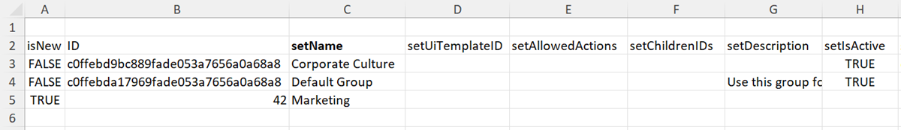
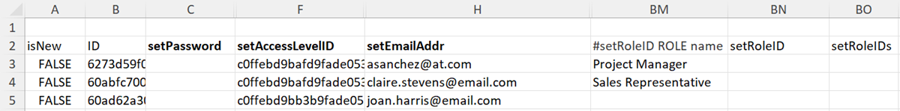

# Import data into Adobe Workfront using a Kick-Start template

Kick-Starts are specially formatted Excel workbooks that you can populate with data you want to import into Workfront. Adobe Workfront provides a Kick-Start template you can use to do this, as explained in [Kick-Starts data importer](../../../administration-and-setup/manage-workfront/using-kick-starts/kick-starts-data-importer.md).

This process is broken up into 3 main tasks:

* First, you export a Kick-Start template as a spreadsheet file
* Second, you populate the spreadsheet with your data
* Finally, you import the populated spreadsheet into Workfront

Each of these procedures is outlined in the proper order in this article.

## Access requirements

You must have the following access to perform the steps in this article: 

<table style="table-layout:auto"> 
 <col> 
 <col> 
 <tbody> 
  <tr> 
   <td role="rowheader">Adobe Workfront plan</td> 
   <td>Any</td> 
  </tr> 
  <tr> 
   <td role="rowheader">Adobe Workfront license</td> 
   <td>Plan</td> 
  </tr> 
  <tr> 
   <td role="rowheader">Access level configurations</td> 
   <td> 
You must be a Workfront administrator.
 
<b>NOTE</b>: If you still don't have access, ask your Workfront administrator if they set additional restrictions in your access level. For information on how a Workfront administrator can modify your access level, see <a href="../../../administration-and-setup/add-users/configure-and-grant-access/create-modify-access-levels.md" class="MCXref xref">Create or modify custom access levels</a>.
 </td> 
  </tr> 
 </tbody> 
</table>

## Limitations

You can import large numbers of objects into Workfront using a Kick-Start template. However, consider the following limitations:

* Importing data this way doesn't update information on records that already exist in Workfront
* You can import only new records and their information
* Import no more than 2,000 records at a time to ensure that the import does not time out

## Export a Kick-Start template as a spreadsheet file

When you export a Kick-Start template you receive a blank Excel spreadsheet workbook. In subsequent procedures in this article, you will populate the workbook with your information and then import it back into Workfront.

To export a Kick-Start template:

1. Click the **Main Menu** icon  in the upper-right corner of Adobe Workfront, then click **Setup** .  

1. Click **System** > **Export Data (Kick-Starts)**.

1. Click **More Options**, then select the types of information that you want to include.

   Each option that you select represents a collection of multiple tabs in the exported spreadsheet. For example, if you select the Report option, all the necessary objects for creating a report will be included in the spreadsheet (views, filters, groupings, reports).

   You can use all of the object types listed below to import data into Workfront. (The only exception is the Access Levels option. The Access Levels data sheet in an export is provided for reference purposes—it allows you to assign an access level to a new user account by ID.)

   The template for each of the object types can be exported in the following file formats and contains the following sheets:

   <table style="table-layout:auto"> 
    <col> 
    <col> 
    <col> 
    <thead> 
     <tr> 
      <th> 
<strong>Object</strong> 
 </th> 
      <th> 
<strong>Exports as</strong> 
 </th> 
      <th> 
<strong>Sheets in the exported spreadsheet</strong> 
 </th> 
     </tr> 
    </thead> 
    <tbody> 
     <tr> 
      <td scope="col"> 
Dashboard
 
All dashboards in the system are available to export. You can select up to 100 specific dashboards in a single export.
 </td> 
      <td scope="col">Exports as ZIP file</td> 
      <td scope="col"> 
Parameter
 
Parameter Option
 
Parameter Group
 
Category Parameter
 
Category
 
Report
 
Portal Tab Section
 
Dashboard
 
Preferences
 </td> 
     </tr> 
     <tr> 
      <td scope="col"> 
Report
 
All reports in the system are available to export. You can select up to 100 specific reports in a single export.
 </td> 
      <td scope="col">Exports as ZIP file </td> 
      <td scope="col"> 
Parameter
 
Parameter Option
 
Parameter Group
 
Category Parameter
 
Category
 
Report
 
Preferences
 </td> 
     </tr> 
     <tr> 
      <td scope="col"> 
Approval
 </td> 
      <td scope="col"> 
Exports as Excel file
 </td> 
      <td scope="col"> 
Step Approver
 
Approval Step
 
Approval
 
Approval Process
 
Preferences
 </td> 
     </tr> 
     <tr> 
      <td scope="col"> 
Custom Data
 </td> 
      <td scope="col"> 
Exports as Excel file
 </td> 
      <td scope="col"> 
Parameter
 
Parameter Option
 
Parameter Group
 
Category Parameter
 
Category
 
Preferences
 </td> 
     </tr> 
     <tr> 
      <td scope="col"> 
Expense Type
 </td> 
      <td scope="col"> 
Exports as Excel file
 </td> 
      <td> 
Expense Type
 
Preferences
 </td> 
     </tr> 
     <tr> 
      <td> 
Hour Type
 </td> 
      <td scope="col"> 
Exports as Excel file
 </td> 
      <td> 
Hour Type
 
Preferences
 </td> 
     </tr> 
     <tr> 
      <td> 
Team
 </td> 
      <td scope="col"> 
Exports as Excel file
 </td> 
      <td> 
 Team Member
 
Team
 
Preferences 
 </td> 
     </tr> 
     <tr> 
      <td> 
User
 </td> 
      <td> 
Exports as Excel file. To see the full list of options, click <strong>More Options</strong>.
 </td> 
      <td> 
User
 
Preferences
 </td> 
     </tr> 
     <tr> 
      <td>Access Level</td> 
      <td>Exports as Excel file</td> 
      <td> 
Access Level
 
Preferences
 </td> 
     </tr> 
     <tr> 
      <td>Assignment</td> 
      <td>Exports as Excel file</td> 
      <td> 
Assignment
 
Preferences
 </td> 
     </tr> 
     <tr> 
      <td>Company</td> 
      <td>Exports as Excel file</td> 
      <td> 
 Company
 
Preferences 
 </td> 
     </tr> 
     <tr> 
      <td>Email Template</td> 
      <td>Exports as Excel file</td> 
      <td> 
Email Template
 
Preferences 
 </td> 
     </tr> 
     <tr> 
      <td>Expense</td> 
      <td>Exports as Excel file</td> 
      <td> 
 Expense'
 
Preferences 
 </td> 
     </tr> 
     <tr> 
      <td>External Page</td> 
      <td>Exports as Excel file</td> 
      <td> 
 External Page
 
Preferences 
 </td> 
     </tr> 
     <tr> 
      <td>Filter</td> 
      <td>Exports as a ZIP file</td> 
      <td> 
 Filter
 
Preferences 
 </td> 
     </tr> 
     <tr> 
      <td>Group</td> 
      <td>Exports as Excel file</td> 
      <td> 
 Group
 
Preferences 
 </td> 
     </tr> 
     <tr> 
      <td>Grouping</td> 
      <td>Exports as a ZIP file</td> 
      <td> 
 Grouping
 
Preferences 
 </td> 
     </tr> 
     <tr> 
      <td>Hour</td> 
      <td>Exports as Excel file</td> 
      <td> 
 Hour
 
Preferences 
 </td> 
     </tr> 
     <tr> 
      <td>Issue</td> 
      <td>Exports as Excel file</td> 
      <td> 
 Issue
 
Preferences 
 </td> 
     </tr> 
     <tr> 
      <td>Job Role</td> 
      <td>Exports as Excel file</td> 
      <td> 
 Job role
 
Preferences 
 </td> 
     </tr> 
     <tr> 
      <td>Milestone Path</td> 
      <td> Exports as Excel file</td> 
      <td> 
 Milestone
 
Milestone Path
 
Preferences 
 </td> 
     </tr> 
     <tr> 
      <td>Note</td> 
      <td>Exports as Excel file</td> 
      <td> 
 Note
 
Preferences 
 </td> 
     </tr> 
     <tr> 
      <td>Portfolio</td> 
      <td>Exports as Excel file</td> 
      <td> 
 Portfolio
 
Preferences 
 </td> 
     </tr> 
     <tr> 
      <td>Project</td> 
      <td>Exports as Excel file</td> 
      <td> 
 Queue
 
Project
 
Routing Rule
 
Queue Topic
 
Preferences 
 </td> 
     </tr> 
     <tr> 
      <td>Resource Estimate</td> 
      <td>Exports as Excel file</td> 
      <td> 
 Resource Estimate
 
Preferences 
 </td> 
     </tr> 
     <tr> 
      <td>Resource Pool</td> 
      <td>Exports as Excel file</td> 
      <td> 
 Resource Pool
 
Preferences 
 </td> 
     </tr> 
     <tr> 
      <td>Risk</td> 
      <td>Exports as Excel file</td> 
      <td> 
 Risk
 
Preferences 
 </td> 
     </tr> 
     <tr> 
      <td>Risk Type</td> 
      <td> Exports as Excel file</td> 
      <td> 
 Risk Type
 
Preferences
 </td> 
     </tr> 
     <tr> 
      <td>Scorecard</td> 
      <td>Exports as Excel file</td> 
      <td> 
Scorecard Questions
 
Scorecard Option
 
Scorecard
 
Preferences 
 </td> 
     </tr> 
     <tr> 
      <td>Task</td> 
      <td>Exports as Excel file</td> 
      <td> 
 Task
 
Preferences 
 </td> 
     </tr> 
     <tr> 
      <td>Template</td> 
      <td> Exports as Excel file</td> 
      <td> 
 Queue
 
Template
 
Routing Rule
 
Queue Topic
 
Preferences 
 </td> 
     </tr> 
     <tr> 
      <td>Template Assignment</td> 
      <td>Exports as Excel file</td> 
      <td> 
 Template Assignment
 
Preferences 
 </td> 
     </tr> 
     <tr> 
      <td>Template Task</td> 
      <td>Exports as Excel file</td> 
      <td> 
 Template Task
 
Preferences 
 </td> 
     </tr> 
     <tr> 
      <td>Timesheet</td> 
      <td> Exports as Excel file</td> 
      <td> 
 Timesheet Profile
 
Timesheet
 
Preferences 
 </td> 
     </tr> 
     <tr> 
      <td>View </td> 
      <td> 
Exports as ZIP file
 </td> 
      <td> 
 View
 
Preferences 
 </td> 
     </tr> 
    </tbody> 
   </table>

1. Click **Download**.
1. Continue with [Populate the spreadsheet template with your data](#populate-the-spreadsheet-template-with-your-data) to populate the template with your information.

## Populate the spreadsheet template with your data {#populate-the-spreadsheet-template-with-your-data}

* [About the tabs (data sheets) included in the spreadsheet](#about-the-tabs-data-sheets-included-in-the-spreadsheet) 
* [Import a record](#import-a-record) 
* [Include dates](#include-dates) 
* [Use wildcards](#use-wildcards) 
* [Attribute name substitution for IDs](#attribute-name-substitution-for-ids)

### About the tabs (data sheets) included in the spreadsheet {#about-the-tabs-data-sheets-included-in-the-spreadsheet}

>[!TIP]
>
>To better understand how you will need to format the information in each column when you populate the Kick-Start template, consider doing a practice run by exporting a Kick-Start with existing Workfront data on the objects you are trying to import. For instructions, see [Export data from Adobe Workfront via Kick-Starts](../../../administration-and-setup/manage-workfront/using-kick-starts/export-data-from-wf-via-kick-starts.md).

When you open a blank Kick-Starts template, a number of tabs (data sheets) are available. They depend on the objects that you selected for download. Each one represents an object in the application, such as project, tasks, hours, dashboard, and users:

When you open one of these tabs, row 2 displays the fields for each object that can be set during an import. In a column header, after the word "set," the name of the field displays as it appears in the database. These fields act as column headers.

>[!IMPORTANT]
>
>To avoid errors, make sure of the following:
>
>* Do not delete or modify these fields in any way. For example, don't change their order or their names.
>* Populate every field with a column header displayed in bold. These represent required fields.
>
>  However, if a required field contains a default value set in the system preferences, you don't have to populate it. 
>
>  For example, on the **PROJ Project** tab, the **setCondition** and **setConditionType** fields can be left empty, but the **setGroupID** and **setName** columns cannot.
>

### Import a record  {#import-a-record}

Each row of the sheet corresponds to a unique object.

1. Complete the cell in the **isNew** column:

   * If the object you are importing is new, type **TRUE** to import the data in the row.
   * If the object is already in Workfront, type **FALSE** to ignore the row.

1. Complete the cell in the **ID** column in one of the following ways:

   * If the object you are importing is new (and you typed **TRUE** in the **isNew** column), specify any number for the ID. This number must be unique in the spreadsheet.
   
   * If the object you are importing already exists in the Workfront system (and you typed **FALSE** in the **isNew** column), the ID must be the alpha-numeric GUID that exists in Workfront for that object.
   
     **Example:** For a project, the value displayed in the **setGroupID** column must one of the following:

      * The GUID for an existing Group in your Workfront instance
      * The value (number) in the ID column on the **GROUP Group** sheet if you are creating a new Group during the import

        

1. Input values for the required fields and any other fields you want to populate during the import.
1. (Optional) To add custom data:

   * Create a new column for each custom field that you want to include in the import process. 
   * Name each new column for its corresponding custom field as follows: **DE:[Name of Custom Field as Appears in Workfront]**.
   * In the column **setCategoryID**, type the GUID of the existing custom form on which this custom field resides. This field is required when importing custom data.
   * If you need to add multiple data values in the custom field, (such as radio buttons, check boxes, or lists) use the vertical bar custom data delimiter "|" listed in the Preferences tab to separate the values.

     **Example:** Type A|D under the DE:Departments column to populate department A and department D in your custom form.

### Include dates  {#include-dates}

Workfront can process most date formats. However, you must ensure that the date column in the spreadsheet is formatted as a date. The import will fail if the column is formatted as general, a number, or text.

>[!TIP]
>
>Most people find it easiest to use the MM/DD/YYYY format (for example: 07/10/2022).

Workfront also accepts time values as part of the date (for example: 07/10/2022 01:30 or 07/10/2022 1:00 PM).

If you omit a time in the date, Workfront does one of the following:

* Assumes 12:00 AM. In order to see the date result you expect, the system timezone must match your time zone.
* If it is on an object that is associated with a schedule, the time defers to the earliest time that the schedule allows. 

>[!NOTE]
>
>When using a UNIX time stamp you must include three additional zeros at the end of the value.
>
>For example, if your time stamp is 7336899000, you would input 7336899000000 in the cell.

### Use wildcards {#use-wildcards}

You can use the following wildcards when populating your Kick-Start template spreadsheet:

<table style="table-layout:auto"> 
 <col> 
 <col> 
 <thead> 
  <tr> 
   <th> 
<strong>Wildcard</strong> 
 </th> 
   <th> 
<strong>Behavior</strong> 
 </th> 
  </tr> 
 </thead> 
 <tbody> 
  <tr> 
   <td> 
$$TODAY
 </td> 
   <td> 
When used on a <strong>setDate</strong> field, this wildcard sets the date as midnight on the day when you import the Kick-Start.
 
You can modify the wildcard using the standard syntax allowed with the wildcard on a filter.
 
Example: </b>"><b>Example: </b>If you want a project to start on the Monday of the week it is imported on, regardless of the day you actually perform the import, you could use <strong>$$TODAYbw</strong>. This sets your project's planned start date as 12:00 AM on Sunday. Since the schedule for the project probably doesn't allow work at that time, it will start at 9:00 AM Monday morning.
 </td> 
  </tr> 
  <tr> 
   <td> 
$$NOW
 </td> 
   <td> 
When used on a <strong>setDate</strong> field, this wildcard sets the date according to the moment when you create the record during the Kick-Start import.
 
You can modify the wildcard using the standard syntax allowed with the wildcard on a filter.
 
Example: </b>"><b>Example: </b>If you want a project to start 3 hours after it is imported, you could use <strong>$$NOW+3h</strong>.
 </td> 
  </tr> 
  <tr> 
   <td> 
$$USER.ID
 </td> 
   <td> 
When used on a <strong>setAssignedToID</strong> or other userID based field, this wildcard assigns the work or otherwise associates the record with the individual performing the import.
 </td> 
  </tr> 
  <tr> 
   <td> 
$$CUSTOMER
 </td> 
   <td> 
This wildcard was added specifically for Kick-Start user imports. When a Workfront account is created, a user with the System Administrator access level is created. The username assigned to the default administrator can be used as a prefix when creating other users in the account.
 
Because usernames must be unique across all customers, this is useful when you have several individuals with very common usernames such as John Smith, who might have a username "jsmith." By prepending the username assignment with the default administrator username, you guarantee that each username is unique (for example: <strong>$$CUSTOMER.jsmith</strong>).
 
Tip: A more elegant way to ensure that usernames are unique system wide is to input the individual's email address in the <strong>setUsername</strong> field.
 </td> 
  </tr> 
 </tbody> 
</table>

### Attribute name substitution for IDs  {#attribute-name-substitution-for-ids}

Though it is a best practice to use IDs whenever possible, sometimes it's inconvenient to cross-reference IDs from one sheet to another when setting a **setAttributeID** value. You can reference values by name simply by changing the column header.

**Examples:** 

* **(project import)**

  When importing projects, set the **setGroupID** of the projects by going to the **GROUP Group** sheet, making note of the respective Group IDs, and pasting them in the correct cells (**setGroupID** column) on the **PROJ Project** sheet.

  This is feasible when working with only a few groups and projects, but if you are working with several of each, it's not practical.

  To do the Attribute Name Substitution for the example described above, you change the **setGroupID** column header to **#setGroupID GROUP****name**. You can then reference each project's group by name.

  >[!NOTE]
  >
  >The option to use Attribute Name Substitution is limited to references for existing records only. You cannot use name substitution for objects you are creating in the same import.

* **(user import)**

  When importing users, fill in the **setRoleID** from a list of roles on the **ROLE Role** tab.

  Some of the Role IDs are for records that already exist in the account, and others are being created during the import.

  For the new user records assigned to existing roles, you can use name substitution. For the new user records assigned to newly imported roles, you cannot.

  Here is how you can use both methods on the same import file:

   * Add a column in the spreadsheet to the left of the **setRoleID** column.
   * Name the new column **#setRoleID ROLE name**.
   * For role assignments to existing records, input the role names in the **#setRoleID ROLE name** column.

     For role assignments to new role records, input the ID you assigned on the ROLE Role sheet in the setRoleID.

     

## Import the spreadsheet data into Workfront

After you populate the Excel template with your data, you can upload it's data into Workfront.

The Kick-Start import supports the following file types:

* XML-based Excel (&#42;.xlsx)
* Legacy Excel (&#42;.xls)
* Zipped (&#42;ZIP) xlsx or xls file

   >[!NOTE]
   >
   >You must use a ZIP file when importing Excel spreadsheets that reference reports; documents; avatars; or view, filter, or grouping property files. When using a zipped import file, the &#42;ZIP file must have the same name as the &#42;.xlsx or &#42;.xls file, and all contents must be at the same file structure level (no folders).

To import the template spreadsheet data into Workfront:

1. Click the **Main Menu** icon  in the upper-right corner of Adobe Workfront, then click **Setup** .  

1. Click **System** >**Import Data (Kick-Starts)**.

1. In the **Upload data with Kick-Start spreadsheet** section, click **Choose File**, then browse to and select the populated spreadsheet.

1. Click **Upload.**

   If the Excel file takes longer than 5 minutes to upload to Workfront, the application times out and the file cannot be uploaded.

   Try importing your data in smaller batches of objects.  

1. (Conditional) If you are using Workfront Fusion, you can now turn on your FLOs or scenarios.
