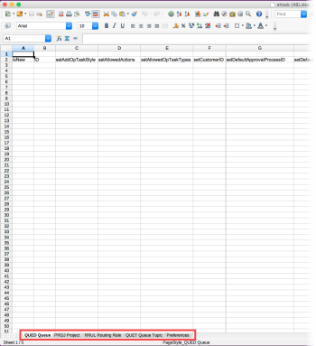

# Kick-Starts data importer

Kick-Starts enable Adobe Workfront administrators to import data from external data sources into Workfront and to export existing data in Workfront to be used in other systems.

Kick-Starts are highly formatted Excel spreadsheets that populate with existing data from Workfront (in the case of an export) or with data to be imported into Workfront (in the case of an import of data).

The Kick-Start importer is designed for the creation of new records; it is not designed for updating existing records.

For information about importing data into Workfront using Kick-Starts, see [Import data into Adobe Workfront using a Kick-Start template](../../../administration-and-setup/manage-workfront/using-kick-starts/import-data-via-kickstarts.md).

For information about exporting data from Workfront using Kick-Starts, see [Export data from Adobe Workfront via Kick-Starts](../../../administration-and-setup/manage-workfront/using-kick-starts/export-data-from-wf-via-kick-starts.md).
