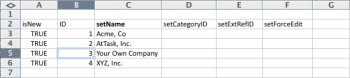
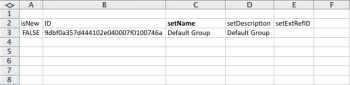

# Kick-Starts scenario: company, group, role, and user Kick-Starts preparation

When you begin implementing Adobe Workfront, rather than manually inputting data, you can import your customer list, internal departments, job roles, and user information.

## Access requirements

+++ Expand to view access requirements for the functionality in this article.

You must have the following access to perform the steps in this article: 

<table style="table-layout:auto"> 
 <col> 
 <col> 
 <tbody> 
  <tr> 
   <td role="rowheader">Adobe Workfront plan</td> 
   <td>Any</td> 
  </tr> 
  <tr> 
   <td role="rowheader">Adobe Workfront license</td> 
   <td>Plan</td> 
  </tr> 
  <tr> 
   <td role="rowheader">Access level configurations</td> 
   <td> 
You must be a Workfront administrator.
 
<b>NOTE</b>: If you still don't have access, ask your Workfront administrator if they set additional restrictions in your access level. For information on how a Workfront administrator can modify your access level, see <a href="../../../administration-and-setup/add-users/configure-and-grant-access/create-modify-access-levels.md" class="MCXref xref">Create or modify custom access levels</a>.
 </td> 
  </tr> 
 </tbody> 
</table>

+++

## What you can import

The following table displays the companies, groups, and roles to import:

<table style="table-layout:auto"> 
 <col> 
 <col> 
 <col> 
 <thead> 
  <tr> 
   <th><strong>Companies</strong> </th> 
   <th><strong>Groups</strong> </th> 
   <th><strong>Roles</strong> </th> 
  </tr> 
 </thead> 
 <tbody> 
  <tr> 
   <td valign="top"> 
Acme, Co
 
Workfront, Inc.
 
<em>Your Company</em> 
 
XYZ, Inc.
 </td> 
   <td valign="top"> 
Finance
 
IT 
 
Marketing 
 
Sales
 </td> 
   <td valign="top"> 
Business Analyst
 
Controller Creative
 
Designer
 
Resource Manager
 
Scrum Master
 
Technical Writer
 
Web Developer
 </td> 
  </tr> 
 </tbody> 
</table>

Role names must be unique. Existing job roles cannot be imported.

The following tables display the users to import and several user attributes for each:

### User 1

| **First Name** |Chris |
|---|---|
| **Last Name** |Manning |
| **Username/Email** |mailto:cmanning@foo.com  |
| **Password** |updateMe |
| **Access** |Team Member |
| **Company** |<*Your Company>* |
| **Home Group** |Marketing |
| **Job Role** |Business Analyst |

{style="table-layout:auto"}

### User 2

| **First Name** |Jennifer |
|---|---|
| **Last Name** |Campbell |
| **Username/Email** |jcampbell@foo.com |
| **Password** |updateMe |
| **Access** |Project Manager |
| **Company** |<*Your Company>* |
| **Home Group** |Marketing |
| **Job Role** |Project Manager |

{style="table-layout:auto"}

### User 3

| **First Name** |Jill |
|---|---|
| **Last Name** |Sullivan |
| **Username/Email** |jsullivan@foo.com |
| **Password** |updateMe |
| **Access** |Help Desk |
| **Company** |<*Your Company>* |
| **Home Group** |Sales |
| **Job Role** |Sales Rep |

{style="table-layout:auto"}

### User 4

| **First Name** |Marc |
|---|---|
| **Last Name** |Lewis |
| **Username/Email** |mlewis@foo.com |
| **Password** |updateMe |
| **Access** |Portfolio Manager |
| **Company** |<*Your Company>* |
| **Home Group** |Finance |
| **Job Role** |Controller |

{style="table-layout:auto"}

### User 5

| **First Name** |Pam |
|---|---|
| **Last Name** |Reynolds |
| **Username/Email** |preynolds@foo.com |
| **Password** |updateMe |
| **Access** |Project Manager |
| **Company** |*Your Company>* |
| **Home Group** |Marketing |
| **Job Role** |IT |

{style="table-layout:auto"}

### User 6

| **First Name** |Ray |
|---|---|
| **Last Name** |Andrews |
| **Username/Email** |randrews@foo.com |
| **Password** |updateMe |
| **Access** |Administrator |
| **Company** |*Your Company>* |
| **Home Group** |Resource Manager |
| **Job Role** |none |

{style="table-layout:auto"}

## Download a Kick-Start Template

{{step-1-to-setup}}

1. Click **System** > **Kick-Starts** > **Import Data.**

1. Click **More Options** to see the full list of import options.
1. Select the Access Level, Company, Group, Job Role, and User objects that you want to import.

## Input company information

1. Open the **Workfront.xlsx** file you just downloaded.

   >[!TIP]
   >
   >When working with very wide data sheets, you may want to use your spreadsheet editor's Freeze Pane (or equivalent) tool to make the spreadsheet easier to work with.

1. Go to the 'CMPY Company' sheet.

   It should be empty unless companies are already in the system. 

   

1. Specify TRUE into the **isNew** column.
1. Repeat this action for each company being added. (In this example, complete this action for rows 3-6, because four companies are being added.)

   

1. Specify a unique ID.

   This must be done for each row for the ID column. Integers starting at 1 work well when creating new records.

   

1. Set a Name.

   Specify the names of each customer in the **setName** column.

   

1. Go to the GROUP Group sheet.

   Unless you have already created groups in Workfront, this sheet should display only the Default Group provisioned with every account of Workfront.

    

1. Set the **isNew** column.According to the scenario, 4 groups will be imported, so specify TRUE into rows 4 through 7 for the 'isNew' column.
1. Specify a unique ID.

   This must be done for each row for the ID column. Integers starting at 1 work well when creating new records.

   

1. Set a Name.

   Specify the names of each department in the **setName** column.

   

   Specify role information. Go to the ROLE Role sheet.

1. Unless you have already created or deleted roles in your account, this sheet should display 8 roles that are provisioned with every account of Workfront.

   

1. Set True statement.

   Seven Job Roles are importing, input TRUE into rows 12 through 18 for the 'isNew' column.

   

1. Specify a unique ID.

   This must be done for each row for the ID column. Integers starting at 1 work well when creating new records. 

   

   

1. Provide a names for each role by typing it in the setName column.

   

1. Provide additional details as needed.

   Include billing rates, cost rates, and descriptions for the Roles you are creating, as needed.

1. Go to the USER User sheet to input User Information.

   Unless you have already created users in your account, this sheet should display only the Admin User that is provisioned with every account of Workfront.

    

1. Set True value by specifying TRUE into rows 4 through 9 for the 'isNew' column, since 6 users are being imported.

   

1. Set a unique ID by specifying a unique ID in each row for the ID column. Typically integers starting at 1 work well for new records.

   

1. Input the names of each user into the 'setFirstName' and 'setLastName' columns.

   

1. Set detail values by specifying values into the 'setEmail,' 'setPassword,' and 'setUsername' columns.

   

1. Specify Access Level values.

   For example, Chris Manning, who is a Team Member, look up the ID on the ACSLVL Access Level sheet for the Team Member access level. Copy the ID into your clipboard, and on the USER User sheet paste it in the **setAccessLevelID** column on Chris' row. 

   Repeat this step for each user and access level.

    

1. Specify Home Group details.

   According to the scenario, Chris Manning belongs to the Marketing group. On the GROUP Group sheet, locate the ID for the Marketing group, copy it into the clipboard, and on the USER User sheet paste it in the **setHomeGroupID**column on Chris' row. ​Repeat this step for each user and group assignment.

    

1. Specify Company details.

   All the users in this scenario belong to the same company. On the CMPY Company sheet, locate the ID for the *Your Own Company *company, copy the ID into the clipboard, and on the USER User tab, paste this value into each row of the 'setCompanyID' column.​

   Repeat this step for each user and group assignment.

   

   

1. Specify Job Role details.

   According to the scenario, Chris Manning will have the Business Analyst role. On the ROLE Role sheet, locate the ID for the Business Analyst role, copy it into the clipboard, and on the USER User sheet paste it in the 'setRoleID' column on Chris' row. ​Repeat this step for each user and group assignment.

   

   

1. Fill in other user details, as needed, then save the file.
1. Import the Excel File.

   Follow the directions provided in [Import data into Adobe Workfront using a Kick-Start template](/help/quicksilver/administration-and-setup/manage-workfront/using-kick-starts/import-data-via-kickstarts.md).
