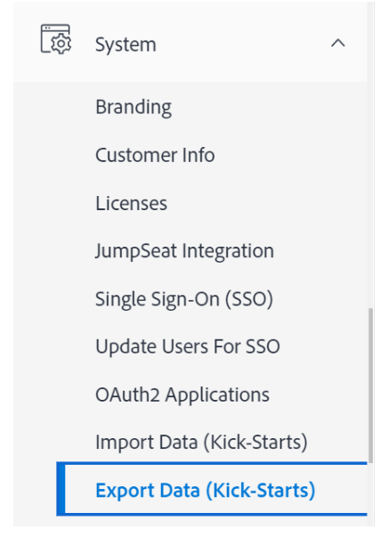
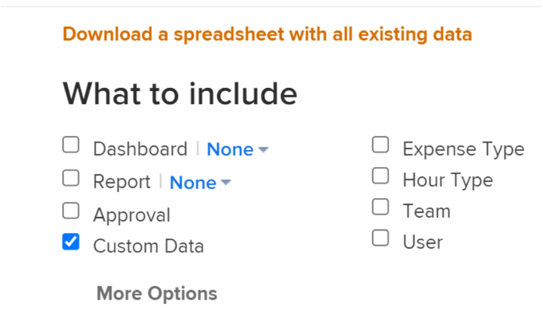
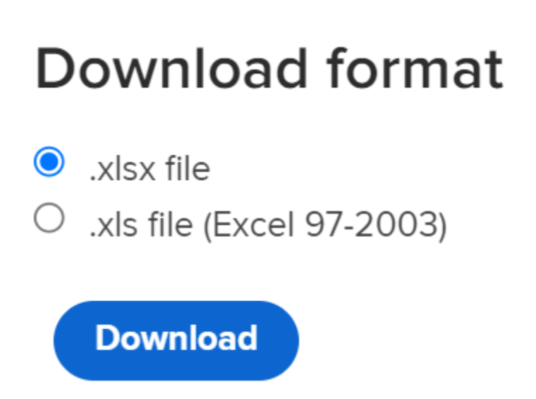
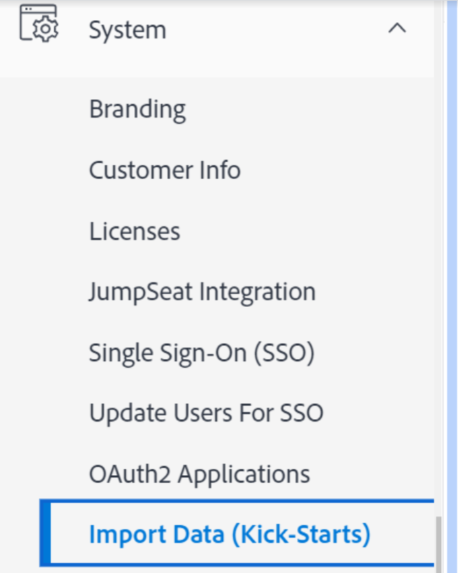
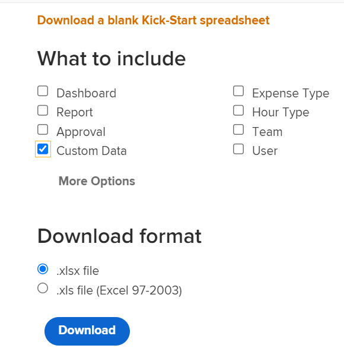
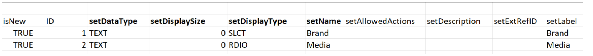
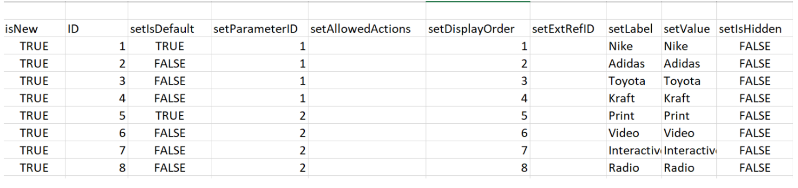
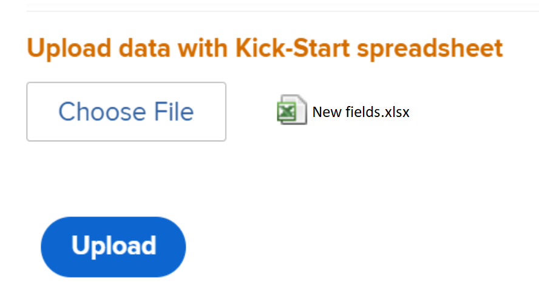

# Kick-Starts scenario: Import multiple-option custom fields into Workfront

You can import custom fields with multiple options in Adobe Workfront using the Kick-Start functionality. 

Examples of custom fields with multiple options are:  

* Multi-Select Dropdown 
* Dropdown 
* Checkboxes 
* Radio Buttons  

These fields can sometimes have many (sometimes hundreds) of options. Importing them using the Kick-Start functionality can save you, as the Workfront administrator, a lot of time and ensure you avoid errors.  

>[!IMPORTANT]
>
>You must follow the steps outlined in the sections below, in this order, to import custom fields with multiple options using a kick-start: 
>
>1. Export existing Custom Data from Workfront (optional step)
>1. Export the Kick-Starts Template for Custom Data
>1. Populate the Excel Kick-Starts spreadsheet
>1. Upload the Excel Spreadsheet to Workfront

## Export existing Custom Data from Workfront (optional step)

If you are not familiar with the Workfront database structure, or if you are not familiar with the kick-start file that Workfront requires to import information, we recommend that you first export a kick-start file from Workfront with existing information, similar to that of the fields that you want to import.  

For example, if you want to import custom forms or custom fields, you must export a kick-start file with existing Custom Data first.  

Exporting your existing data first allows you to scan it and see how your new data needs to be formatted.  

If you have a good understanding of the Workfront database objects and structure, you can continue with the section below.  

To export existing data from Workfront: 

{{step-1-to-setup}}

1. Expand **System** in the left menu, then click **Export Data (Kick-Starts)**. 

    

1. Select **Custom Data** in the **What to include** section. 

    

1. Choose **.xlsx file** in the **Download format** section.   
  
    >[!TIP]
    >
    >    Depending on how much custom data you have in your system, this might take a long time. 

    

1. Click **Download**. An .xlsx file downloads to your computer. Navigate to and open it. 

    

1. Examine the downloaded file and make note of the following details:  

    * The file contains several sheets. You might not need to know the information in every sheet, but you will use some of the sheets to import your information. Take some time to familiarize yourself with their content and especially with the format of the content in each sheet.  
    * Pay special attention to the column names and to the format in which the data in each column displays.  
    * You must not change the names or the order of the columns in any of the sheets. The column headers indicate fields that you need to fill out with your information, in each row. If the column header displays in bold, it is a required field, so you must have information in that column.
    
    >[!IMPORTANT]
    >
    >Some column headers might not display in bold, but they might still be required. 

    * Keep the downloaded file for future reference and continue to the following section.
 
## Export the Kick-Starts template for Custom Data

After scanning the information about existing custom fields in your system, you can download a new kick-start template for your import.  

{{step-1-to-setup}}

1. Expand **System** in the left menu.

1. Click **Import Data (Kick-Starts)**.   

    
 
1. In the **Download a blank Kick-Start spreadsheet** area, choose the **Custom Data** checkbox and click **Download**. 

    

    A blank kick-start file downloads to your computer.  

    >[!NOTE]
    >
    >The number of sheets in the file, their names, and the number of and names of the columns in each sheet should be identical to the ones from the kick-start downloaded in the above section which contained your existing custom data. 

## Populate the Excel Kick-Starts spreadsheet

Before populating the excel spreadsheet, download the kick-start template as described in the above section.  

>[!IMPORTANT]
>
>Do not try to import information using an ad-hoc Excel spreadsheet. All spreadsheets for importing information into Workfront using the kick-start functionality must match the contents of the files you download from Workfront and described in this article. 

To populate the Excel spreadsheet with information for the new custom fields: 

1. Open the Excel spreadsheet you downloaded in the previous section, and notice a number of sheets. Each sheet represents an object in the application. 

    >[!INFO]
    >
    >For example, **Parameter** (which refers to Custom Field), **Parameter Option**(which refers to Custom Field option), **Category** (which refers to Custom Form). 
    >
    >You must write the names of the objects and their attributes in the format supported by the Workfront database.
    >
    >For information about the meaning of these objects, see the [Glossary of [!DNL Adobe Workfront] terminology](../../../workfront-basics/navigate-workfront/workfront-navigation/workfront-terminology-glossary.md). 
    >
    >For information about the names of the objects in the Workfront database, see the [API Explorer](../../../wf-api/general/api-explorer.md). 
    >
    >
    

1. Ensure the following information is formatted correctly:  

    * The first row of every sheet must remain empty, otherwise the import generates an error.  
    * The column headers in each sheet represent attributes of the objects that can be set during an import. All column headers must remain in the same order you find them when you export the sheet and they cannot be renamed.  
    * The column headers in bold are required fields and they must have a value. 

        >[!TIP]
        >
        >Some columns are required although they are not in bold. For example, the `isNew` and `ID` columns are not in bold, but they are required fields.  

1. Select the `**PARAM Parameter`** sheet and add information about the new custom fields in the following required columns: 

    * **`isNew`** = enter **`TRUE`** in this column for every line that represents a new custom field. This indicates that the field is new and not existing in Workfront.    

        >[!TIP]
        >
        >    If a line represents an existing field already in Workfront, you would enter **`isNew`** = **`FALSE`**. 

    * **`ID`** = must be a unique number for each line that represents a new field. You can use any number starting with 1, as long as each new field has  a unique number.  
    * **`setDataType`** = for each line that represents a new field, enter the data type that the field supports. The Data Type must be entered as it would appear in the database. Select from the following data types: 
        * **`NMBR`** for Number 
        * **`CURC`** for Currency 
        * **`TEXT`** for Text 
    * `**setDisplaySize**`= the display size ('**setDisplaySize**') for any multiple options custom fields is always 0. 
    * **`setDisplayType`** = for each line that represents a new field, enter the display type of the field. The Display Type must be entered as it would appear in the database.

        For multiple-option custom fields, select from the following options: 

        * **`MULT`** for Multi-select Dropdown 
        * **`SLCT`** for Dropdown 
        * **`RDIO`** for Radio Buttons 
        * **`CHCK`** for Checkboxes 

        >[!TIP]
        >
        >To find the Data Type and Display Type information, refer to the [API Explorer](../../../wf-api/general/api-explorer.md), expand the **Parameter** object, and look for these attributes under the **fields** tab.  

    * **`setName`** = enter the name of the custom fields as you wish it displays in Workfront.
    
        >[!INFO]
        >
        >For example, we might import two custom fields, called _Brand_, a checkbox field, and _Media_, a radio button field.  

    * The **`setName`** and the **`setValue`** columns usually contain the same information and they should reflect the names desired in the Workfront interface for your new field. 
    
    The value of a field is the name which appears in reports, for example, whereas the name displays in the custom forms attached to objects.
    
    For more information, see [Design a form with the form designer](/help/quicksilver/administration-and-setup/customize-workfront/create-manage-custom-forms/form-designer/design-a-form/design-a-form.md).

    

1. Select the **`POPT Parameter Options`** sheet and add information about the options of each custom field in the following required columns:

    * **`isNew`** = enter **`TRUE`** in this column for every line that represents a new field option.

        >[!TIP]
        >
        >    If a line represents an existing option, you would enter **`isNew`** = **`FALSE`**. 

    * **`ID`** = must be a unique number for each line that represents a new option. You can use any number starting with 1, as long as each new option has  a unique number. 
    * **`setIsDefault`** = enter `TRUE` for the options that you want to display by default, and `FALSE` for all other options, for each field.  For example, we want _Nike_ to be the default option for _Brand_ and _Print_ to be the default option for _Media_. 

        >[!TIP]
        >
        >You can only have one default option for each field.  

    * **`setParameterID`** = the options corresponding to the _Brand_ custom field  have a **`setParameterID`** of 1, and the options corresponding to the _Media_ have a **`setParameterID`**of 2. The `PARAM` and `POPT` sheets cross-reference each other to indicate which options belong to which custom field.  
    * **`setDisplayOrder`**=  the display order column indicates the order in which the options will display in your custom field. You can start with 1 and continue in ascending order for all the options, regardless of which fields they will belong to. The important thing here is to have unique numbers for each option.  
    * The **`setLabel`** and the `**setValue`** columns usually contain the same information and they should reflect the names desired in the Workfront UI. The value of an option is the name that displays in reports, for example, whereas the label displays in the custom forms when attached to an object. For more information, see [Design a form with the form designer](/help/quicksilver/administration-and-setup/customize-workfront/create-manage-custom-forms/form-designer/design-a-form/design-a-form.md).  
    * **`setIsHidden`** = enter `TRUE` if you want any of the options to be hidden.  

    

1. (Optional) If you want to also create a custom form where you can later add the new fields, select the  **`CTGY Category`** sheet and update the following required columns for the custom form information: 

    * **`isNew`** = enter **`TRUE`** in this column for every line that represents a new custom form. 
    * **`ID`** = enter a unique number for each line that represents a new form. You can use any number starting with 1, as long as each new option or line has  a unique number. 
    * **`setGroupID`** = add the Group ID for your Home Group, or any other group in the system whose members you want to have access to this form. This is a required field.   

    To find out the `ID` of a Group, you can either build a Group report and add the `ID` field in the View, or navigate to a group and find the URL for the group. The Group ID will be in the URL of the group's page. For example, if the URL of the group is `https://companyName.my.workfront.com/group/575b000800467a6f66e747932c807464/members`, the Group ID is `575b000800467a6f66e747932c807464`. 

    * **`setCatObjCode` **= this is the object code for the object type that you want the form to be created for. Enter a code from the following options:  
        * **`CMPY`** for Company 
        * **`TASK`** for Task 
        * **`PROJ`** for Project 
        * **`PORT`** for Portfolio 
        * **`PRGM`** for Program 
        * **`USER`** for User 
        * **`DOCU`** for Document 
        * **`OPTASK`** for Issue 
        * **`EXPNS`** for Expense 
        * **`ITRN`** for Iteration 
        * **`BILL`** for Billing Records 
        * **`GROUP`** for Group 

        >[!NOTE]
        >
        >For multi-object forms, enter the first object you would select when creating a form in the UI. For example, set the `setCatObjCode` to `TASK`, if you would select Task in the Workfront interface and then, Issue, Portfolio, etc., but you do not want the form to be available to Projects.  

    * **`setName`** = this is the name of the custom form as you would like it to appear in the Workfront interface.   

        

1. Save the spreadsheet as an .xls or .xlsx file on your computer. Your Excel spreadsheet is filled out and is now ready for importing into Workfront.  

## Upload the Excel spreadsheet to Workfront 

After performing the steps described in the previous sections, continue with the following to upload the new fields and forms into Workfront:  

{{step-1-to-setup}}

1. Click **System > Import Data (Kick-Starts)**.

1. Click **Choose File** under the section **Upload data with Kick-Start spreadsheet**. 

1. Browse for the Excel spreadsheet you prepared, on your computer and select it when you find it.  When the file is recognized by Workfront, the Upload button will turn blue. 
1. Click **Upload.** 

    

1. A notification that the import was successful displays. Depending on how much information you are importing, this step might take a few seconds to a minute.

    

    The new custom fields and forms are now in your Workfront system. You can find them in the Custom Forms area of Setup. 

    >[!NOTE]
    >
    >The new forms and the fields you imported are not yet connected. The form is imported with no custom fields. You must manually add the fields to the new custom form or to another existing custom form.   

    
    For information about adding fields to custom forms, see [Design a form with the form designer](/help/quicksilver/administration-and-setup/customize-workfront/create-manage-custom-forms/form-designer/design-a-form/design-a-form.md).

1. (Conditional) If the import was not successful, you receive an error message with what the problem is. Try to identify the field, the sheet, and the row number in which the problem was encountered and correct the information in the Excel file, then try importing the file one more time.

    

1. (Conditional) Depending on what the problem is, as stated in the error message, some information might already be imported. You must do one of the following before you can import the sheet again: 

    * Delete the information that was successfully imported from Workfront from the Custom Forms area, then make the correction indicated by the error message.  
    * Indicate that a field or a form is already in the system for those fields or forms that have already imported, then make the correction. 
    To indicate that a field or a custom form is already in Workfront, you must ensure that the `inNew` field is marked as `FALSE` in sheets that contain information about the form (`CTGY`) or the field (`PARAM`) on the kick-start importing sheet.
