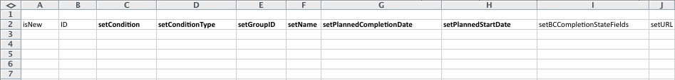
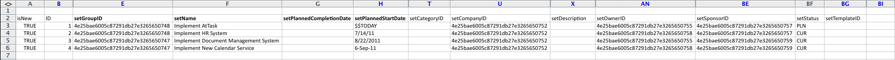
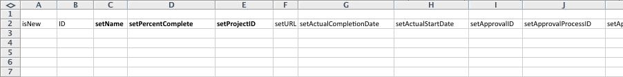
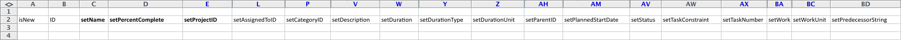
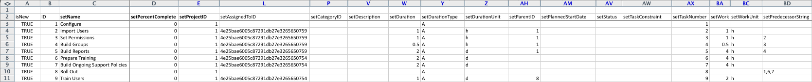

# Kick-Starts scenario: simple project and task import preparation

Describes in detail the available settings and controls for a basic Project and Task Import using the Kick-Start method.

## Scenario

The implementation team would rather import project and task information for active projects instead of manually inputting this data into the system.

* [Projects](#projects) 
* [Task list](#task-list)

### Projects {#projects}

The following table displays four Projects and their basic details that need to be mapped into the Kick Start file formats.

This scenario assumes users are already imported into Adobe Workfront. If users are not already in Workfront, subsitute different names or complete the Kick Start Scenario with users prior to this scenario.

1. Implement Workfront.

   | Planned Start Date |Today |
   |---|---|
   | Project Manager |Jennifer Campbell |
   | Project Sponsor |Marc Lewis |
   | Group |Marketing |
   | Company |*YourCompany* |

   {style="table-layout:auto"}

1. Implement HR System.

   | Planned Start Date |July 14, 20XX |
   |---|---|
   | Project Manager |Pam Reynolds |
   | Project Sponsor |Marc Lewis |
   | Group |Marketing |
   | Company |*YourCompany* |

   {style="table-layout:auto"}

1. Implement Document Management System.

   | Planned Start Date |August 22, 20XX |
   |---|---|
   | Project Manager |Jennifer Campbell |
   | Project Sponsor |Ray Andrews |
   | Group |IT |
   | Company |*YourCompany* |

   {style="table-layout:auto"}

1. Implement New Calendar System.

   | Planned Start Date |September 6, 20XX |
   |---|---|
   | Project Manager |Pam Reynolds |
   | Project Sponsor |Ray Andrews |
   | Group |IT |
   | Company |*YourCompany* |

   {style="table-layout:auto"}

### Task list {#task-list}

The following task list displays overly simplified task lists for the projects. The only difference between projects is the start dates and progress made on each project. 

Parent tasks inherit the Duration, Work, and Percent Complete of children tasks. It is not necessary to set those values for that will become summary tasks.

>[!NOTE]
>
>The instructions provided in this scenario are not as explicit as the step-by-step directions provided in [Kick-Starts Scenario: Company, Group, Role, and User Kick-Starts Preparation](../../../administration-and-setup/manage-workfront/using-kick-starts/kick-starts-scenario-company-group-role-user-prep.md). The assumption is you have already learned how to look up and copy values from the Company and Group sheets, so these steps will be mentioned, but not specifically outlined. 

1. Configure.
1. Import users.

   <table style="table-layout:auto"> 
    <col width="50%"> 
    <col width="50%"> 
    <tbody> 
     <tr> 
      <td role="rowheader">Assigned to</td> 
      <td>Ray Andrews</td> 
     </tr> 
     <tr> 
      <td role="rowheader">Parent task</td> 
      <td>1</td> 
     </tr> 
     <tr> 
      <td role="rowheader">Duration</td> 
      <td>1 hour</td> 
     </tr> 
     <tr> 
      <td role="rowheader">Work</td> 
      <td>1 hour</td> 
     </tr> 
     <tr> 
      <td role="rowheader">Percent complete</td> 
      <td> 
Workfront: 0%
 
HR: 100%
 
Docs: 100%
 
Calendar: 100%
 </td> 
     </tr> 
    </tbody> 
   </table>

1. Set permissions.

   <table style="table-layout:auto"> 
    <col width="50%"> 
    <col width="50%"> 
    <tbody> 
     <tr> 
      <td role="rowheader">Assigned to</td> 
      <td>Ray Andrews</td> 
     </tr> 
     <tr> 
      <td role="rowheader">Parent task</td> 
      <td>1</td> 
     </tr> 
     <tr> 
      <td role="rowheader">Pred</td> 
      <td>2</td> 
     </tr> 
     <tr> 
      <td role="rowheader">Duration</td> 
      <td>1 hour</td> 
     </tr> 
     <tr> 
      <td role="rowheader">Work</td> 
      <td>1 hour</td> 
     </tr> 
     <tr> 
      <td role="rowheader">Percent complete</td> 
      <td> 
Workfront: 0%
 
HR: 100%
 
Docs: 100%
 
Calendar: 100%
 </td> 
     </tr> 
    </tbody> 
   </table>

1. Build groups.

   <table style="table-layout:auto"> 
    <col width="50%"> 
    <col width="50%"> 
    <tbody> 
     <tr> 
      <td role="rowheader">Assigned to</td> 
      <td>Ray Andrews</td> 
     </tr> 
     <tr> 
      <td role="rowheader">Parent task</td> 
      <td>1</td> 
     </tr> 
     <tr> 
      <td role="rowheader">Pred</td> 
      <td>4</td> 
     </tr> 
     <tr> 
      <td role="rowheader">Duration</td> 
      <td>2 days</td> 
     </tr> 
     <tr> 
      <td role="rowheader">Work</td> 
      <td>4 hours</td> 
     </tr> 
     <tr> 
      <td role="rowheader">Percent complete</td> 
      <td> 
Workfront: 0%
 
HR: 100%
 
Docs: 100%
 
Calendar: 25%
 </td> 
     </tr> 
    </tbody> 
   </table>

1. Prepare training.

   <table style="table-layout:auto"> 
    <col width="50%"> 
    <col width="50%"> 
    <tbody> 
     <tr> 
      <td role="rowheader">Assigned to</td> 
      <td>Chris Manning</td> 
     </tr> 
     <tr> 
      <td role="rowheader">Duration</td> 
      <td>2 days</td> 
     </tr> 
     <tr> 
      <td role="rowheader">Work</td> 
      <td>4 hours</td> 
     </tr> 
     <tr> 
      <td role="rowheader">Percent complete</td> 
      <td> 
Workfront: 0%
 
HR: 100%
 
Docs: 50%
 
Calendar: 100%
 </td> 
     </tr> 
    </tbody> 
   </table>

1. Build ongoing support policies.

   <table style="table-layout:auto"> 
    <col width="50%"> 
    <col width="50%"> 
    <tbody> 
     <tr> 
      <td role="rowheader">Assigned to</td> 
      <td>Chris Manning</td> 
     </tr> 
     <tr> 
      <td role="rowheader">Duration</td> 
      <td>2 days</td> 
     </tr> 
     <tr> 
      <td role="rowheader">Work</td> 
      <td>4 hours</td> 
     </tr> 
     <tr> 
      <td role="rowheader">Percent complete</td> 
      <td> 
Workfront: 0%
 
HR: 100%
 
Docs: 50%
 
Calendar: 0%
 </td> 
     </tr> 
    </tbody> 
   </table>

1. Roll out.

   | Pred |1, 6, 7 |
   |---|---|

   {style="table-layout:auto"}

1. Train users.

   <table style="table-layout:auto"> 
    <col width="50%"> 
    <col width="50%"> 
    <tbody> 
     <tr> 
      <td role="rowheader">Assigned to</td> 
      <td>Chris Manning</td> 
     </tr> 
     <tr> 
      <td role="rowheader">Parent task</td> 
      <td>8</td> 
     </tr> 
     <tr> 
      <td role="rowheader">Duration</td> 
      <td>1 day</td> 
     </tr> 
     <tr> 
      <td role="rowheader">Work</td> 
      <td>2 hours</td> 
     </tr> 
     <tr> 
      <td role="rowheader">Percent complete</td> 
      <td> 
Workfront: 0%
 
HR: 0%
 
Docs: 0%
 
Calendar: 0%
 </td> 
     </tr> 
    </tbody> 
   </table>

## Download Template

Go to the Kick-Starts page. Select the Company, Group, Project, Task, and User objects. Select the Include existing data checkbox (do this to quickly reference Company, Group and User IDs). Click the Download button.

## Input Project Details

Open the Workfront.xlsx file you just downloaded. Go to the PROJ Project sheet.

Unless you have already created projects in Workfront, it should be empty.  

Set the values for the following project fields: 

* **Set isNew column** 
  Input TRUE into rows 3 through 6 for the isNew column.
* **Set unique IDs** 
  Input a unique ID in each row for the ID column — Typically, integers starting at 1 work well when creating new records.
* **Set Project Names** 
  Input the names of each project into the setName column.
* **Set project schedule**

  Input the ID of the schedule that you want the project to use in the setScheduleID field

* **Set the project Planned Start Date**

  Input the date and the time in the setPlannedStartDate column with the time and the date when you want the project to start. If left empty, Workfront imports the project with the current day's date and a timestamp of that day's midnight according to the browser's timezone. 

* **Set Task numbers** 
  Input values into the setTaskNumber column to control the order the tasks will appear in the project plan.
* **Provide project dates.** 
  Input the Planned Start Date for each project in the setPlannedStartDate column.
* **Set other needed details.** 
  Fill in other details, such as a description or current status, as needed. Look up the Group IDs for each project on the GROUP Group sheet and input them into the setGroupID column for the respective projects. Look up the Company ID for the projects on the CMPY Company sheet and input it into the setCompanyID column. Look up the User ID for each project owner on the USER User sheet and input it into the setOwnerID column. Look up the User ID for each project sponsor on the USER User sheet and input it into the setSponsorID column.

>[!NOTE]
>
>Acceptable values for Status and Priority fields can be located by reviewing the status and priority preferences for each object in the Workflow Setup area of Workfront.

## Input Task Details

You can add information about the tasks on the project, as you import the project using kick-starts.

Open the Workfront.xlsx file you just downloaded. **Go to the TASK Task sheet.**

Unless you have already created tasks in Workfront, this sheet should be empty.

The easiest way to map tasks is one project at a time (especially when the tasks are the same on each project). You can then copy the task plan for the first project and make small adjustments to the task plan for the subsequent projects. The remaining steps will assume you are creating tasks for just the Implement Workfront project. According to the scenario, you will be importing 9 tasks per project, so input TRUE into rows 3 through 11 for the isNew column.

Set the values for the following task fields: 

* **Set IDs** 
  Input a unique ID in each row for the ID column.
* **Set Names** 
  Input the task names into the setName column.
* **Confirm Project ID** 
  Input the ID you set for the Implement Workfront project; review the PROJ Project sheet to make sure it is the correct ID.
* **Set Users** 
  Go to the USER User sheet to look up the ID for the user assigned to each task and input these values in the respective cells in the setAssignedToID column.
* **Identify Task relationships** 
  For tasks 2 through 5, input a 1 in the setParentID column. For task 9, input a 8 in the setParentID column. In the  setPredecessorString column, input the task number for each predecessor task. In cases where a task has multiple predecessors, like task 8 in this scenario, you will need to use a comma to separate each predecessor task ID. Predecessors  can be defined with lags on non-Finish-Start relationships by using the shorthand described in the Creating Predecessor Relationships article.
* **Set Duration** 
  Set the duration for each task by inputting number of hours, days, weeks, or months for the task in the setDuration field. Then input the duration unit in the setDurationUnit field.

  |   |Acceptable value |
  |---|---|
  | Minutes |M |
  | Hours |H |
  | Days |D |
  | Weeks |W |
  | Months |T |

  Minutes can also be represented  as fraction of an hour (eg., minutets = 5 hours)

* Set the amount of effort for each task in the setWorkRequired field. Then input the work unit in the setWorkUnit field. If the Work Required value is different from the duration, you will also need to input an A into the setDurationType field.

  | Duration Type |Acceptable Value |
  |---|---|
  | Calculated Assignment |A |
  | Calculated Work |W |
  | Effort Driven |D |
  | Simple |S |

* Input the whole number representation of the percent complete in the setPercentComplete field for each task. This value should not include the percent symbol (%).
* Include a description and other details for each Task you are creating, as needed.

  

* The setPlannedStartDate and setTaskConstraint columns are not used to build out the timeline of this project because we are relying on predecessor relationships. You can input a date for each task instead. If you do this, be sure you also provide a valid task constraint in the setTaskConstraint column. Review the Task Constraintand related articles for details on valid values for this field.

  In the case of this scenario, the easiest way to build out the tasks for the other projects you are importing is to copy the tasks you just defined and paste them below, starting on row 12. Then you will:

   1. Renumber the values in the ID column.
   1. Update the setProjectID column to the value you set for the next project.
   1. Update the setParentID and setPredecessorString values to reflect the new IDs assigned to this project's tasks.
   1. Update task assignments and percent complete.
   1. Repeat these steps for the next project's tasks.

* **Import the Excel File**

  Follow the directions provided in [Import data into Adobe Workfront using a Kick-Start template](../../../administration-and-setup/manage-workfront/using-kick-starts/import-data-via-kickstarts.md).
