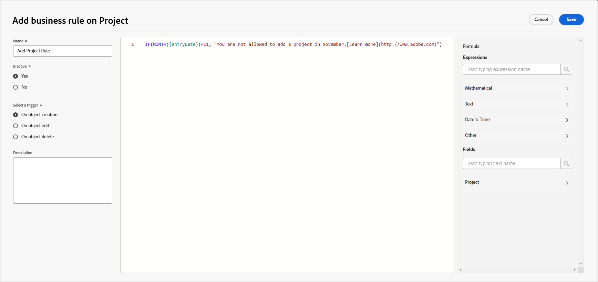

# Create and edit business rules

>[!IMPORTANT]
>
>Business rules are temporarily unavailable.

A business rule allows you to apply validation to Workfront objects and prevent users from creating, editing, or deleting an object when certain conditions are met. Business rules help to improve data quality and operational efficiency by preventing actions that could compromise data integrity.

A single business rule can be assigned to only one object. For example, if you create a business rule for not editing projects under certain conditions, you can't apply the same rule to tasks. You would have to create a separate business rule with the same conditions for tasks.

Access levels and object sharing have a higher priority than business rules when a user interacts with an object. For example, if a user has an access level or permission that does not allow editing a project, then those would take precedence over a business rule that permits editing a project under certain conditions.

When more than one business rule applies to an object, then the rules are all followed but are not applied in a certain order. For example, you have two business rules. One restricts creating expenses in the month of February. The second prevents editing a project when the project status is Complete. If a user tries to add an expense to a completed project in June, the expense cannot be added because it has triggered the second rule.

Business rules apply to creating, editing, and deleting objects through the API as well as in the Workfront interface.

>[!NOTE]
>
>Because business rules block certain actions, you should always configure your business rules first in a sandbox or preview environment and test them thoroughly before enabling them in production.

## Access requirements

+++ Expand to view access requirements for the functionality in this article.

You must have the following to perform the steps in this article:

<table style="table-layout:auto"> 
 <col> 
 <col> 
 <tbody> 
  <tr> 
   <td>Adobe Workfront plan</td> 
   <td>Ultimate</td> 
  </tr> 
  <tr> 
   <td>Adobe Workfront license</td> 
   <td>Standard</td> 
  </tr> 
  <tr> 
   <td>Access level configurations</td> 
   <td>System administrator</td> 
  </tr>  
 </tbody> 
</table>

For more detail about the information in this table, see [Access requirements in Workfront documentation](/help/quicksilver/administration-and-setup/add-users/access-levels-and-object-permissions/access-level-requirements-in-documentation.md).

+++

## Scenarios for business rules

The format of a business rule is "IF the defined condition is met, then the user is prevented from the action on the object, and the message is displayed."

The syntax for the properties and other functions in a business rule is the same as the syntax for a calculated field in a custom form. For more information about the syntax, see [Add calculated fields with the form designer](/help/quicksilver/administration-and-setup/customize-workfront/create-manage-custom-forms/form-designer/design-a-form/add-a-calculated-field.md).

For information about IF statements, see ["IF" statements overview](/help/quicksilver/reports-and-dashboards/reports/calc-cstm-data-reports/if-statements-overview.md) and [Condition operators in calculated custom fields](/help/quicksilver/reports-and-dashboards/reports/calc-cstm-data-reports/condition-operators-calculated-custom-expressions.md).

For information about user-based wildcards, see [Use user-based wildcards to generalize reports](/help/quicksilver/reports-and-dashboards/reports/reporting-elements/use-user-based-wildcards-generalize-reports.md).

For information about date-based wildcards, see [Use date-based wildcards to generalize reports](/help/quicksilver/reports-and-dashboards/reports/reporting-elements/use-date-based-wildcards-generalize-reports.md).

An API wildcard is also available in business rules. You can use `$$ISAPI` to trigger the rule only in the UI or only in the API.

Some simple business rule scenarios are:

* Users cannot add new expenses during the last week of February. This formula could be stated as: `IF(MONTH($$TODAY) = 2 && DAYOFMONTH($$TODAY) >= 22, "You cannot add new expenses during the last week of February.")`
* Users cannot edit a project that is in Complete status. This formula could be stated as: `IF({status} = "CPL", "You cannot edit this project because it is in Complete status.")`

A scenario with nested IF statements is:

Users cannot edit completed projects and cannot edit projects with a Planned Completion Date in March. This formula could be stated as:

```
IF(
    {status}="CPL",
    "You cannot edit a completed project",
    IF(
        MONTH({plannedCompletionDate})=3,
        "You cannot edit a project with a planned completion date in March")
)
```

## Add a new business rule

{{step-1-to-setup}}

1. Click **Business Rules** in the left panel.
1. Click **New business rule**.
1. Select the object type to assign the business rule to, then click **Continue**.

   

1. Type the **Name** for the business rule.
1. In the **Is Active** field, select whether the rule should be active when you save it.

   If you select **No**, the rule is saved as inactive, and you can activate it later.

1. Select a **Trigger** for the business rule. The options are:

   * **On object creation:** The rule is applied when a user attempts to create an object.
   * **On object edit:** The rule is applied when a user attempts to edit an object.
   * **On object delete:** The rule is applied when a user attempts to delete an object.

1. (Optional) Enter a **Description** of the business rule and what happens when it is applied.
1. Build the formula in the formula editor, in the center of the business rule dialog.

   The format of a business rule is "IF the defined condition is met, then the user is prevented from the action on the object, and the message is displayed."

   In the formula area, the parts of the business rule you build are the condition, and the message that displays in Workfront when the condition is met.

   * The "object" is the object type you selected when creating the business rule. It is displayed in the heading of the dialog.
   * The "action" is the trigger you selected for the rule: create, edit, or delete the object.
   * Because the object and the action are already defined, you do not include them in the formula.
   * The custom error message is displayed to the user when they trigger the business rule. It should provide clear instructions on what went wrong and how to correct the issue.

   

   This example is a business rule for expenses. If the current month is June, then users are not permitted to create new expenses, and the message explains this.
   
   For more examples of business rules, see [Scenarios for business rules](#scenarios-for-business-rules) in this article.

1. (Optional) Use the formula **Expressions** and **Fields** in the right panel to assist with building the rule.
    
    Search for an expression or field to narrow the list of available items.

    The list of available fields is limited to fields related to the object type for the business rule.

1. Click **Save** when you are finished building the business rule.

>[!NOTE]
>
>After you add a business rule, you should test it by adding, editing, or deleting the associated object to make sure the rule is applied properly.

## Activate a business rule

When a business rule is inactive, the Is Active field in the list of business rules displays False. You cannot update the status of the rule in the list view.

To activate a business rule:

1. Select the business rule in the list of rules and click the Edit icon.
1. Select **Yes** for **Is Active** in the business rule dialog.
1. Click **Save**.
