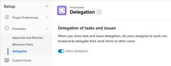

# Configure Delegation preferences

<!--

(NOTE: keep this here, for 22.3 release)

(not sure if this will also come to Classic??&nbsp;- since it's in Setup, it might but this feature is only available in&nbsp;NWE)

(update the TOC article etc and see if this needs to be added to both NWE and classic TOC article)

-->

As an Adobe Workfront administrator you can configure the Delegation preferences for your system.

The Delegation preferences determine whether users in your system can temporarily delegate their work to others.

For information about delegating work to others, see the following artickes:

* [Delegate work overview](../../../manage-work/delegate-work/delegate-work-overview.md) 
* [Delegate tasks and issues](../../../manage-work/delegate-work/how-to-delegate-work.md).

## Access requirements

You must have the following access to perform the steps in this article:

<table cellspacing="0"> 
 <col> 
 <col> 
 <tbody> 
  <tr> 
   <td role="rowheader">Adobe Workfront plan*</td> 
   <td> 
Any
 </td> 
  </tr> 
  <tr> 
   <td role="rowheader">Adobe Workfront license*</td> 
   <td> 
Plan 
 </td> 
  </tr> 
  <tr> 
   <td role="rowheader">Access level configurations*</td> 
   <td> 
 You must be a System Administrator. 
 <!--
     
You must be a group administrator. For more information on group administrators, see <a href="../../../administration-and-setup/manage-groups/group-roles/group-administrators.md" class="MCXref xref">Group administrators</a>. (NOTE:&nbsp;can a Plan user who is a Group admin also do this? Update, if yes)

    --> </td> 
  </tr> 
 </tbody> 
</table>

<!--

*To find out what plan, license type, or access you have, contact your Workfront administrator. (NOTE:&nbsp;only keep this if you can do this as a Plan +&nbsp;group admin)

-->

## Configure Delegation preferences

1. Log in to&nbsp;Workfront as a System Administrator. 
1. Go to the **Main menu** >&nbsp;**Setup** > **Processes** >&nbsp;**Delegation**.

   <!--
   <MadCap:conditionalText data-mc-conditions="QuicksilverOrClassic.Draft mode">
   (NOTE: check shot below. It's a mock. Is the Approvals setting including Reviews also in the real UI?)
   </MadCap:conditionalText>
   -->

   

1. Enable the **Allow delegation** setting. It is disabled by default. 

   <!--
   <MadCap:conditionalText data-mc-conditions="QuicksilverOrClassic.Draft mode">
   (NOTE: is it disabled by default, or do you need to edit that?!&nbsp;is there a Save step?&nbsp;Insert below.)
   </MadCap:conditionalText>
   -->

   Now, all users in your&nbsp;Workfront instance can see the Delegate button in their Home area and they can temporarily delegate their work to other users.

&nbsp;
