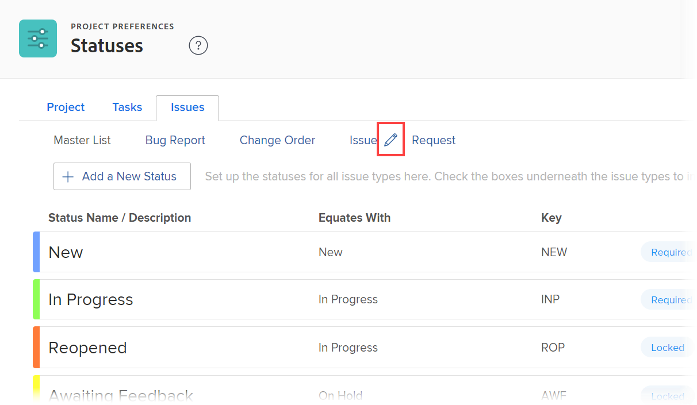

# Configure request types

While working on a project, you might discover that unexpected events arise. You can log those unexpected events as issues for a particular project or task. You can also submit requests, which are recorded as issues on a project that is designated as a Request Queue. Issues and requests are used considered to be interchangeable in Adobe Workfront.

For information about creating issues in [!DNL Workfront], see [Create issues](../../../manage-work/issues/manage-issues/create-issues.md). For information about creating requests in [!DNL Workfront], see [Create and submit [!DNL Adobe Workfront] requests](../../../manage-work/requests/create-requests/create-submit-requests.md). For information about associating Request Types with projects, see [Define Request Types for a project](../../../manage-work/requests/create-and-manage-request-queues/define-request-types-for-project.md).

## Access requirements

+++ Expand to view access requirements for the functionality in this article.

You must have the following access to perform the steps in this article:

<table style="table-layout:auto"> 
 <col> 
 <col> 
 <tbody> 
  <tr> 
   <td role="rowheader">[!DNL Adobe Workfront] plan</td> 
   <td>Any</td> 
  </tr> 
  <tr> 
   <td role="rowheader">[!DNL Adobe Workfront] license</td> 
   <td>
New: [!UICONTROL Standard]

   Or
   
Current: [!UICONTROL Plan]

   </td> 
  </tr>
  <tr> 
   <td role="rowheader">Access level configurations</td> 
   <td>[!UICONTROL System Administrator]</td>
  </tr> 
 </tbody> 
</table>

For more detail about the information in this table, see [Access requirements in Workfront documentation](/help/quicksilver/administration-and-setup/add-users/access-levels-and-object-permissions/access-level-requirements-in-documentation.md).

+++

<!--
THIS IS DRAFTED IN FLARE
<h2>Set what issue or request types are allowed for a project</h2>

You can organize the kind of issues or requests that are logged in Workfront by Request Types. This organization is useful for reporting reasons and for helping users understand what kind of unexpected work might occur during the lifetime of a project.

You can specify the type of requests that can be logged on a project when you configure the <strong>Queue Details</strong> area for the project. 

<ol>
<li value="1"> 
 Click <strong>Projects</strong> in the Main Menu.  
 </li>
<li value="2">Click the name of the project to open it.</li>
<li value="3"> In the left panel, click <strong>Queue Details</strong>. </li>
<li value="4"> 
In the <strong>Queue Properties</strong> section, select the <strong>Request Types</strong> you want for the project.
 <note type="note">
You must have at least one request type selected. You can select multiple request types.
</note> </li>
<li value="5"> 
Click <strong>Save</strong>.
 
The request types you specified will be available to select when you enter a new issue on a task or a project, or when you submit a new request to the project.
 </li>
</ol>

-->

## Customize the names of the request types

As a [!DNL Workfront] administrator, you can configure the names of the request types in your system. The new names are visible in any area of [!DNL Workfront] where the **[!UICONTROL Issue Type]** or **[!UICONTROL Request Type]** fields display:

* In the **[!UICONTROL Queue Details]** area of a project that will receive the issues or requests.
* If more than one request type is selected for a Request Queue, in the **[!UICONTROL New Issue] Form** in the **[!UICONTROL Issue Type]** field, when you create a new issue or submit a new request.

   For more information about creating issues in [!DNL Workfront], see  [Create issues](../../../manage-work/issues/manage-issues/create-issues.md)

   For more information about creating requests in [!DNL Workfront], see  [Create and submit [!DNL Adobe Workfront] requests](../../../manage-work/requests/create-requests/create-submit-requests.md).

* On the **[!UICONTROL Queue Topic Detail]** form, when you configure the Queue Topic.\
   For more information about creating Queue Topics, see [Create Queue Topics](../../../manage-work/requests/create-and-manage-request-queues/create-queue-topics.md).

To customize the names of the request types:

{{step-1-to-setup}}

1. Click **[!UICONTROL Project Preferences]** > **[!UICONTROL Statuses]**.

1. Click the **[!UICONTROL Issues]** tab.
1. At the top of the **[!UICONTROL Issues]** tab, hover over the name of a request type, then click the **[!UICONTROL Edit]** icon that appears.

   

1. In the box that appears, type a new name, then press **[!UICONTROL Enter]**.

## Configure issue statuses within different request types

You can associate each request type with different issue statuses. You can also change the order in which the statuses display on an issue, depending on what type of issue it is.

For more information about changing the default order of issue statuses and configuring issue statuses, see the [Create or edit a status](../../../administration-and-setup/customize-workfront/creating-custom-status-and-priority-labels/create-or-edit-a-status.md) section in [Create or edit a status](../../../administration-and-setup/customize-workfront/creating-custom-status-and-priority-labels/create-or-edit-a-status.md).
