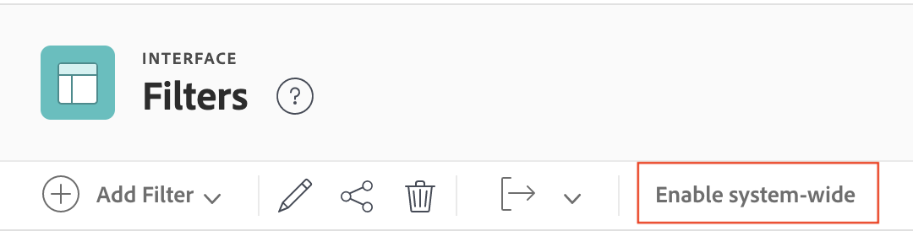

# Create, edit, and share system-wide filters, views, and groupings

<!-- Audited: 5/2025 -->

<!--

***DON'T DELETE, DRAFT OR HIDE THIS ARTICLE. IT IS LINKED TO THE PRODUCT, THROUGH THE CONTEXT SENSITIVE HELP LINKS. **

-->

You can create filters, views, and groupings and make them available to users system-wide in your organization. 

When you create system-wide filters, views, and groupings as described in this article, users who you share them with can leverage them when viewing their lists. Users can create their own filters, views, and groupings based on those you create, but they cannot directly change them.

Please note that system-wide filters, views, and groupings that you create are different from the default ones that Adobe Workfront automatically creates for you in the system. Those default filters, views, and groupings can't be edited or deleted.

## Access requirements

+++ Expand to view access requirements for the functionality in this article.

You must have the following access to perform the steps in this article: 

<table style="table-layout:auto"> 
 <col> 
 <col> 
 <tbody> 
  <tr> 
   <td role="rowheader">[!DNL Adobe Workfront] plan</td> 
   <td>Any</td> 
  </tr> 
  <tr> 
   <td role="rowheader">[!DNL Adobe Workfront] license</td> 
   <td>
New: [!UICONTROL Standard]

   Or
   
Current: [!UICONTROL Plan]

   </td> 
  </tr>
  <tr> 
  <tr> 
   <td role="rowheader">Access level configurations</td> 
   <td>[!UICONTROL System Administrator]</td>
  </tr> 
 </tbody> 
</table>

For more detail about the information in this table, see [Access requirements in Workfront documentation](/help/quicksilver/administration-and-setup/add-users/access-levels-and-object-permissions/access-level-requirements-in-documentation.md).

+++

## Create filters, views, or groupings

{{step-1-to-setup}}

1. Click **[!UICONTROL Interface]**, then click one of the following: **[!UICONTROL Filters]**, **[!UICONTROL Views]**, or **[!UICONTROL Groupings]**.

1. If you're creating a filter, view, or grouping, click **[!UICONTROL Add Filter]**, **[!UICONTROL Add View]**, or **[!UICONTROL Add Grouping]**, then select the object type you want to associate the new filter, view, or grouping with.

   Or

   If you're editing an existing filter, view, or grouping, select it, then click the **[!UICONTROL Edit]** icon .

1. Configure the filter, view, or grouping.

   For information about available options, see one of the following articles:

   * [Filters overview](../../../reports-and-dashboards/reports/reporting-elements/filters-overview.md) 
   * [Views overview in [!UICONTROL Adobe Workfront]](../../../reports-and-dashboards/reports/reporting-elements/views-overview.md) 
   * [Groupings overview in [!UICONTROL Adobe Workfront]](../../../reports-and-dashboards/reports/reporting-elements/groupings-overview.md)

1. Click **[!UICONTROL Save]** near the lower-left corner.

You can make the filter, view, or grouping available to users in your system. For more information about sharing filters, views or groupings with other users, see the section [Make filters, views, or groupings available to users](#make-filters-views-or-groupings-available-to-users) in this article.

## Show or hide filters, views, or groupings available from the Layout Template

You can choose to show or hide filters, views, or groupings from the Layout Template. Visible filters are available for all users system wide. You can use a Layout Template to hide visible filters for specific users or groups.

>[!NOTE]
>
>If a user is actively using a filter, view, or grouping and then an administrator disables it, the user still has access until they choose a new filter, view, or grouping. After they choose a new one, they will no longer be able to revert to the hidden one.

To show or hide filters, views, or groupings available from the Layout Template:

{{step-1-to-setup}}

1. Click **[!UICONTROL Interface]**, then click one of the following: **[!UICONTROL Filters]**, **[!UICONTROL Views]**, or **[!UICONTROL Groupings]**.

1. (Conditional) Select the filter, view, or grouping that you want to make available to users, then click **[!UICONTROL Enable system-wide]**.

   

   >[!TIP]
   >
   >If you want to keep the filter, view, or grouping available for most users but hide it from others, you can use the Layout Template. For more information, see [Customize Filters, Views, and Groupings using a layout template](/help/quicksilver/administration-and-setup/customize-workfront/use-layout-templates/customize-fvg-list-controls-layout-template.md).

1. (Conditional) Select the filter, view, or grouping that you want to hide from users, then click **[!UICONTROL Disable system-wide]**. The filter, view, or grouping is now hidden from the layout template and users across the system.

## Make filters, views, or groupings available to all users {#make-filters-views-or-groupings-available-to-users}

These steps explain how to make filters, views, and groupings available from the [!UICONTROL Share] dialog in the [!UICONTROL Interface] area in [!UICONTROL Setup]. This setting acts like an on/off switch for the entire system, including the Layout Template.

{{step-1-to-setup}}

1. Click **[!UICONTROL Interface]**, then click one of the following: **[!UICONTROL Filters]**, **[!UICONTROL Views]**, or **[!UICONTROL Groupings]**.

1. Select the filter, view, or grouping that you want to make available to users, then click the **[!UICONTROL Share]** icon .
1. Begin typing the name of specific users, teams, roles, groups, or companies to share the filter, view, or grouping with, then click the name when it appears in the drop-down list.

   For more information about sharing, see [Overview of sharing permissions on objects](../../../workfront-basics/grant-and-request-access-to-objects/sharing-permissions-on-objects-overview.md).

1. Click **[!UICONTROL Save]**. Users that you specified can now see the filter, view, or grouping when viewing the object type that you associated it with.

## Delete filters, views, and groupings

{{step-1-to-setup}}

1. Click **[!UICONTROL Interface]**, then click one of the following: **[!UICONTROL Filters]**, **[!UICONTROL Views]**, or **[!UICONTROL Groupings]**.

1. Select one or more items in the list, then click the **[!UICONTROL Delete]** icon .

1. In the **Delete** dialog box that appears, click **Yes, Delete it**.
