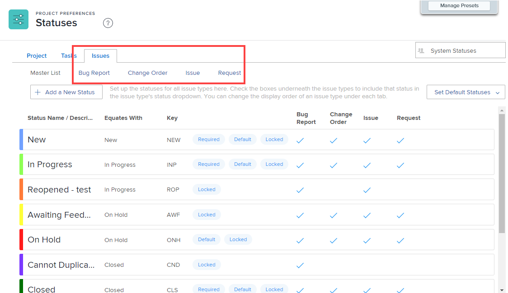
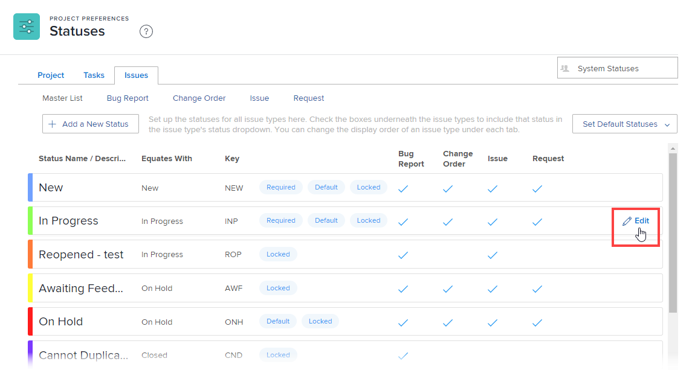

# Customize default issue types

Issue types are useful in the following circumstances:

* When customizing issue statuses, as described in [Create or edit a status](../../../administration-and-setup/customize-workfront/creating-custom-status-and-priority-labels/create-or-edit-a-status.md).
* When creating a request queue, as described in [Create a Request Queue](../../../manage-work/requests/create-and-manage-request-queues/create-request-queue.md).

You can customize the labels for each default issue type to better match the terminology used in your organization.

## Access requirements

+++ Expand to view access requirements for the functionality in this article.

You must have the following access to perform the steps in this article:

<table style="table-layout:auto"> 
 <col> 
 <col> 
 <tbody> 
  <tr> 
   <td role="rowheader">[!DNL Adobe Workfront] plan</td> 
   <td>Any</td> 
  </tr> 
  <tr> 
   <td role="rowheader">[!DNL Adobe Workfront] license</td> 
   <td>[!UICONTROL Plan]</td> 
  </tr> 
  <tr> 
   <td role="rowheader">Access level configurations</td> 
   <td> 
You must be a [!DNL Workfront] administrator.
 
<b>NOTE</b>: If you still don't have access, ask your [!DNL Workfront] administrator if they set additional restrictions in your access level. For information on how a [!DNL Workfront] administrator can modify your access level, see <a href="../../../administration-and-setup/add-users/configure-and-grant-access/create-modify-access-levels.md" class="MCXref xref">Create or modify custom access levels</a>.
 </td> 
  </tr> 
 </tbody> 
</table>

+++

## Default issue types

If you have [!DNL Adobe Workfront] [!UICONTROL administrator] access, there are four default issue types that you can configure and rename:

* **[!UICONTROL Bug Report]** Used to track reported bugs in the system.
* **[!UICONTROL Change Order]** Used to track issues that need to be updated or revised.
* **[!UICONTROL Issue]** An object in [!DNL Workfront] that communicates unplanned work, a problem that arises, or something that must be resolved in order to continue a task.
* **[!UICONTROL Request]** An issue type that applies to a request queue where users make requests in Workfront.

## Customize an issue type

Consider the following about customizing issue types:

* You can modify the label for an issue type, but you can't change its function.
* You can't create additional issue types.
* You can't change the filter values for the name of an issue type. So, if you create a filter on an issue report, the value of the filter (key) does not reflect the issue type's custom name.
* Three default statuses are associated with each issue type: [!UICONTROL New], [!UICONTROL In Progress], and [!UICONTROL Closed]. You can't delete these statuses or remove them from an issue type, but you can rename them.
* You can re-order the options that appear on the drop-down menu for each issue type.

To customize an issue type:

{{step-1-to-setup}}

1. Click **[!UICONTROL Project Preferences]** > **[!UICONTROL Statuses]**.

1. Click the **[!UICONTROL Issues]** tab.
1. Do any of the following:

   * Hover over the issue type you want to customize, click the [!UICONTROL Edit] icon  that appears to the far right, then type a new name for the issue type.

      

   * Click an [!UICONTROL issue type] to list its associated statuses, then drag the handles that appear when you hover over them and and drop them in the order you want them to appear in your users' issue **[!UICONTROL Status]** drop-down menu.
