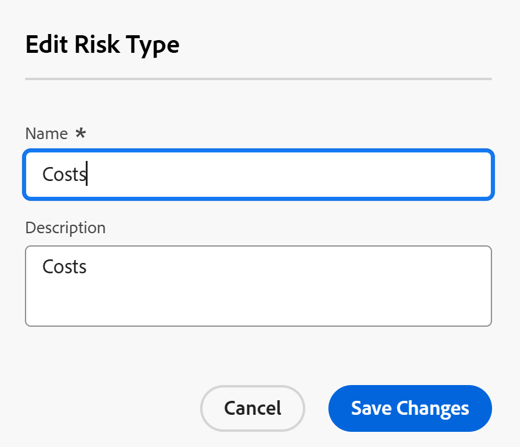
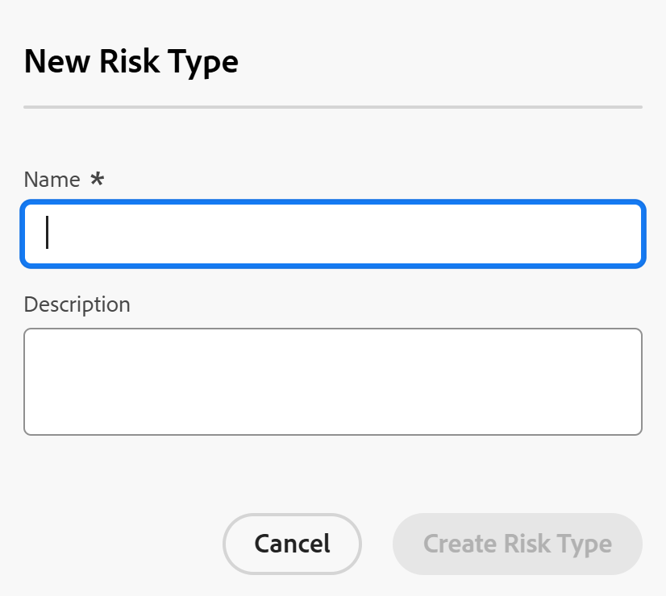

# Edit and create risk types

<!--Audited: 03/2025-->

<!--DON'T DELETE, DRAFT OR HIDE THIS ARTICLE. IT IS LINKED TO THE PRODUCT, THROUGH THE CONTEXT SENSITIVE HELP LINKS.-->

The highlighted information on this page refers to functionality not yet generally available. It is available only in the Preview environment for all customers. After the monthly releases to Production, the same features are also available in the Production environment for customers who enabled fast releases.    

For information about fast releases, see [Enable or disable fast releases for your organization](/help/quicksilver/administration-and-setup/set-up-workfront/configure-system-defaults/enable-fast-release-process.md). 

Adobe Workfront has a number of default risk types that you can associate with projects in the planning phase to identify potential obstacles prior to the approval of any work. 

Risks are possible events that could prevent completion of the project on time or within budget.

In addition to the default risk types, you can add new risk type to reflect the needs in your organization. 

You can associate risk types with project risks to identify what kind of risk a project might encounter. 

## Access requirements

+++ Expand to view access requirements for the functionality in this article.

You must have the following access to perform the steps in this article:

<table style="table-layout:auto"> 
 <col> 
 <col> 
 <tbody> 
  <tr> 
   <td role="rowheader">[!DNL Adobe Workfront] plan</td> 
   <td>Any</td> 
  </tr> 
  <tr> 
   <td role="rowheader">[!DNL Adobe Workfront] license*</td> 
   <td>
New: [!UICONTROL Standard]

   Or
   
Current: [!UICONTROL Plan]

   </td> 
  </tr> 
  <tr> 
   <td role="rowheader">Access level configurations</td> 
   <td>[!UICONTROL System Administrator]</td>
  </tr> 
 </tbody> 
</table>

*For more detail about the information in this table, see [Access requirements in Workfront documentation](/help/quicksilver/administration-and-setup/add-users/access-levels-and-object-permissions/access-level-requirements-in-documentation.md).

+++

## Risks types

Risk types are labels you can use for your risks to categorize them for reporting purposes. 

As a [!DNL Workfront] administrator, you can create [!UICONTROL Risk Types] in the [!UICONTROL **Setup**] area. 

After setting up risk types, they are universal to your system. 

All project owners can use the same risk types for their projects.

## Edit and create risk types

Some risk types are already in [!DNL Workfront], by default. 

You can do the following to enhance the number of risk types in your Workfront instance: 

* [Edit existing risk types](#edit-existing-risk-types)
* [Create risk types](#create-risk-types)

### Edit existing risk types {#edit-existing-risk-types}

{{step-1-to-setup}}

1. Click **[!UICONTROL Risk Types]**.
1. Select the risk type you want to edit.
1. Click the **[!UICONTROL Edit]** icon .

   The [!UICONTROL **Edit Risk Type**] box opens.

   

   >[!TIP]
   >
   >   You can edit risk type information inline, when you double-click the Name or Description of a risk type in a list of risk types.

1. (Optional) Change the name and the description of the risk type.

   There is a character limit of 50 characters for the **[!UICONTROL Name]** and the **[!UICONTROL Description]** fields.

1. Click **[!UICONTROL Save Changes].**

1. (Optional) To delete a risk type, select it in the list, then click the [!UICONTROL **Delete**] icon , then click [!UICONTROL **Yes, Delete It**]. The risk type is deleted and cannot be recovered. 

1. (Optional) To export a list of risk types, click the [!UICONTROL **Export**] icon . You can export to the following file types:

   * PDF
   * Excel
   * Excel (xlsx)
   * Tab Delimited

   >[!TIP]
   >
   >   You can first select a limited number of risk types, and then export them for a smaller list. 

### Create risk types {#create-risk-types}

You can create risk types, in addition to the default ones.

{{step-1-to-setup}}

1. Click **[!UICONTROL Risk Types]**.

1. Click **[!UICONTROL New Risk Type]** to open the [!UICONTROL **New Risk Type**] box

   Or

   Click [!UICONTROL **Add More Risk Types**] in the lower-left corner of the risk type list to add risk types inline.

   The **New Risk Type** box opens. 

   

1. Add a **[!UICONTROL Name]** (required) and a **[!UICONTROL Description]** (optional) for the risk type. 

   There is a character limit of 50 characters for the **[!UICONTROL Name]** and the **[!UICONTROL Description]** fields.

1. Click **[!UICONTROL Create Risk Type]**, 

   Or, if you used in-line edit to add your risk type, click **[!UICONTROL Enter]** when you are done.

   >[!TIP]
   >
   >To edit a custom risk type, see the section [[!UICONTROL Edit existing] risk types](#edit-existing-risk-types) in this article.

## Attach risks with risk types on projects

You can use risks types to label risks added to your projects. 

For more information on how to add risks to projects, see [Create and edit risks on projects](../../../manage-work/projects/define-a-business-case/create-edit-risks-on-projects.md).
