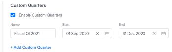
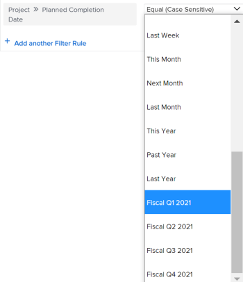

# Enable custom quarters for projects

For reporting purposes, you might want to create custom quarters if your organization's quarters are based on specific criteria other than calendar dates (such as business days or shopping days).

You can configure up to eight custom quarters for your Adobe Workfront system.

## Access requirements

You must have the following access to perform the steps in this article: 

<table cellspacing="0"> 
 <col> 
 <col> 
 <tbody> 
  <tr> 
   <td role="rowheader">Adobe Workfront plan</td> 
   <td> 
Any
 </td> 
  </tr> 
  <tr> 
   <td role="rowheader">Adobe Workfront license</td> 
   <td> 
Plan 
 </td> 
  </tr> 
  <tr> 
   <td role="rowheader">Access level configurations</td> 
   <td> 
You must be a Workfront administrator. For more information, see <a href="../../../administration-and-setup/add-users/configure-and-grant-access/grant-a-user-full-administrative-access.md" class="MCXref xref">Grant a user full administrative access</a>.
 
Note: If you still don't have access, ask your Workfront administrator if they set additional restrictions in your access level. For information on how a Workfront administrator can modify your access level, see <a href="../../../administration-and-setup/add-users/configure-and-grant-access/create-modify-access-levels.md" class="MCXref xref">Create or modify custom access levels</a>.
 </td> 
  </tr> 
 </tbody> 
</table>

## Set up custom quarters for your Workfront system

1. Click the **Main Menu** icon  in the upper-right corner of Adobe Workfront, then click **Setup** .

1. Click **Project Preferences** > **Projects.**

1. In the **Timelines** section, select **Enable Custom Quarters**.

1. Type a name for the custom quarter, such as "Fiscal Q1 2021."
1. Select start and end dates for the custom quarter.

   

1. (Optional) Click **Add Custom Quarter** to add additional custom quarters to the system.
1. (Optional) Create a reporting element that refers to the fiscal quarters.

   **Example:** Create a filter for a project list and include the Planned Completion Date of a project referencing the custom quarters.

   

   The references to "This Quarter", "Next Quarter", and "Last Quarter"&nbsp;are replaced with new references to the custom quarters.

   For information about reporting elements, see [Reporting elements: filters, views, and groupings](../../../reports-and-dashboards/reports/reporting-elements/reporting-elements-filters-views-groupings.md).

   For information about creating filters, see [Create or edit filters in Adobe Workfront](../../../reports-and-dashboards/reports/reporting-elements/create-filters.md).

