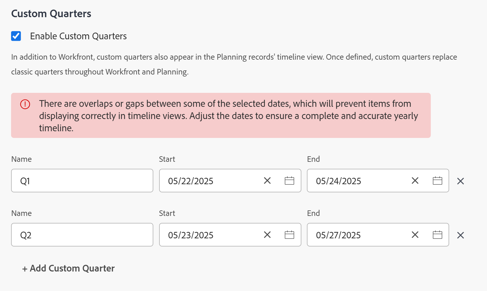

# Enable custom quarters 

<!--Audited: 11/2024-->

The highlighted information on this page refers to functionality not yet generally available. It is available only in the Preview environment for all customers who have purchased [!DNL Adobe Workfront Planning]. After the monthly releases to Production, the same features are also available in the Production environment for customers who enabled fast releases.    

For information about fast releases, see [Enable or disable fast releases for your organization](/help/quicksilver/administration-and-setup/set-up-workfront/configure-system-defaults/enable-fast-release-process.md).    

For reporting purposes, you might want to create custom quarters if your organization's quarters are based on specific criteria other than calendar dates (such as business days or shopping days).

Depending on what products your company has purchased, you can configure the following number of quarters in your Workfront Setup area: 

* Customers who purchased [!DNL Workfront] only, can configure up to eight custom quarters for the [!DNL Adobe Workfront] system.
* Customers who purchased [!DNL Workfront] and [!DNL Workfront Planning], can configure up to 100 quarters for the [!DNL Workfront] system which are also available in [!DNL Planning]. 

## Access requirements

+++ Expand to view access requirements for the functionality in this article.

You must have the following access to perform the steps in this article:

<table style="table-layout:auto"> 
 <col> 
 <col> 
 <tbody> 
  <tr> 
   <td role="rowheader">[!DNL Adobe Workfront] plan</td> 
   <td>Any</td> 
  </tr> 
  <tr> 
   <td role="rowheader">[!DNL Adobe Workfront] license</td> 
   <td>
New: [!UICONTROL Standard]

   Or
   
Current: [!UICONTROL Plan]

   </td> 
  </tr> 
  <tr> 
   <td role="rowheader">Access level configurations</td> 
   <td>[!UICONTROL System Administrator]</td>
  </tr> 
 </tbody> 
</table>

For more detail about the information in this table, see [Access requirements in Workfront documentation](/help/quicksilver/administration-and-setup/add-users/access-levels-and-object-permissions/access-level-requirements-in-documentation.md).

+++

## Set up custom quarters for your [!DNL Workfront] system

{{step-1-to-setup}}

1. Click **[!UICONTROL Project Preferences]** > **[!UICONTROL Projects].**

1. In the **[!UICONTROL Timelines]** section, select **[!UICONTROL Enable Custom Quarters]**.

1. Type a name for the custom quarter, such as "Fiscal Q1 2021."
1. Select start and end dates for the custom quarter.

   

1. (Optional) Click **[!UICONTROL Add Custom Quarter]** to add additional custom quarters to the system.

      >[!IMPORTANT]
      >
      > If your company purchased [!DNL Workfront Planning], you cannot save your custom quarters if there are gaps or overlaps between the quarters. 
      >
      >Gaps and overlaps between the quarters are allowed for [!DNL Workfront] only customers. 

1. (Optional and conditional) If your company purchased only [!DNL Workfront], without [!DNL Workfront Planning], create a reporting element that refers to the fiscal quarters.

   **Example:** Create a filter for a [!UICONTROL project] list and include the Planned Completion Date of a project referencing the custom quarters.

   

   The references to "This Quarter", "Next Quarter", and "Last Quarter" are replaced with new references to the custom quarters.

   For information about reporting elements, see [Reporting elements: filters, views, and groupings](../../../reports-and-dashboards/reports/reporting-elements/reporting-elements-filters-views-groupings.md).

   For information about creating filters, see [Create or edit filters in [!DNL Adobe Workfront]](../../../reports-and-dashboards/reports/reporting-elements/create-filters.md).
1. (Optional and conditional) If you have access to [!DNL Workfront Planning], go to a record type page and open a timeline view. The view displays the new custom quarters. 
