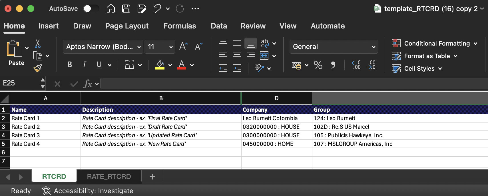
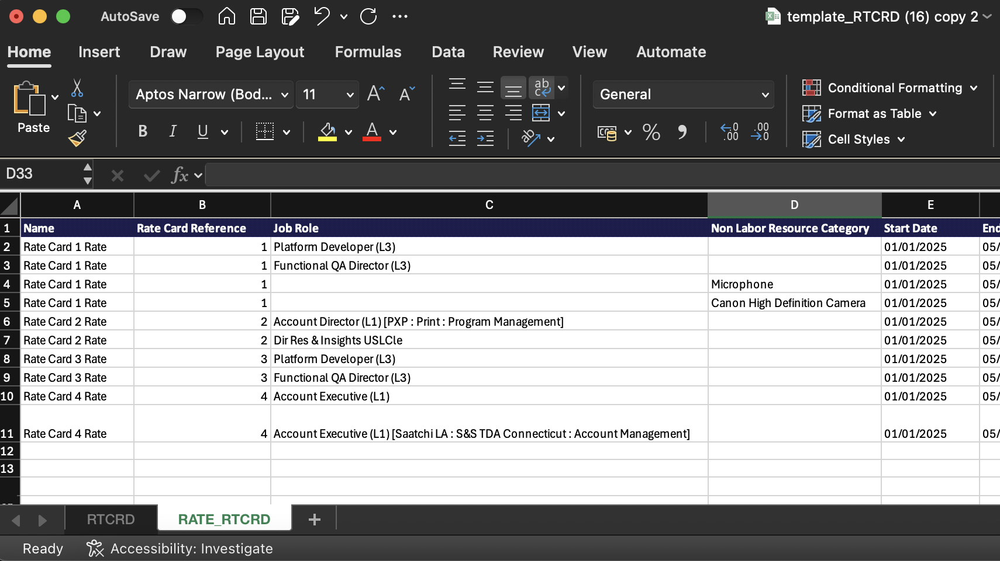

# Import rate cards from a template

You can use a template file to build your rate cards in Excel and import them into Adobe Workfront, instead of adding all of the job roles and rates manually.

To see the example rate cards described in this article, download the [sample file](https://experienceleague.adobe.com/en/docs/workfront/using/administration-and-setup/set-up-wf/configure-system-defaults/import-rate-cards/assets/rate-cards-sample.zip).

## Important rules for working with the template file

* Enter either the Job Role OR the Non-Labor Resource Category, but not both.
* The Rate Card Sequence on the RATE_RTCRD tab must match the order of cards on the RTCRD tab (1 for first, 2 for second, etc.).
* The Start Date and End Date must follow the allowed formats.
* Rate cards can be imported without rates and updated later. 
* Custom attributes (Agency, Cost Center, etc.) may vary. Check with your system administrator for the exact requirements.
* Rows deleted in the template will not delete existing records in the system.

## Access requirements

+++ Expand to view access requirements for the functionality in this article.

<table style="table-layout:auto"> 
 <col> 
 <col> 
 <tbody> 
  <tr> 
   <td>[!DNL Adobe Workfront] package</td> 
   <td>Any</td> 
  </tr> 
  <tr> 
   <td>[!DNL Adobe Workfront] license</td> 
   <td>
[!UICONTROL Standard]

   
[!UICONTROL Plan]

   </td> 
  </tr> 
  <tr> 
   <td>Access level configurations</td> 
   <td>Edit access to [!UICONTROL Rate Cards]</td> 
  </tr> 
 </tbody> 
</table>

For information, see [Access requirements in Workfront documentation](/help/quicksilver/administration-and-setup/add-users/access-levels-and-object-permissions/access-level-requirements-in-documentation.md).

+++

## Fill out the template file

{{step-1-to-setup}}

1. In the left panel, click [!UICONTROL **Rate cards**].
1. Click **New rate card**, then click **Download Excel template**.
1. Follow the browser prompts to save the template file to your computer.
1. Open the template file in Excel.

   >[!TIP]
   >
   > Save the file with a new name if you want to keep the empty template file and use it again later.
   
   The template has two tabs. Both tabs must have the correct information to import the rate cards successfully.

   * RTCRD: Define the rate cards (basic information)
   * RATE_RTCRD: Define the detailed rates associated with each rate card

### Fill out the RTCRD (Rate Card Setup) tab

Create and list all of rate cards on this tab. Each row represents one rate card.

1. Enter the information for a rate card on each row:

   * **Name** (required): The name of the rate card, such as "Global Billing 2025."

     This name is the main identifier for the rate card. Each rate card must have a unique name.

   * **Description** (optional): A free-form text description of the rate card. Use this to describe purpose, scope, or validity, for example, "Applies to North American projects."
   * **Company** (optional): This can be either the company name or the company ID. The import will recognize both.
     
     Example: Coffesta, or _68c0234e00000541dd8c0757723daa68_
 
   * **Group** (optional): This can be either the group name or the group ID. The import will recognize both.

     Example: Marketing, or _68c0234e00000541dd8c0757723daa68_

   * **Custom fields** (optional): You can add additional columns with custom field names if your environment has specific requirements.

   >[!NOTE]
   >
   >* At minimum, you must enter the Name for each rate card.
   >* Each rate card is automatically given a sequence number based on its row position. For example, the first rate card you define (in row 2) is sequence 1, the next is 2, and so on. These sequence numbers are used in the RATE_RTCRD tab to attach rates.

### Fill out the RATE_RTCRD (Rates Setup) tab

Define all the rates that belong to the rate cards on this tab.

Every row on the tab defines one specific rate. You can create multiple rates under the same rate card by repeating the rate card sequence.

Make sure that dates do not overlap unless that is intended.

1. Enter the information for a rate on each row:

   * **Name** (required): A label for the rate row.

     The best practice is to reuse the rate card name for clarity, such as "Global Billing 2025 – Developer Rate."

   * **Rate Card Reference** (required): The sequence number of the rate card that this rate belongs to.
     
     If the rate card was the first one you listed on the RTCRD tab (row 2), enter 1. If it was the second, enter 2, and so on.

   * **Job Role** (required if Non-Labor Resource Category is not used): The job role that the rate applies to. This can be either the job role name or the job role ID. The import will recognize both.

     Example: Designer or _68c0234e00000541dd8c0757723daa68_

   * **Non-Labor Resource Category** (required if Job Role is not used): The non-labor resource category that the rate applies to. This can be either the category name or the category ID. The import will recognize both.
     
     Example: Camera or _68c0234e00000541dd8c0757723daa68_

     >[!IMPORTANT]
     >
     >You cannot enter data in both the **Job Role** and the **Non-Labor Resource Category** columns. One is required.

   * **Start Date** (optional): The date when the rate becomes effective.

     The date must follow one of the supported formats (depending on your location): MM/dd/yyyy, dd/MM/yyyy, MM/DD/YY, DD/MM/YY, M/d/yy, d/M/yy, yyyy/MM/dd, yyyy/dd/MM, yyyy-MM-dd, yyyy-dd-MM

     Example: 01/01/2025

     For more information, see [Date formatting requirements](#date-formatting-requirements), below.

   * **End Date** (optional): The date when the rate stops being effective.

     This date must follow the same supported formats as the start date.

     For more information, see [Date formatting requirements](#date-formatting-requirements), below.

   * **Value** (optional): The numeric rate value, for example 150. The default value is 0.
   * **Currency** (optional): The currency for the rate, for example USD, EUR, GBP. The default is the system currency.
   * **Locked** (optional): Indicates if the rate is locked. Valid values are True or False.
   * **Attributes** (optional / custom): The last columns (Agency, Location, Cost Center, etc.) are Rate Attributes that differ by customer configuration. These are customizable fields and may vary per customer environment.

     Example: Agency = "1: Agency," Location = "Chicago," Cost Center = "22: Cost Center"

### Date formatting requirements

When preparing rate card data for importing, you must ensure that the date columns are formatted as **General**, not as **Date**.

If the columns are set to Date format, the system may misinterpret values during the import process, leading to errors or failed uploads. Using the General format preserves the raw numeric or text representation of the date, allowing the system to correctly validate and apply the values.

Following these steps will prevent unnecessary issues and ensure a smooth and accurate import of rate data.

1. Before saving or uploading the file, select the date columns in the spreadsheet.
1. Change the column format to **General**.
1. Verify that the values still display correctly (for example, 01/01/2025 or 2025-01-01).

## Import the template file

{{step-1-to-setup}}

1. In the left panel, click [!UICONTROL **Rate cards**].
1. Click **New rate card**, then click **Import new rate cards**.
1. Drag and drop your file into the dialog, or click Select an Excel file to browse to the file on your computer.
1. Click **Start importing**.

   If there are no issues with the file, then a confirmation message appears and the new rate cards appear in the list.

1. If the file contains issues, an error message appears. Click **See issues** to view the issues on a separate screen.

   You must correct the issues in the Excel file and import it again before the rate cards will exist in Workfront.
