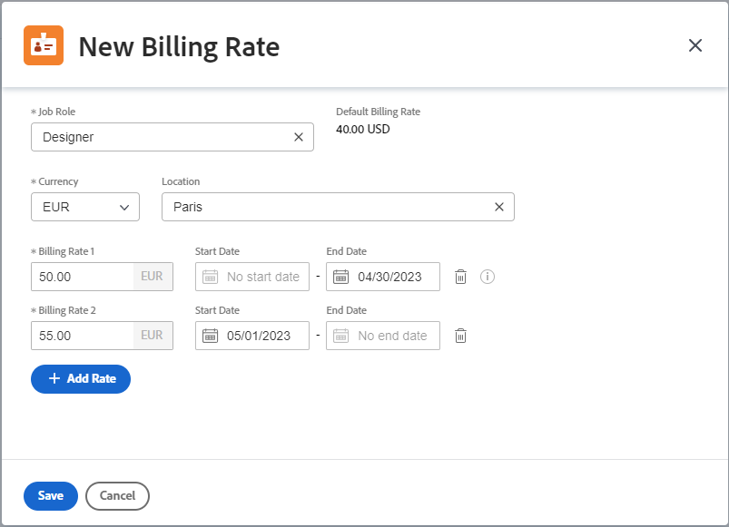

# Manage rate cards

{{highlighted-preview-article-level}}

Rate cards allow you to define multiple billing rates per role, based on location. You could have a job role of Designer based in Paris and a second Designer based in New York, each with different billing rates. However, a location is not required for job roles on a rate card. A billing rate for a job role (and possibly location) on a rate card can also include effective dates.

## Access requirements

+++ Expand to view access requirements for the functionality in this article.

You must have the following access to perform the steps in this article:

<table style="table-layout:auto"> 
 <col> 
 <col> 
 <tbody> 
  <tr> 
   <td role="rowheader">[!DNL Adobe Workfront] plan</td> 
   <td>Any</td> 
  </tr> 
  <tr> 
   <td role="rowheader">[!DNL Adobe Workfront] license</td> 
   <td>
New: [!UICONTROL Standard]

   Or
   
Current: [!UICONTROL Plan]

   </td> 
  </tr> 
  <tr> 
   <td role="rowheader">Access level configurations</td> 
   <td>Edit access to [!UICONTROL Financial Data]</td> 
  </tr> 
  <tr> 
   <td role="rowheader">Object permissions</td> 
   <td>To edit a rate card shared with you, you must have Manage permissions to the rate card.</td> 
  </tr> 
 </tbody> 
</table>

For more detail about the information in this table, see [Access requirements in Workfront documentation](/help/quicksilver/administration-and-setup/add-users/access-levels-and-object-permissions/access-level-requirements-in-documentation.md).

+++

## Add a rate card

{{step-1-to-setup}}

1. In the left panel, click [!UICONTROL **Rate cards**].
1. Click [!UICONTROL **New rate card**], then type a name for the rate card in the [!UICONTROL New rate card] box, to replace "Untitled Rate Card."
1. (Optional) On the Rate Card Details screen, add a [!UICONTROL **Description**].
1. (Optional) To attach a custom form to the rate card, click the [!UICONTROL **Add custom form**] field in the upper-right corner and select a custom form from the list that displays.

   For more information on attaching a custom form, see [Add a custom form to an object](/help/quicksilver/workfront-basics/work-with-custom-forms/add-a-custom-form-to-an-object.md).

1. Click [!UICONTROL **Job Roles and Rates**] in the left navigation panel.
1. On the Rate Card Job Roles and Rates screen, click [!UICONTROL **Add job role**].
1. In the dialog, select a [!UICONTROL **Job Role**] to define billing rates for.

   The Default Billing Rate displays the system-level rate for this job role, if one is defined.

   

1. Select a [!UICONTROL **Currency**] for the job role.
1. (Optional) Select a [!UICONTROL **Location**] for the job role.
1. In the [!UICONTROL **Billing Rate 1**] field, enter the billing rate for this location. Then, click [!UICONTROL **Save**] to override the billing rate one time.
   
   Or
   
   Click [!UICONTROL **Add Rate**] to add more location-specific billing rates with effective dates.

1. (Conditional) If you are adding more than one billing rate for this location, enter the following information:

   * **[!UICONTROL Billing Rate 1], 2, etc.:** The value of the billing rate for the time period.
   * **[!UICONTROL Start Date]:** The date when the rate override begins.
   * **[!UICONTROL End Date]:** The date when the rate override ends.

     Billing Rate 1 will not have a start date and the last billing rate will not have an end date. Some dates are added automatically. For example, if Billing Rate 1 does not have an end date, and you add Billing Rate 2 with a start date of May 1, 2023, an end date of April 30, 2023 is added to Billing Rate 1 so that no gaps exist.

1. Click [!UICONTROL **Save**].
1. (Optional) To add another billing rate, either for the same job role in another location or for a separate job role, click [!UICONTROL **Add job role**].
1. (Optional) To edit a rate card, click the rate card name in the Rate Cards list in Setup. To edit a billing rate, click [!UICONTROL **Job Roles and Rates**] in the left navigation panel of the rate card. Then, select the rate and click the **Edit** icon .

## Copy a rate card

{{step-1-to-setup}}

1. In the left panel, click [!UICONTROL **Rate cards**].
1. Select the check box next to the rate card in the list and click the **Copy** icon .
1. Type a name for the rate card in the [!UICONTROL Copy rate card] box, to replace "Untitled Rate Card." Then, click **Save**.

   The new rate card is saved. Edit the rate card details, job roles, and rates as needed.

## Delete an entire rate card

{{step-1-to-setup}}

1. In the left panel, click [!UICONTROL **Rate cards**].
1. Select the check box next to the rate card in the list, and click the **Delete** icon .

   >[!NOTE]
   >
   >A rate card attached to a project will be deleted from the project.
