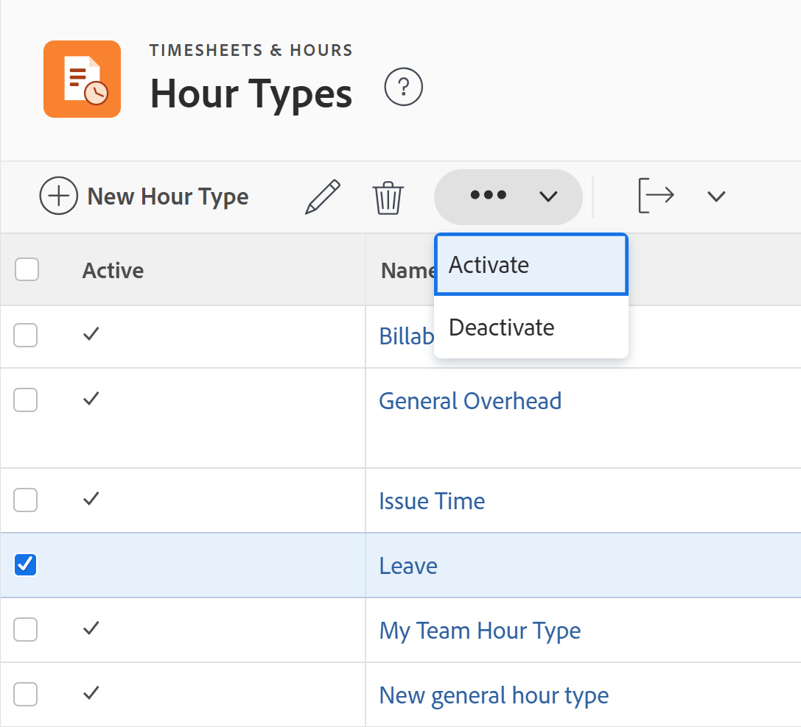

# Manage hour types

<!--Audited: 05/2025-->

<!--DON'T DELETE, DRAFT OR HIDE THIS ARTICLE. IT IS LINKED TO THE PRODUCT, THROUGH THE CONTEXT SENSITIVE HELP LINKS. 
**Linked to Creating Billing Record-->

The highlighted information on this page refers to functionality not yet generally available. It is available only in the Preview environment for all customers. The same features will also be available in the Production environment for all customers after a week from the Preview release.     

For more information, see [Interface modernization](/help/quicksilver/product-announcements/product-releases/interface-modernization/interface-modernization.md). 

Hour types are labels you use to define your hour entries. You can associate hour types with your hour entries. 

There are two categories of hour types:

* **Project Specific Hour Types**: This is time logged on projects, tasks, and issues. Project-specific hour types can be associated with hour entries anywhere in [!DNL Adobe Workfront] where you can log time for projects, tasks, and issues.

   When logging time in [!DNL Workfront], the project-specific hour types that are available depend on configuration options set at the system, project, and user levels.

   The following default project-specific hour types are always available:

   * Project Time
   * Task Time
   * Issue Time

   The [!DNL Workfront] administrator determines which project-specific hour types are made available, as described in [Define hour types and availability](../../../timesheets/create-and-manage-timesheets/define-hour-types-and-availability.md).

   >[!NOTE]
   >
   >If you enable any project-specific hour types in your [!DNL Workfront] system, at least one project-specific hour type must be enabled on each project in your system. You cannot enable a project-specific hour type at the system level and have no project-specific hour types available at the project level.

* **General Hour Types**: General hours cannot be associated with a project, task, or issue, and are logged directly into a timesheet. 

For information about logging hours and associating them with hour types, see [Log time](/help/quicksilver/timesheets/create-and-manage-timesheets/log-time.md).

## Access requirements

+++ Expand to view access requirements.

<table style="table-layout:auto"> 
 <col> 
 <col> 
 <tbody> 
  <tr> 
   <td role="rowheader">Adobe Workfront plan</td> 
   <td>Any</td> 
  </tr> 
  <tr> 
   <td role="rowheader">Adobe Workfront license*</td> 
   <td> 
New: Standard

   
Or

   
Current: Plan
</td> 
  </tr> 
  <tr> 
   <td role="rowheader">Access level</td> 
   <td>System Administrator</td>
  </tr> 
 </tbody> 
</table>

*For more detail about the information in this table, see [Access requirements in Workfront documentation](/help/quicksilver/administration-and-setup/add-users/access-levels-and-object-permissions/access-level-requirements-in-documentation.md).

+++

## Built-in hour types

Workfront comes with a set of built-in hour types. These hour types can't be edited or hidden.

The hour types that come with [!DNL Workfront] are:

* **[!UICONTROL Sick Time]**: A general hour type that can't be associated with hour entries on a project, task, or issue. Sick Time hours can't be counted as revenue. 
* **[!UICONTROL Vacation Time]**: A general hour type that can't be associated with hour entries on a project, task, or issue. Vacation Time can't be counted as revenue. 
* **[!UICONTROL General Overhead]**: A general hour type that can't be associated with hour entries on a project, task, or issue. It can count as revenue in your project planning process.
* **[!UICONTROL Project Time]**: A general hour type that can only be associated with hour entries on a project.
* **[!UICONTROL Task Time]**: A general hour type that can only be associated with hour entries on a task.
* **[!UICONTROL Issue Time]**: A general hour type that can only be associated with hour entries on an issue.

## Create hour types

As a [!DNL Workfront] administrator, you can create hour types for your organization at the system- and project-level. 

After you define hour types at the system-level, users can define which hour types are available for specific projects or for specific users. 

For more information, see the [Define hour types and availability](../../../timesheets/create-and-manage-timesheets/define-hour-types-and-availability.md)

To create hour types:

{{step-1-to-setup}}

1. In the left panel, click **Timesheet & Hours**, then click **Hour Types**.

1. In the **Hour Types** section, click **New Hour Type**.
1. In the  **New Hour Types** dialog box, specify the following information:

   <table style="table-layout:auto"> 
    <col> 
    <col> 
    <tbody> 
     <tr> 
      <td role="rowheader">[!UICONTROL Name]</td> 
      <td>Enter an hour type name that is easily recognizable in the system.</td> 
     </tr> 
     <tr> 
      <td role="rowheader">[!UICONTROL Description]</td> 
      <td>Add a description for your hour type.</td> 
     </tr> 
     <tr> 
      <td role="rowheader">[!UICONTROL Scope]</td> 
      <td> 
Select whether the hour type is a general or project-specific hour type in the <strong>Scope</strong> drop-down menu.
 
General hour types are visible only in timesheets and can't be associated with projects, tasks, or issues.
 
<b>IMPORTANT</b>

 If you have a custom Hour Type that is [!UICONTROL Project Specific] and you change it to [!UICONTROL General], all the existing Task, Issues and Project hours are set to their system default types.
 </td> 
     </tr> 
     <tr> 
      <td role="rowheader">[!UICONTROL Count as Revenue]</td> 
      <td>
Select this option if you want the hour entry associated with this hour type to affect your revenue calculations.

      
Sick Time and Vacation Time can't be counted as revenue.

      
<b>NOTE</b>

      
When general hour types are counted as revenue, the Cost rate associated with the profile of the user logging the time is associated with the hour cost.  
      </td> 
     </tr> 
    </tbody> 
   </table>

1. Click  **[!UICONTROL Create Hour Type]**   or **Save**. 

   The hour type is added to your Workfront system and it is activated by default. 

## Edit hour types

As a [!DNL Workfront] administrator, you can edit hour types for your organization at the system- and project-level. 

>[!NOTE]
>
>* You cannot edit built-in hour types.
>* You cannot edit hour types in bulk. 

{{step-1-to-setup}}

1. In the left panel, click **Timesheet & Hours**, then click **Hour Types**.

1. Click an hour type name or select the hour type, then click the **Edit** icon  at the top of the list. 
1. In the  **Edit Hour Types** dialog box, specify the following information:

   <table style="table-layout:auto"> 
    <col> 
    <col> 
    <tbody> 
     <tr> 
      <td role="rowheader">[!UICONTROL Name]</td> 
      <td>Enter an hour type name that is easily recognizable in the system.</td> 
     </tr> 
     <tr> 
      <td role="rowheader">[!UICONTROL Description]</td> 
      <td>Add a description for your hour type.</td> 
     </tr> 
     <tr> 
      <td role="rowheader">[!UICONTROL Scope]</td> 
      <td> 
Select whether the hour type is a general or project-specific hour type in the <strong>Scope</strong> drop-down menu.
 
General hour types are visible only in timesheets and can't be associated with projects, tasks, or issues.
 
<b>IMPORTANT</b>
 
If you have a custom Hour Type that is [!UICONTROL Project Specific] and you change it to [!UICONTROL General], all the existing Task, Issues and Project hours are set to their system default types.
 </td> 
     </tr> 
     <tr> 
      <td role="rowheader">[!UICONTROL Count as Revenue]</td> 
      <td>
Select this option if you want the hour entry associated with this hour type to affect your revenue calculations.

      
Sick Time and Vacation Time can't be counted as revenue.

      
<b>NOTE</b>

      
When general hour types are counted as revenue, the Cost rate associated with the profile of the user logging the time is associated with the hour cost.  
      </td> 
     </tr> 
    </tbody> 
   </table>

 
1. Click  **[!UICONTROL Save Changes]**   or **Save**. 

   Your changes are saved and the hour type is edited. 

## Deactivate hour types

You can deactivate hour types if you no longer want users to associate their hours with them. Deactivating hour types hides them from anywhere in [!DNL Workfront] where hour types are visible.

>[!NOTE]
>
>* You cannot deactivate built-in hour types.
>* You can deactivate hour types in bulk. 
>* When you deactivate a project-specific Hour Type, all the time logged for that type automatically defaults to a built-in project-specific hour type. For example, time logged for a project defaults to the Project Time hour type; time logged for a task defaults to the Task Time hour type. 
>* When you deactivate a general hour type, the logged time remains on the timesheet, but users can no longer log time for that hour type in the future. 

To deactivate an hour type:

{{step-1-to-setup}}

1. In the left panel, click **[!UICONTROL Timesheet & Hours]**, then click **[!UICONTROL Hour Types]**.

1. Select the hour type you want to deactivate. You can select multiple hour types. 

1. Click **More**, then **Deactivate**.

   

   The hour type is deactivated and users can no longer find it when logging hours.

1. (Optional) To reactivate an hour type, select it in the **Hour Types** list, then click **More** > **Activate**. 

