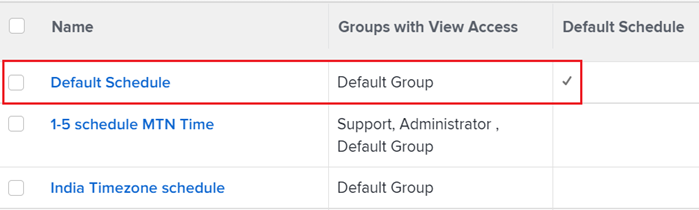

# Schedules overview

<!-- Audited: 1/2024 -->

You can define your work week using schedules and associate a schedule with a user or a project. This allows [!DNL Adobe Workfront] to calculate timelines and user availability. For instructions, see [Create a schedule](../../../administration-and-setup/set-up-workfront/configure-timesheets-schedules/create-schedules.md).

Consider the following when working with schedules in Workfront:

* The [!DNL Workfront] administrator identifies the hours of operation for the organization in a schedule.

   Similarly, a group administrator can identify the hours of operation of a schedule administered by a group they manage. For more information about group administrators, see [Group administrators](../../../administration-and-setup/manage-groups/group-roles/group-administrators.md).

   For example, a schedule can be defined as: Monday through Friday, 8 AM to 5 PM, with an hour break for lunch.

* [!DNL Workfront] uses the schedule to determine when the work day starts and ends.

   This does not prevent a user from working on or completing work in [!DNL Workfront] outside normal business hours. Generally, it's not necessary to create a new schedule or a schedule exception to focus on work planned in the evening.

   Likewise, your organization may have flexible arrival times for your work day. You may have a set of employees that arrives at 8 AM and another set that arrives at 9 AM. It is not necessary to create unique schedules for each group, if the groups have similar or identical schedules. But if the groups have drastically different schedules, their users should be associated with unique schedules. An employee understands if an assignment is due to complete at 5 PM it means the work must be done by the end of the business day, regardless of the time they come in to work.

* We recommend that you create separate schedules for each time zone associated with the organization.

   You can assign a specific time zone for each schedule to ensure work is scheduled appropriately for users that work in different time zones.

* The [!DNL Workfront] Default Schedule is used in timeline calculations when users or projects are not associated with a schedule.

   The Default Schedule comes with your [!DNL Workfront] system and cannot be deleted unless it's replaced with a new schedule you create.

* In addition to calculating timelines, [!DNL Workfront] uses schedules to calculate user availability.

   >[!IMPORTANT]
   >
   >[!DNL Workfront] uses either the user or the project schedule to determine resource availability in the Resource Planner. Which schedule is used depends on what the [!DNL Workfront] administrator selected for the [!UICONTROL Calculate Resource Availability Using] setting. For information about Resource Management settings, see [Configure Resource Management preferences](../../../administration-and-setup/set-up-workfront/configure-system-defaults/configure-resource-mgmt-preferences.md).

## Hierarchy of schedules

If a task is assigned to a user who is associated with a schedule, and resides on a project which is associated with a second schedule, you have at least 2 schedules that could potentially be applied to your timeline calculations.

>[!IMPORTANT]
>
>[!DNL Workfront] uses the schedule of a user only when the [!UICONTROL Calculate Resource Availability Using] setting is set to [!UICONTROL The User's Schedule] in the [!UICONTROL Resource Management] area of [!UICONTROL Setup]. For information about how the [!UICONTROL Calculate Resource Availability Using] setting affects which schedule is used for Resource Management, see [Configure Resource Management preferences](../../../administration-and-setup/set-up-workfront/configure-system-defaults/configure-resource-mgmt-preferences.md).

The order in which the schedules are used by the system when more than one exists is:

* When a user is assigned to a task, [!DNL Workfront] uses the user's schedule for calculating the timeline of the task. This also includes the personal time of the user. The schedule of the project is ignored.

   For more information about personal time, see [Configure personal time off](../../../workfront-basics/manage-your-account-and-profile/configuring-your-user-profile/personal-time-overview.md).

* When multiple users are assigned to a task, and the users have different schedules during the time frame of the task, [!DNL Workfront] uses either one of the following schedules, as defined in the [!UICONTROL Project Preferences] area of [!UICONTROL Setup]:

   * The schedule of the user who is designated as the Primary Assignee
   * The schedule associated with the project.

      For more information about project preferences, see [Configure system-wide project preferences](../../../administration-and-setup/set-up-workfront/configure-system-defaults/set-project-preferences.md).

* If the user assigned to the task has no schedule, or the task is assigned only to a job role, a team, or is unassigned, [!DNL Workfront] uses the project schedule for the timeline calculations.
* If the user assigned to the task has no schedule, or the task is assigned only to a job role, a team, or is unassigned, and the project has no schedule, then [!DNL Workfront] uses the schedule in the system designated as the Default Schedule for timeline calculations.

   

## Collaboration in [!DNL Workfront] across time zones

For information about using schedules to help users collaborate in [!DNL Workfront] across time zones, see [Working across time zones](../../../workfront-basics/tips-tricks-and-troubleshooting/working-across-timezones.md).
