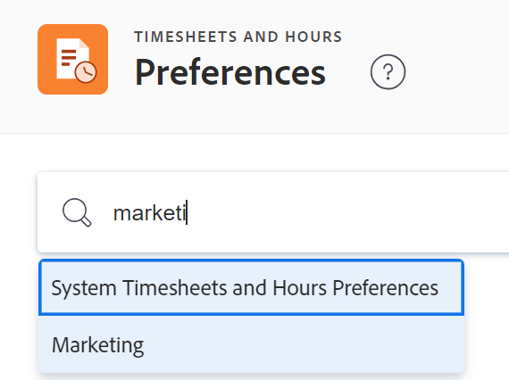

# Configure timesheet and hour preferences

<!--Audited: 01/2024-->

<!--DON'T DELETE, DRAFT OR HIDE THIS ARTICLE. IT IS LINKED TO THE PRODUCT, THROUGH THE CONTEXT SENSITIVE HELP LINKS.-->

As an [!DNL Adobe Workfront] administrator, you can specify preferences for timesheets and hours in [!DNL Workfront] in order to define what items the timesheets can pre-populate with and what items users can log time to.

>[!IMPORTANT]
>
>In addition to the items that pre-populate a timesheet according to the conditions described in this article, the following items also display on timesheets, by default:
>
>* Items for which you logged time during the time frame of the timesheet
>* Items that are pinned to the timesheet
>* Items that you search for and manually add to the timesheet. Manually added items are pinned, by default. 
>
>For more information, see [Log time](../../../timesheets/create-and-manage-timesheets/log-time.md) and [Timesheet overview](/help/quicksilver/timesheets/timesheets/timesheets-overview.md). 

Any changes you make to timesheets impact all timesheets that are created in the future.

## Access requirements

+++ Expand to view access requirements for the functionality in this article.

You must have the following access to perform the steps in this article:

<table style="table-layout:auto"> 
 <col> 
 <col> 
 <tbody> 
  <tr> 
   <td role="rowheader">[!DNL Adobe Workfront] plan</td> 
   <td>Any</td> 
  </tr> 
  <tr> 
   <td role="rowheader">[!DNL Adobe Workfront] license</td> 
   <td>
Current:[!UICONTROL Plan]

   Or
   
New: Standard

   </td> 
  </tr> 
  <tr> 
   <td role="rowheader">Access level configurations</td> 
   <td>[!UICONTROL System Administrator]</td>
</tr> 
 </tbody> 
</table>

For more detail about the information in this table, see [Access requirements in Workfront documentation](/help/quicksilver/administration-and-setup/add-users/access-levels-and-object-permissions/access-level-requirements-in-documentation.md).

+++

## Set timesheet and hour preferences

{{step-1-to-setup}}

1. Click **[!UICONTROL Timesheet & Hours]** > **[!UICONTROL Preferences]**.

   The Timesheets and Hours Preferences page displays.

1. (Optional) In the **System Timesheets and Hours Preferences** search box, start typing the name of a group, then select it when it displays in the list. 

   

   The Timesheet and Hours Preferences page updates with the preferences for the group you selected. System-level preferences must be unlocked to be able to modify group-level preferences. For more information, see the section [Unlock timesheet and hour preferences for groups](#unlock-timesheet-and-hour-preferences-for-groups) in this article. 

1. In the **[!UICONTROL General preferences]** section, configure any of the following options:

   <table style="table-layout:auto"> 
    <col> 
    <col> 
    <tbody> 
     <tr> 
      <td role="rowheader">[!UICONTROL Log time for future dates]</td> 
      <td> 
Allows users to log time for future dates throughout the system in:
 
       <ul> 
        <li>Any projects, tasks, and issues where they have access to log time</li> 
        <li>Their timesheets as General Time</li> 
       </ul> 
This is useful when users plan to be away from the office and want to log that time beforehand.
 
<b>NOTE</b>:
 
       
You cannot prevent users from logging time on tasks or issues that are closed or canceled. You can only prevent users from logging time on complete or dead projects. We recommend that you use filters in lists of tasks and issues to exclude the ones that have been completed or canceled from being visible to users.
 </td> 
     </tr>

   <tr> 
      <td role="rowheader">[!UICONTROL Assign Job Roles to hour entries manually]</td> 
      <td> 
Allow users to manually select any Job Role assigned in their user profile or assigned to the object.
 
<b>IMPORTANT</b>:  
        <ul> 
         <li>If you disable this setting after assigning job roles to hour entries, users must adjust hours logged under various roles on the [!UICONTROL Hours] tab of the project, task, or issue.</li> 
         <li>If the user does not have a job role assigned in their profile and there is a task assigned as the [!UICONTROL Task Owner] in the [!UICONTROL Advanced Assignments] dialog box, that job role appears when the user logs time on the task.</li> 
        </ul> 
 </td> 
     </tr> 
     <tr data-mc-conditions=""> 
      <td role="rowheader">[!UICONTROL Restrict timesheet editing to owners and administrators]</td> 
      <td> 
Restrict editing to timesheet owners and [!DNL Workfront] administrators. When this option is disabled, timesheets can also be edited by:
 
       <ul> 
        <li> 
Users with administrative access to timesheets and hours in their access level
 </li> 
        <li> 
Timesheet approvers if "Can edit hours" is enabled on the timesheet
 </li> 
        <li> 
The manager of the timesheet owner
 </li> 
       </ul> </td> 
     </tr> 
     <tr data-mc-conditions=""> 
      <td role="rowheader">[!UICONTROL Restrict hour editing to owners and administrators]</td> 
      <td>Restrict editing to the user who input the hours and [!DNL Workfront] administrators. This setting applies to the [!UICONTROL Hours] tab in a project or in an Hours report.</td> 
     </tr> 
    </tbody> 
   </table>

1. In the **[!UICONTROL Where users can log time]** section, configure any of the following options:

   <table style="table-layout:auto">
    <tr>
        <td>[!UICONTROL Directly on projects]</td>
        <td>Allows users to log time on the project (both on the [!UICONTROL Updates] tab and timesheet). If users do not record time at the project level, this options should remain unchecked.</td>
    </tr>
    <tr>
        <td>[!UICONTROL On projects that are complete]</td>
        <td>Allows users to record time on a project that has been marked complete. If this option is disabled, users cannot record time for the work they have completed on projects in the [!UICONTROL Complete] status.</td>
    </tr>
    <tr>
        <td>[!UICONTROL On projects that are dead]</td>
        <td>When this option is enabled, users can log hours on projects with a [!UICONTROL Dead] status.</td>
    </tr>
   </table>

1. In the **[!UICONTROL Pre-populate timesheets]** section, configure any of the following options:

   <table style="table-layout:auto"> 
    <col> 
    <col> 
    <tbody> 
     <tr> 
      <td role="rowheader">[!UICONTROL Work that is within] &lt;number of weeks> [!UICONTROL of the timesheet's work range]</td> 
      <td> 
Defines the number of weeks before and after the date range of the timesheet that contains dates of tasks and issues assigned to the user.
 
      
The default setting is 1 week, and you can extend this range to 4 weeks.
 
      
This means that the timesheet is pre-populated with tasks and issues which have dates anywhere between four weeks before the date range of the timesheet up to four weeks after the date range of the timesheet, if you select 4 weeks for your range. 
 </td> 
     </tr> 
     <tr> 
      <td role="rowheader">[!UICONTROL Tasks and issues that have been completed]</td> 
      <td>If multiple resources are typically assigned to a single task, we recommend this setting. This means when one resource records time against the task and marks it as complete, the other resources assigned to the task can still find the task or the issue in their timesheet, to record their hours.</td> 
     </tr> 
     <tr> 
      <td role="rowheader">[!UICONTROL Tasks and issues that have Planned Dates in timesheet's date range]</td> 
      <td> 
When selected, the timesheet includes tasks and issues that have either a Planned Start Date or Completion Date that falls within the date range of the timesheet.
 </td> 
     </tr> 
     <tr> 
      <td role="rowheader"> [!UICONTROL Tasks that have Projected Dates in timesheet's date range]</td> 
      <td> 
When selected, the timesheet includes tasks that have either a Projected Start Date or Completion Date that falls within the time frame of the project, even if the planned date of the issue or task falls outside of the timesheet date range.
 </td> 
     </tr> 
    </tbody> 
   </table>

1. In the **[!UICONTROL Deleted projects, tasks, and issues]** section, specify the following:

   <table style="table-layout:auto"> 
    <col> 
    <col> 
    <tbody> 
     <tr> 
      <td role="rowheader"> When deleting projects</td> 
      <td> 
       <ul> 
        <li><strong>[!UICONTROL Keep logged time already added to timesheets as general time]</strong>: If this project is restored at a later time, the time remains on the timesheet.</li> 
        <li><strong>[!UICONTROL Delete any logged time]</strong>: If this project is later restored, time already logged is restored to the project.</li> 
       </ul> </td> 
     </tr> 
     <tr> 
      <td role="rowheader">When deleting tasks or issues</td> 
      <td> 
       <ul> 
        <li><strong>[!UICONTROL Move any logged time to the project]</strong> where the task or issue resides: If this task or issue is later restored, the time remains on the project. </li> 
        <li> 
<strong>[!UICONTROL Delete any logged time]</strong>: If this task or issue is later restored, logged time is restored to the task or issue.
 
For more detailed information about these options, see <a href="../../../administration-and-setup/manage-workfront/manage-deleted-items/configure-how-hours-affected-when-obj-deleted-restored.md" class="MCXref xref">[!UICONTROL Configure affect] on hours when an object is deleted and restored</a>.
 </li> 
       </ul> </td> 
     </tr> 
    </tbody> 
   </table>

1. Click **[!UICONTROL Save]**.

## Unlock timesheet and hour preferences for groups

Groups in your organization might need timesheets or hour preferences configured differently for their unique workflows. You can unlock the preferences for all groups throughout the organization so that they can configure it on their own.

When a preference is unlocked and a group administrator modifies it, it affects timesheet owners if the group is their Home Group.

For information about how a group administrator configures timesheet and hour preferences for a group, see [Configure timesheet and hour preferences for a group](../../../administration-and-setup/manage-groups/create-and-manage-groups/configure-timesheet-hour-preferences-group.md).

>[!NOTE]
>
>After a [!DNL Workfront] administrator unlocks a preference at the system level, any group administrator can configure it and then lock it to ensure that everyone in their group and the subgroups below is using the same configuration. This is parallel to the ability that a [!DNL Workfront] administrator has to configure and lock a preference for everyone in the system. For more information, see [Lock or unlock a group timesheet and hour preference](../../../administration-and-setup/manage-groups/create-and-manage-groups/lock-or-unlock-a-group-timesheet-hour-preference.md).

To unlock a project preference so that groups can configure it:

{{step-1-to-setup}}

1. In the left panel, click **[!UICONTROL Timesheets & Hours]**, then click **[!UICONTROL Preferences]**.

1. Do any of the following:

   * If you want group administrators to be able to configure a preference for their groups, click the **unlock** toggle  to unlock it .
   * If you want all groups to use your configuration for a preference, make sure that it is the toggle is locked  (this is the default).

      >[!IMPORTANT]
      >
      >We recommend that you communicate with the administrators and users in groups throughout the system to ensure that all needs are accounted for in the way you configure a locked preference.
      >
      >When you lock it, your configuration for it is inherited by all groups in the system. And if the preference has been unlocked for any period of time, your configuration replaces those that group administrators might have made.

1. Click **[!UICONTROL Save]**.
