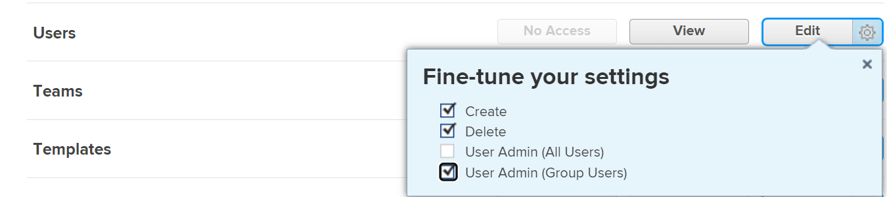
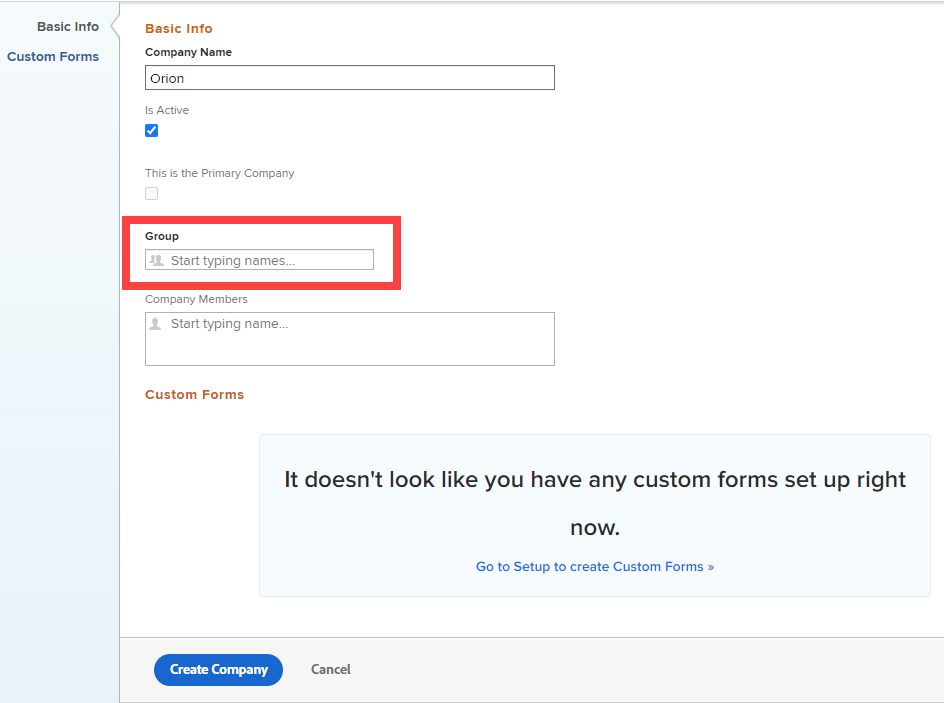

# Create and edit companies

<!--Audited: 01/2024-->

<!--DON'T DELETE, DRAFT OR HIDE THIS ARTICLE. IT IS LINKED TO THE PRODUCT, THROUGH THE CONTEXT SENSITIVE HELP LINKS.-->

A company is an organizational unit in [!DNL Adobe Workfront] that can represent your organization, a department within the organization, or a client you work with. You can add companies to [!DNL Workfront] and use them for financial planning, reporting purposes, to define permissions around objects, and to keep information confidential.

## Access requirements

+++ Expand to view access requirements for the functionality in this article.

You must have the following in order to manage companies in [!DNL Workfront]:

<table style="table-layout:auto"> 
 <col data-mc-conditions=""> 
 <col data-mc-conditions=""> 
 <tbody> 
  <tr> 
   <td role="rowheader"> 
[!DNL Workfront] plan
 </td> 
   <td>Any</td> 
  </tr> 
  <tr> 
   <td role="rowheader"> 
[!DNL Adobe Workfront] license*
 </td> 
   <td>
Current: [!UICONTROL Plan]

   Or
   
New: [!UICONTROL Standard]

   </td> 
  </tr> 
  <tr data-mc-conditions=""> 
   <td role="rowheader">Access level configuration</td> 
   <td> 
One of the following:
 
    <ul> 
     <li> 
The [!UICONTROL System Administrator] access level, which allows you to edit any company in the system. For more information, see <a href="../../../administration-and-setup/add-users/configure-and-grant-access/grant-a-user-full-administrative-access.md">Grant a user full administrative access</a>. 
 </li> 
     <li> 
Administrative access to manage companies, which allows you to edit any company in the system. For more information, see <a href="../../../administration-and-setup/add-users/configure-and-grant-access/grant-users-admin-access-certain-areas.md">Grant users administrative access to certain areas</a>.
 </li> 
    </ul> 
<b>NOTE</b>:  
     <ul> 
      <li> 
You can also manage companies associated with any group where you are assigned as a group administrator.
 </li> 
      <li> 
In order to add to and remove users from the [!DNL Workfront] system, you must have one of the following:
 
       <ul> 
        <li> 
The [!UICONTROL System Administrator] access level. For more information, see <a href="../../../administration-and-setup/add-users/configure-and-grant-access/grant-a-user-full-administrative-access.md" class="MCXref xref">Grant a user full administrative access</a>. 
 </li> 
        <li> 
In your access level, [!UICONTROL Edit] must be selected for the [!UICONTROL Users] setting. Also, for the [!UICONTROL Users] setting, under [!UICONTROL Fine-tune your settings] , the [!UICONTROL Create] option and at least one of the two [!UICONTROL User Admin] options must be enabled. 
 
  
 
If you are using the [!UICONTROL User Admin (Group Users)] option, you must be a group administrator of a group where the user is a member.
 </li> 
       </ul> 
For information about the Users setting in an access level, see <a href="../../../administration-and-setup/add-users/configure-and-grant-access/grant-access-other-users.md" class="MCXref xref">Grant access to users</a>.
 </li> 
     </ul> 
 </td> 
  </tr> 
 </tbody> 
</table>

&#42;To find out what plan, license type, or access level configurations you have, contact your [!DNL Workfront] administrator. For more information, see [Access requirements in Workfront documentation](/help/quicksilver/administration-and-setup/add-users/access-levels-and-object-permissions/access-level-requirements-in-documentation.md).

+++

## Benefits of adding users to a company {#benefits-of-adding-users-to-a-company}

* You can build a company's organization chart by associating users with direct reports. Only users from the same company can be added as direct reports of another user from that company.
* As a project manager, you can identify available resources within the same company.
* You can keep information private between companies by choosing one or all of the following settings:

   * Users from the same company can see each others' requests.

      For more information about how a [!DNL Workfront] administrator can give similar access to requests based on users' company, see the section [Configure task and issues preferences for everyone in [!DNL Workfront]](../../../administration-and-setup/set-up-workfront/configure-system-defaults/set-task-issue-preferences.md#changing-task-and-issue-preferences) in the article [Configure system-wide task and issue preferences](../../../administration-and-setup/set-up-workfront/configure-system-defaults/set-task-issue-preferences.md).

      For more information about how a group administrator can give similar access to requests based on users' company, see [Configure task and issue preferences for a group](../../../administration-and-setup/manage-groups/create-and-manage-groups/configure-task-issue-preferences-group.md).

   * Users can see only request queues that are associated with their companies. For more information about restricting visibility of a request queue, see [Provide access to request queues](../../../manage-work/requests/create-and-manage-request-queues/provide-access-to-request-queues.md).
   * You can restrict users to only see users in their company or their company and the primary company. For information about the primary company functionality regarding user privacy, see [Create or modify custom access levels](../../../administration-and-setup/add-users/configure-and-grant-access/create-modify-access-levels.md).
   * Users can restrict updates they make on items to be visible by their company users only. For more information about making an update private to a company, see [Update work](../../../workfront-basics/updating-work-items-and-viewing-updates/update-work.md).

## Create or edit a company in [!DNL Workfront] {#create-or-edit-a-company-in-workfront}

There is no limit to the number of companies you can add. However, we recommend that limit the number of companies you use because of problems that can occur with object permissions—too much fragmentation might interfere with users' visibility to work items.

By default, the company associated with your instance of [!DNL Workfront] is already created in your [!DNL Workfront] system and is the Primary Company for your organization. It has the same name as your customer name. For more information about your customer information in [!DNL Workfront], see [Configure basic information for your system](../../../administration-and-setup/get-started-wf-administration/configure-basic-info.md).

To add or edit a company:

{#step-1-to-setup}

1. Click **[!UICONTROL Companies]**.

   A list of companies displays. 
1. If you are adding a company, click **[!UICONTROL New Company]**.

   Or

   If you are editing an existing company, select the company, then click **[!UICONTROL Edit]** at the top of the company list.

1. Update the following information:

   <table style="table-layout:auto"> 
    <col> 
    <col> 
    <tbody> 
     <tr> 
      <td role="rowheader">[!UICONTROL Basic Info] section</td> 
      <td> 
       <ul> 
        <li> 
<b>[!UICONTROL Company Name]</b>: Type a name for the company.
 </li> 
        <li> 
<b>[!UICONTROL Is Active]</b>: When this option is enabled, users can find the company and attach it to projects that they create and edit. An inactive company cannot be attached to projects. This option is enabled by default.
 </li> 
        <li> 
<b>[!UICONTROL This is the Primary Company]</b>: Assigns the company as your organization's primary company. The primary company typically represents your [!DNL Workfront] account where most of your users work.
 
You can have one company or no company designated as a primary company, but you cannot have multiple companies designated as primary companies. For more information, see <a href="../../../administration-and-setup/add-users/configure-and-grant-access/create-modify-access-levels.md" class="MCXref xref">Create or modify custom access levels</a>.
 
<b>NOTE</b>: By modifying their access levels, you can restrict users to see other users: only in their primary company, or in their associated company and the primary company. For information about how the primary company works with users' access levels, see <a href="../../../administration-and-setup/add-users/configure-and-grant-access/create-modify-access-levels.md" class="MCXref xref">Create or modify custom access levels</a>.
 </li> 
        <li> 
<b>[!UICONTROL Group]</b>: If there is a group that conducts business with the company, you can add the name of the group here. This is useful for group administrators who need to report on and manage all the companies that their groups do business with.
 
<b>IMPORTANT</b>: If you don't associate the group that will be working with this company, administrators for the group can't access the company unless they have administrative access to companies in their access level. For information about how this access is granted, see <a href="../../../administration-and-setup/add-users/configure-and-grant-access/grant-users-admin-access-certain-areas.md" class="MCXref xref">Grant users administrative access to certain areas</a>.
 
Start typing the name of the group, then press <strong>[!UICONTROL Enter]</strong> when it appears.
 
When you assign a group to a company, the group administrators for the group gain [!UICONTROL Manage] access to the company. For more information, see <a href="#group-administrators-and-companies" class="MCXref xref">Group administrators and companies</a> in this article.
 </li> 
        <li> 
<b>[!UICONTROL Company Members]</b>: Add existing users to the company. By doing this, you are associating these users with this company.
 
There is no limit to how many users you associate with one company, but a user cannot be associated with more than one company.
 </li> 
       </ul> </td> 
     </tr>
     <tr> 
      <td role="rowheader">[!UICONTROL Custom Forms] section</td> 
      <td> 
If there are fields that you want to add to your company that are not available in [!DNL Workfront], you can build a custom form and associate it with your company. 
 
You can attach this form to your company by selecting it from the drop-down menu. Only active custom forms are listed in the menu.
 
<strong>Note:</strong> Advanced custom form features such as External Lookup fields and Workfront native fields are only available when you open the company record on the details page, not on the Edit Company dialog. (From the list of companies, click the company name to open the details.)
 
 For information about creating custom forms, see <a href="/help/quicksilver/administration-and-setup/customize-workfront/create-manage-custom-forms/form-designer/design-a-form/design-a-form.md">Design a form with the form designer</a>. 
 </td>
     </tr> 
    </tbody> 
   </table>

1. (Conditional) If you are creating a company, click **[!UICONTROL Create Company]**.

   Or

   If you are editing an existing company, click **[!UICONTROL Save Changes]**.

## Manage company memberships

For information about managing memberships for an existing company, see [Manage company memberships](../../../administration-and-setup/set-up-workfront/organizational-setup/manage-company-memberships.md).

## Manage billing rates

For information about overriding billing rates at the company level, see [Override job role billing rates at the company level](/help/quicksilver/administration-and-setup/set-up-workfront/organizational-setup/override-job-role-billing-rates-company-level.md).

## Overview of sharing objects with companies

Certain permissions are available to users who are associated with a company, as explained in the section [Benefits of adding users to a company](#benefits-of-adding-users-to-a-company). In addition to these permissions, you can allow users permissions to view, contribute, or edit objects in [!DNL Workfront] by sharing the object with their company.

Rather than sharing an object with one individual user at a time, you can share it with their entire company. Each user in the company has the same permissions on that object.

For more information about sharing objects, see [Overview of sharing permissions on objects](../../../workfront-basics/grant-and-request-access-to-objects/sharing-permissions-on-objects-overview.md).

## Group administrators and companies {#group-administrators-and-companies}

When a [!DNL Workfront] administrator assigns a group to a company, the group administrators for the group gain [!UICONTROL Manage] access to the company in [!UICONTROL Setup]. This includes access to the [!UICONTROL Companies] page in [!UICONTROL Setup], where they can see and manage the company associated with their group.

With this access to the [!UICONTROL Companies] page, a group administrator can assign a group to a company, but it must be a company that the group administrator created. If the group administrator's access level is not configured with administrative access to companies, the [!UICONTROL Group] field is required when the group administrator creates the company—its bolded title indicates this:

For information about how users gain administrative access to companies in their access level, see [Grant users administrative access to certain areas](../../../administration-and-setup/add-users/configure-and-grant-access/grant-users-admin-access-certain-areas.md).

For information about managing a company in the [!UICONTROL Setup] area, see [Create or edit a company in [!DNL Workfront]](#create-or-edit-a-company-in-workfront) in this article.
