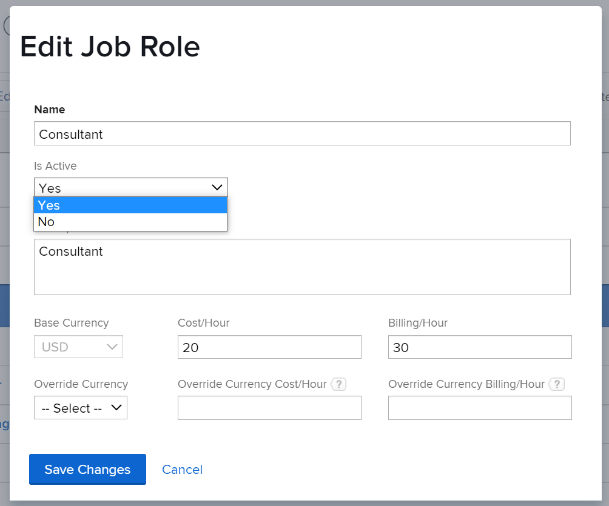

# Deactivate job roles

As an [!DNL Adobe Workfront] administrator or a user with administrative access to Job Roles, you can deactivate job roles that become obsolete in your system. When you deactivate a job role instead of deleting it, you can keep any historical information that is associated with it.

You can also reactivate job roles that have previously been deactivated.

## Access requirements

You must have the following:

<table style="table-layout:auto"> 
 <col> 
 <col> 
 <tbody> 
  <tr> 
   <td role="rowheader">[!UICONTROL Adobe Workfront] plan*</td> 
   <td> 
Any 
 </td> 
  </tr> 
  <tr> 
   <td role="rowheader">[!UICONTROL Adobe Workfront] license*</td> 
   <td>[!UICONTROL Plan]</td> 
  </tr> 
  <tr> 
   <td role="rowheader">Access level configurations*</td> 
   <td> 
Administrative access to Job roles
 
<b>NOTE</b>: If you still don't have access, ask your [!DNL Workfront] administrator if they set additional restrictions in your access level. For information on how a [!DNL Workfront] administrator can modify your access level, see <a href="../../../administration-and-setup/add-users/configure-and-grant-access/create-modify-access-levels.md" class="MCXref xref">Create or modify custom access levels</a>.
 </td> 
  </tr> 
 </tbody> 
</table>

&#42;To find out what plan, license type, or access you have, contact your [!DNL Workfront] administrator.

## The impact of deactivating job roles

If you deactivate a job role, it no longer displays in the following areas:

* The [!UICONTROL Assignments] typeahead field (for tasks, template tasks, issues, approvals, and routing rules)
* The [!UICONTROL Assignments] fields in lists and reports
* User profiles

   >[!NOTE]
   >
   >When you add a new role to a user, a deactivated job role doesn't display. But it does continue to display in the [!UICONTROL Primary Role] and [!UICONTROL Other Roles] fields if the user was associated with the job role before it was deactivated.

* The [!UICONTROL Sharing] dialog box for objects, including layout template assignment
* Typeahead fields in custom forms
* The [!UICONTROL Pool Members] field in [!UICONTROL Resource Pools]
* The [!UICONTROL Job Role] field of a [!UICONTROL Billing Rate] edit screen when a user is overriding billing rates for projects
* The [!UICONTROL Add assignment to Kanban board] dialog box in a project
* The [!UICONTROL Job Role] field of a plan or an initiative when someone is using the [!DNL Adobe Workfront Scenario Planner].

   The [!DNL Scenario Planner] is available only in the new [!DNL Adobe Workfront] experience and requires an additional license. For information about the [!DNL Workfront Scenario Planner], see [The [!DNL Scenario Planner] overview](../../../scenario-planner/scenario-planner-overview.md).

>[!TIP]
>
>Deactivated roles always display in filters in lists, reports, and other tools such as the [!IUCONTROL Workload Balancer].

## Considerations before deactivating a job role

It is better to deactivate rather than delete job roles that become obsolete so that you can keep all the historical information associated with roles you may have used in the past.

>[!NOTE]
>
>Any work assigned to the job role prior to deactivation remains assigned.

We recommend that you do the following before deactivating an unused job role:

* Build reports for any objects that are assigned to the role you plan to deactivate and reassign them to an active job role. For information about building reports, see [Create a report](../../../reports-and-dashboards/reports/creating-and-managing-reports/create-report.md).

   >[!TIP]
   >
   >You can create a report to filter for any tasks or issues where the deactivated role is assigned. Then use the report to reassign outstanding tasks or issues to an active role.

* Take an inventory of all approval processes, current approval paths, and routing rules or other objects that are assigned to the job role you plan to deactivate and reassign them to an active role.

   >[!TIP]
   >
   >When using request queues, if you deactivate a job role assigned as the default assignee in a routing rule, the role remains and requests are still routed to the deactivated role. We recommend updating routing rules with active roles before you deactivate the team.

   For information about creating approval processes and routing rules, see the following articles:

   * [Create an approval process for work items](../../../administration-and-setup/customize-workfront/configure-approval-milestone-processes/create-approval-processes.md)
   * [Create Routing Rules](../../../manage-work/requests/create-and-manage-request-queues/create-routing-rules.md)

## Deactivate a job role

1. Click the **[!UICONTROL Main Menu]** icon  in the upper-right corner of [!DNL Adobe Workfront], then click **[!UICONTROL Setup]** .

1. In the left panel, click&#x200B; **[!UICONTROL Job Roles].**
1. (Optional) In the **[!UICONTROL Filter]** drop-down menu, select **[!UICONTROL Active]** to display only active job roles.
1. Click the name of the job role that you want to deactivate.
1. In the **[!UICONTROL Is Active]** drop-down menu, select **[!UICONTROL No]**.

   

1. Click **[!UICONTROL Save Changes]**.

   The job role is deactivated and can no longer be assigned to work, associated with layout templates, and so on. For information about all uses of job roles in [!DNL Workfront], see [Job role overview](../../../administration-and-setup/set-up-workfront/organizational-setup/job-role-overview.md).
