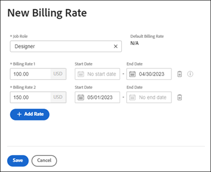

# Override job role billing rates at the company level

{{highlighted-preview}}

When a job role is created, you have the option to select an hourly billing rate for that role. You can create multiple hourly billing rates that are specific to a company. Each billing rate is effective for a specific date range.

At the project level, you can enable an option to allow company-level billing rates to override project-level rates. For more information, see [Override Project-Level Billing Rates with Company-Level Billing Rates](../../../manage-work/projects/project-finances/override-project-level-with-company-level-billing-rates.md).

## Access requirements

You must have the following:

<table style="table-layout:auto"> 
 <col> 
 <col> 
 <tbody> 
  <tr> 
   <td role="rowheader">[!DNL Adobe Workfront] plan*</td> 
   <td> 
Any 
 </td> 
  </tr> 
  <tr> 
   <td role="rowheader">[!DNL Adobe Workfront] license*</td> 
   <td>Plan</td> 
  </tr> 
  <tr> 
   <td role="rowheader">Access level configurations*</td> 
   <td> 
Administrative access to Companies if you are not a System Administrator
 
[!UICONTROL Edit] access to Financial Data
 
<b>NOTE</b>: If you still don't have access, ask your [!DNL Workfront] administrator if they set additional restrictions in your access level. For information on how a [!DNL Workfront] administrator can modify your access level, see <a href="../../../administration-and-setup/add-users/configure-and-grant-access/create-modify-access-levels.md" class="MCXref xref">Create or modify custom access levels</a>.
 </td> 
  </tr> 
 </tbody> 
</table>

&#42;To find out what plan, license type, or access you have, contact your [!DNL Workfront] administrator.

## Override or change an established billing rate used for a specific job role

1. Click the **[!UICONTROL Main Menu]** icon  in the upper-right corner of [!DNL Adobe] Workfront, then click **[!UICONTROL Setup]** .

1. Click **[!UICONTROL Companies]**.
1. Locate the company where the job role is assigned.
1. Click the company name in the list.
1. Click **[!UICONTROL Billing Rates]** in the left panel.
1. Click **[!UICONTROL Add Billing Rate] > [!UICONTROL New Billing Rate]**, or choose an existing rate to edit.
1. In the [!UICONTROL New Billing Rate] dialog, select a [!UICONTROL **Job Role**] to define the billing rate for.

   The [!UICONTROL **Default Billing Rate**] displays the system-level rate for this job role.

   

1. In the [!DNL **Billing Rates 1**] field, enter the billing rate. Then, click [!UICONTROL **Save**] to override the billing rate one time.

   Or

   Click [!UICONTROL **Add Rate**] to add more billing rates with effective dates.

1. (Conditional) If you are adding more than one billing rate, enter the following information:

   * **[!UICONTROL Billing Rates 1], 2, etc.**: The value of the billing rate for the time period.
   * **[!UICONTROL Start Date]**: The date when the rate becomes effective.
   * **[!UICONTROL End Date]**: The date when the rate ends.

     Billing Rate 1 will not have a start date and the last billing rate will not have an end date. Some dates are added automatically. For example, if Billing Rate 1 does not have an end date, and you add Billing Rate 2 with a start date of May 1, 2023, an end date of April 30, 2023 is added to Billing Rate 1 so that no gaps exist.

1. Click [!UICONTROL **Save**].

   >[!NOTE]
   >
   >Job role rates changed on the project will only impact only that project. Rates changed at the company level will impact all projects. For more information, see [Overview of overriding Job Role Billing Rates and calculating Revenue on a project](../../../manage-work/projects/project-finances/override-role-billing-rates-and-calculate-project-revenue.md).
