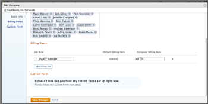

# Override job role billing rates at the company level

When a job role is created, you have the option to select an hourly billing rate for that role. You can create an hourly billing rate that is specific to a company.

At the project level, you can enable an option to allow company-level billing rates to override project-level rates. For more information, see [Override Project-Level Billing Rates with Company-Level Billing Rates](../../../manage-work/projects/project-finances/override-project-level-with-company-level-billing-rates.md).

## Access requirements

You must have the following:

<table> 
 <col> 
 <col> 
 <tbody> 
  <tr> 
   <td role="rowheader">Adobe Workfront plan*</td> 
   <td> 
Any 
 </td> 
  </tr> 
  <tr> 
   <td role="rowheader">Adobe Workfront license*</td> 
   <td> 
Plan 
 </td> 
  </tr> 
  <tr> 
   <td role="rowheader">Access level configurations*</td> 
   <td> 
Administrative access to Companies if you are not a System Administrator
 
Edit access to&nbsp;Financial&nbsp;Data
 
<b>Note<>: If you still don't have access, ask your Workfront administrator if they set additional restrictions in your access level. For information on how a Workfront administrator can modify your access level, see <a href="../../../administration-and-setup/add-users/configure-and-grant-access/create-modify-access-levels.md" class="MCXref xref">Create or modify custom access levels</a>.
 </td> 
  </tr> 
 </tbody> 
</table>

&#42;To find out what plan, license type, or access you have, contact your Workfront administrator.

## Override or change an established billing rate used for a specific job role

1. Click the **Main Menu** icon  in the upper-right corner of Adobe Workfront, then click **Setup** .

1. Click **Companies**.
1. Locate the company where the job role is assigned.
1. Click&nbsp;**Edit Company** in the upper-right corner.
1. In the **Billing Rates** section, select the job role you want to edit, and enter the new billing rate for that job role in the&nbsp;**Company Billing Rate** box.

   

   >[!NOTE]
   >
   >Job role rates changed&nbsp;on the project will only impact only that project. Rates changed at the company level will impact all projects. For more information, see [Overview of overriding Job Role Billing Rates and calculating Revenue on a project](../../../manage-work/projects/project-finances/override-role-billing-rates-and-calculate-project-revenue.md).

