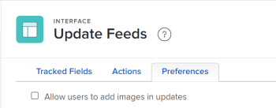

# Configure preferences for user updates

You can configure preferences that give users access to certain features when they are adding comments in an object's [!UICONTROL Updates] area.

## Access requirements

You must have the following access to perform the steps in this article:

<table style="table-layout:auto"> 
 <col> 
 <col> 
 <tbody> 
  <tr> 
   <td role="rowheader">[!DNL Adobe Workfront] plan</td> 
   <td>Any</td> 
  </tr> 
  <tr> 
   <td role="rowheader">[!DNL Adobe Workfront] license</td> 
   <td>[!UICONTROL Plan]</td> 
  </tr> 
  <tr> 
   <td role="rowheader">Access level configurations</td> 
   <td> 
To perform these steps at the system level, you need the [!UICONTROL System Administrator] access level.

To perform them for a group, you must be a manager of that group.
 
<b>NOTE</b>: If you still don't have access, ask your [!DNL Workfront] administrator if they set additional restrictions in your access level. For information on how a [!DNL Workfront] administrator can modify your access level, see <a href="../../../administration-and-setup/add-users/configure-and-grant-access/create-modify-access-levels.md" class="MCXref xref">Create or modify custom access levels</a>.
 </td> 
  </tr> 
 </tbody> 
</table>

## Access requirements

+++ Expand to view access requirements for the functionality in this article.

You must have the following access to perform the steps in this article:

<table style="table-layout:auto"> 
 <col> 
 <col> 
 <tbody> 
  <tr> 
   <td role="rowheader">[!DNL Adobe Workfront] plan</td> 
   <td>Any</td> 
  </tr> 
  <tr> 
   <td role="rowheader">[!DNL Adobe Workfront] license</td> 
   <td>
New: [!UICONTROL Standard]

   Or
   
Current: [!UICONTROL Plan]

   </td> 
  </tr>  
  <tr> 
   <td role="rowheader">Access level configurations</td> 
   <td>
To perform these steps at the system level, you need the [!UICONTROL System Administrator] access level.

To perform them for a group, you must be a manager of that group.
</td>
  </tr> 
 </tbody> 
</table>

For more detail about the information in this table, see [Access requirements in Workfront documentation](/help/quicksilver/administration-and-setup/add-users/access-levels-and-object-permissions/access-level-requirements-in-documentation.md).

+++

## Allow users to add images in updates

By default, users cannot add images in updates. When you enable this preference, users will be able to attach images in updates. The preference applies to all updates in all areas of your [!DNL Workfront] instance.

>[!NOTE]
>
>* Images saved in updates count toward the document storage limit. For information, see [Check document storage limits](../../../documents/managing-documents/check-document-storage.md).
>* Images are accessible through the [!UICONTROL Updates] tab on an object and are also available in the [!UICONTROL Documents] area under the [!UICONTROL Main Menu].
>

1. Click the **[!UICONTROL Main Menu]** icon  in the upper-right corner of [!DNL Adobe Workfront], then click **[!UICONTROL Setup]** .
1. In the left panel, select **[!UICONTROL Interface]** > **[!UICONTROL Update Feeds]**.
1. Select the **[!UICONTROL Preferences]** tab.

   

1. Select the **[!UICONTROL Allow users to add images in updates]** check box.
1. Select **[!UICONTROL Save]**.

   When this preference is enabled, you can disable it at any time. Any images already posted in updates will remain in the [!UICONTROL Updates] area on the object.
