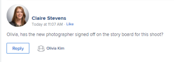
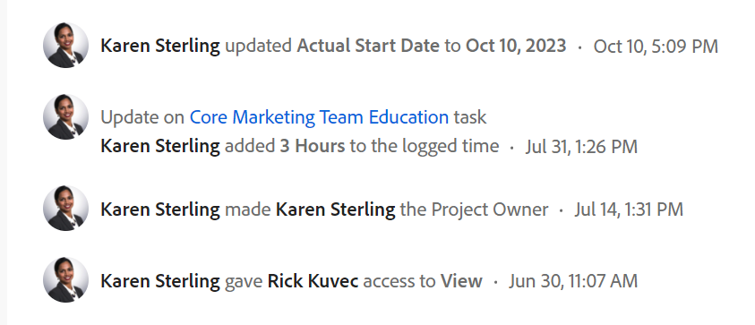

# System-tracked updates

<!-- Audited: April, 2024-->

<!--
The highlighted information on this page refers to functionality not yet generally available. It is available only in the Preview environment for all customers, or in the Production environment for customers who enabled fast releases.

For information about fast releases, see [Enable or disable fast releases for your organization](/help/quicksilver/administration-and-setup/set-up-workfront/configure-system-defaults/enable-fast-release-process.md).

For information about the current release, see [Second Quarter 2024 release overview](/help/quicksilver/product-announcements/product-releases/24-q2-release-activity/24-q2-release-overview.md).-->

[!DNL Adobe Workfront] captures the activity taking place on certain objects by logging status information in the object's [!UICONTROL Updates] section. 

For information about the Updates section, see [Updates section overview](/help/quicksilver/workfront-basics/updating-work-items-and-viewing-updates/updates-tab-overview.md). 

The [!UICONTROL Updates] area includes the following types of updates:

* **User updates:** Manually entered by users. Also referred to as comments, replies, and notes. User updates display in the Comments and the All tabs of the Updates section of an object. 

   For more information about configuring user updates, see [Configure preferences for user updates](../../../administration-and-setup/set-up-workfront/system-tracked-update-feeds/configure-preferences-user-updates.md).

   

* **System updates:** Automatically made by the system. A system update includes a brief note describing what kind of change happened to the item. System updates display in the System Activity and the All tabs of the Updates section of an object. 

   For more information about system update feeds and how to enable them, see [Configure system updates](../../../administration-and-setup/set-up-workfront/system-tracked-update-feeds/configure-system-updates.md). 

   

   <!--
  DRAFTED IN FLARE:
  Timestamps for system updates are based on your operating system's timezone.
  
  -->

## Considerations about system-tracked updates 

System-tracked updates are not available for all the objects that have the Updates area. 

* The [!UICONTROL Updates] area is available for the following objects: 

   * [!UICONTROL Project]
   * [!UICONTROL Task] 
   * [!UICONTROL Issue]
   * [!UICONTROL Portfolio]
   * [!UICONTROL Program]
   * [!UICONTROL User]
   * [!UICONTROL Template]
   * [!UICONTROL Template Task]
   * [!UICONTROL Team]
   * [!UICONTROL Document]
   * [!UICONTROL Timesheet]
   * [!UICONTROL Story] 
      
      In [!DNL Workfront], a story is a task. 
   * [!UICONTROL Iteration] 
   * [!UICONTROL Goal]

      You must have an additional license to have access to the [!UICONTROL Goals] area. For information, see [Requirements to use Workfront Goals](../../../workfront-goals/goal-management/access-needed-for-wf-goals.md). 
   * [!UICONTROL Card] on a board

      For more information on updates on cards, see [Use connected cards on boards](../../../agile/get-started-with-boards/connected-cards.md). 

* [!DNL Workfront] does not track system updates for the following objects:

   * [!UICONTROL Team]
   * [!UICONTROL Template]
   * [!UICONTROL Template Task]
   * Ad-hoc [!UICONTROL Card]
   * [!UICONTROL Iterations]

<!--hiding this bit because this is not true, at this time (August 2023). Users with a Work or Review license can see system updates by default as well.

Your [!DNL Workfront] license determines whether system updates display by default in the [!UICONTROL Updates] area of objects. [!DNL Workfront] users with a [!UICONTROL Plan] license have system updates displayed in the [!UICONTROL Updates] area by default. However, users can filter out system updates, as described in the [Enable or disable system updates](../../../workfront-basics/updating-work-items-and-viewing-updates/update-work.md#enable) section in [Update work](../../../workfront-basics/updating-work-items-and-viewing-updates/update-work.md). All other [!DNL Workfront] licenses filter system updates by default.
-->

* User updates display in the Comments tab and system updates display in the System Activity and the All tabs.  

   For a list of objects that do not have the System Activity or the All tabs, see [Update section overview](/help/quicksilver/workfront-basics/updating-work-items-and-viewing-updates/updates-tab-overview.md)

* You cannot add a reply to a system update. However, any replies made to system activity records in the legacy commenting experience prior to April 11, 2024, are populated on the System Activity tab as read-only.

<!--
* The following are differences between the new and the legacy commenting experience: 

   * When using the new commenting experience, user updates display in the Comments tab and system updates display in the System Activity and the All tabs.  

      For more information about the new commenting experience, see [New commenting experience](../../../product-announcements/betas/new-commenting-experience-beta/unified-commenting-experience.md).

      For a list of objects that do not have the System Activity or the All tabs, see [Update section overview](/help/quicksilver/workfront-basics/updating-work-items-and-viewing-updates/updates-tab-overview.md)

   * When using the new commenting experience, you cannot add a comment to a system update. However, any replies made to system activity records in the legacy commenting experience are populated on the System Activity tab as read-only in the new commenting experience.
   * When using the legacy commenting experience, the system and user updates display in one continuous feed. 

   * When using the legacy commenting experience, users can view system updates by default or they can choose to not display them. Disabling system updates is not possible when using the new commenting experience. 

      For information about disabling the display of system updates, see the section [Enable or disable system updates](../../../workfront-basics/updating-work-items-and-viewing-updates/update-work.md#enable) in the article [Update work](../../../workfront-basics/updating-work-items-and-viewing-updates/update-work.md).  

   * The legacy commenting experience has been disabled in the Preview environment. For more information, see [Second Quarter 2024 Update stream and notification enhancements](/help/quicksilver/product-announcements/product-releases/24-q2-release-activity/24-q2-update-stream-enhancements.md).
-->

* [!DNL Workfront] administrators can define what type of changes the system should track in the [!UICONTROL Updates] area. Not all objects that have an [!UICONTROL Updates] area also have configurable [!UICONTROL update] feeds. The following objects have an [!UICONTROL Updates] area that captures system-tracked update feeds, but do not have configurable update feeds:

   * [!UICONTROL Document]
   * [!UICONTROL Timesheet]
   * [!UICONTROL Iteration] 
   * [!UICONTROL Goal]
   
   
