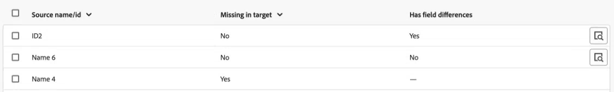

# Compare objects between environments

You can compare objects between environments to ensure that your environment promotion packages contain the objects that you need. 

You select the environments and types of objects to compare. Workfront compares all object of the selected types in both environment and presents data regarding the object differences.

## Generate an object comparison

1. Go to an environment that you want to compare an object in. 
1. Click the **[!UICONTROL Main Menu]** icon  in the upper-right corner of Adobe Workfront, or (if available), click the **[!UICONTROL Main Menu]** icon  in the upper-left corner, then click **[!UICONTROL Setup]** .
1. Select **System** in the left navigation, then select **Environment Promotion**.
1. Click **Compare environments** near the upper-right corner of the screen.
1. In the **Source environment** field, select the  environment that you want to create the package in. This is the environment that you are copying objects **from**.
1. In the **Target environment** field, select the environment where you want to install the package. This is the environment that you are copying objects **to**. 
1. In the **Objects to compare** area, select the object types that you want to compare between environments. 
1. Click **Generate comparison** near the upper-right corner of the screen.

   The comparison may take some time to generate, depending on the number and size of compared objects.

## View object comparison

After comparison generation is complete, the comparison displays.

The list includes objects of the selected type(s) that exist in the source environment, whether those object are missing in the target environment, and whether there are field differences between the two.

>[!BEGINSHADEBOX]

In this example:

* The first line shows an object that is present in the target environment, but is different from the source environment.
* The second line shows an object that is present in the target environment, and is the same as in the source environment.
* The third line shows an object that is not present in the target environment.

>[!ENDSHADEBOX]

## Create a package from an object comparison

You can create a package directly from an object comparison.

1. Create an object comparison, as described in [Generate an object comparison](#generate-an-object-comparison).
1. In the generated comparison, select the objects that you want to include in the package.
1. Click **Create package** in the upper-right corner of the screen.
1. Enter a name and description for the package.
1. Click **Create package** in the Create package window.

   The package is generated.
