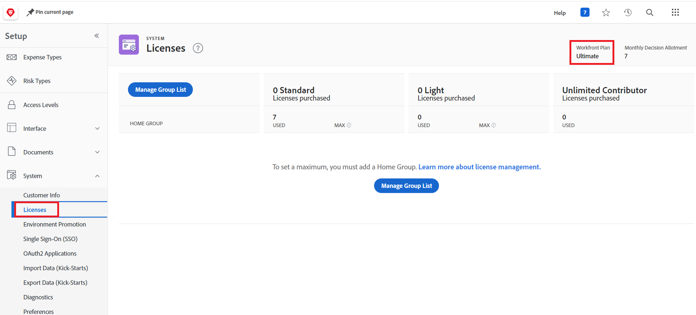

# Environment promotion FAQ

The following are frequently asked questioned about environment promotion:

## Is cross-domain promotion supported?

### Answer

Cross-domain environment promotion is not currently supported. You must promote between environments in the same domain.

## Is the Adobe Business Platform / IMS a prerequisite for environemnt promotion?

### Answer

No. Environment Promotion is available for both IMS-enabled and non-IMSWorkfront instances.

## How can we find out if our Workfront instance is on a Prime or Ultimate license?

### Answer

* A Workfront administrator can locate your organization's license.

   1. Click the **[!UICONTROL Main Menu]** icon  in the upper-right corner of Adobe Workfront, or (if available), click the **[!UICONTROL Main Menu]** icon  in the upper-left corner, then click **[!UICONTROL Setup]** .
   1. Click **System** in the left panel
   1. To view your Workfront plan, select **Licenses**.
      Your plan displays near the upper-right corner of the page.
      

   Or
* Contact your Workfront account representative.

## Is Environment Promotion bi-directional?

### Answer

Yes. For example, you can promote from Sandox to Production, or from Production to Sandbox.

## Is sharing supported?

### Answer

No, sharing is not currently supported.

## When might a rollback feature become available?

### Answer

Rollback is a top priority, and is currently in development. We expect to release rollback functionality in Q3 or Q4 2024.

## Will there be an option to skip promotion of individual components? Where the options `Use Existing`, `Overwrite`, and `Save with a new Name`" exist, can `Skip` be added so you can skip promotion of individual parameters?

### Answer

* "Use existing" is the same as "skipping" or ignoring the deployment, because it maps to the existing object in the target environment, and does not make any changes.
* To skip objects, we recommend removing
any objects that you don't want to install from the promotion package, or from the source environment directly. After removing the objects, reassemble the package.
