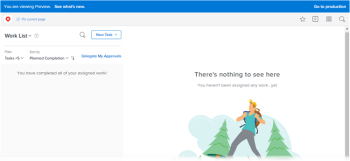

# The [!DNL Adobe Workfront] Preview Sandbox Environment

There are two testing environments for [!DNL Workfront] that are replicas of your [!DNL Workfront] production environment:

* The Preview Sandbox

   The Preview Sandbox is a testing environment that serves as a replica of your live environment and is refreshed each weekend by [!DNL Workfront]. Data added to your live environment on Friday appears in your Preview Sandbox by the following Monday.

   All support packages have access to the Preview Sandbox.

* The Custom Refresh Sandbox

   The Custom Refresh Sandbox is a separate testing environment which is refreshed manually by you. There is an additional cost to obtain the Custom Refresh Sandbox. For more information about this environment, see [The [!DNL Adobe Workfront] Custom Refresh Sandbox environment](../../../administration-and-setup/set-up-workfront/workfront-testing-environments/wf-custom-refresh-sandbox-environment.md).

<table style="table-layout:auto"> 
 <col> 
 <col> 
 <col> 
 <thead> 
  <tr> 
   <th> 
 
 </th> 
   <th> 
<strong>[!UICONTROL Standard] Support Package</strong> 
 </th> 
   <th> 
<strong>[!UICONTROL Plus], [!UICONTROL Preferred], and [!UICONTROL Enterprise] Support Packages</strong> 
 </th> 
  </tr> 
 </thead> 
 <tbody> 
  <tr> 
   <td scope="col"> 
Preview Sandbox
 </td> 
   <td scope="col"> 
✔
 </td> 
   <td scope="col"> 
✔
 </td> 
  </tr> 
  <tr> 
   <td scope="col"> 
Custom Refresh Sandbox
 </td> 
   <td scope="col"> 
 
 </td> 
   <td scope="col"> 
✔
 </td> 
  </tr> 
 </tbody> 
</table>

## Preview Sandbox

The Preview Sandbox serves as an environment where users in your organization can safely test and work with data from the production environment without affecting the production environment.

The Preview Sandbox contains your actual production data; however, it refreshes every weekend so the data can be up to one week behind the production environment. Items created since the last refresh time are in the Preview Sandbox environment until the following refresh.

Data flows uni-directionally, from Production to Preview, and not in reverse. A refresh of the Preview environment is always scheduled by [!DNL Workfront] each weekend. 

Preview Sandbox also allows [!DNL Workfront] to deploy new features in a safe environment, before they are ready to be deployed to Production. You can test the new features and give [!DNL Workfront] feedback on their functionality by accessing the Preview Sandbox. For this reason, the code of the Preview Sandbox is always ahead of the Production code, although your data is refreshed weekly.

The preview environment is ideal for running trainings, testing out new features, and determining setup functionality.

>[!NOTE]
>
>When you access the Preview Sandbox, notice the blue banner at the top of the screen. The banner cannot be removed while you are working in this environment.
>
>The name of the environment you are accessing (Preview) and the release version of the code display on the banner. Click **[!UICONTROL See what's new]** for information about that release.
>
>

## Accessing the Preview Sandbox

By default, as a [!DNL Workfront] administrator, you have access to the [!UICONTROL Preview] Sandbox environment. If you cannot access the [!UICONTROL Preview] Sandbox environment as described in this section, contact your [!DNL Workfront] administrator or our Customer Support team.

* [Accessing the Preview Sandbox from the [!DNL Workfront] Interface](#accessing-the-preview-sandbox-from-the-workfront-interface)
* [Accessing the Preview Sandbox Using a URL](#accessing-the-preview-sandbox-using-a-url)

### Accessing the Preview Sandbox from the [!DNL Workfront] Interface {#accessing-the-preview-sandbox-from-the-workfront-interface}

As a [!DNL Workfront] administrator, you can access the Preview Sandbox via the [!DNL Workfront] interface.

To access the Preview Sandbox:

1. Click the **[!UICONTROL Main Menu]** icon  in the upper-right corner of [!DNL Adobe Workfront], then click **[!UICONTROL Setup]** .

1. Click **[!UICONTROL System]** > **[!UICONTROL Preferences]**.

1. In the **[!UICONTROL Test Environments]** section, click **[!UICONTROL Sandbox Preview]**.

1. Log in with your Preview credentials.

   These should be the same as your production credentials, unless you changed them in Production after the Preview refresh happened. The logins are synchronized only when a refresh occurs. They do not synchronize automatically.

### Accessing the Preview Sandbox Using a URL {#accessing-the-preview-sandbox-using-a-url}

* [Accessing the Preview Sandbox for Accounts on Cluster 1,2,3, and 5](#accessing-the-preview-sandbox-for-accounts-on-cluster-1-2-3-and-5)
* [Accessing the Preview Sandbox for Accounts on Cluster 4 (EMEA Accounts)](#accessing-the-preview-sandbox-for-accounts-on-cluster-4-emea-accounts)

#### Accessing the Preview Sandbox for Accounts on Cluster 1,2,3, and 5 {#accessing-the-preview-sandbox-for-accounts-on-cluster-1-2-3-and-5}

The URL for the Preview Sandbox is: `https://companyname.preview.workfront.com/`.

>[!NOTE]
>
>If you had bookmarks linking to the old URL for the Preview Sandbox, please make note of this change and update the URL in your bookmarks.

To log into the Preview Sandbox using a URL:

1. Navigate to this URL: `https://companyname.preview.workfront.com/`.

   If you are an EMEA customer and your account is on Cluster 4, see the section [Accessing the Preview Sandbox for Accounts on Cluster 4 (EMEA Accounts)](#accessing-the-preview-sandbox-for-accounts-on-cluster-4-emea-accounts) in this article.

1. Log in using your Preview credentials.

   Your Preview credentials should be the same as your production credentials, unless you changed them in Production after the Preview refresh happened. The logins are synchronized only when a refresh occurs. They do not synchronize automatically.

#### Accessing the Preview Sandbox for Accounts on Cluster 4 (EMEA Accounts) {#accessing-the-preview-sandbox-for-accounts-on-cluster-4-emea-accounts}

To log into the Preview Sandbox using a URL:

1. Navigate to this URL: `https://companyname.preview.workfront.com/`.

   You may also access the Preview Sandbox by going to [https://cl04.preview.workfront.com/login](https://cl04.preview.workfront.com/login).

1. Log in using your Preview credentials.

   Your Preview credentials should be the same as your production credentials, unless you changed them in Production after the Preview refresh happened. The logins are synchronized only when a refresh occurs. They do not synchronize automatically.

## Receiving Emails from the Preview Sandbox

Workfront disables all email communication from the Preview Sandbox environment. If you want to receive email notifications from the Preview Sandbox environment, you must enable this functionality in your user settings. For more information about enabling email notifications in the Preview Sandbox environment, see [Enable delivery of emails from the Preview Sandbox environment](../../../workfront-basics/using-notifications/enable-delivery-emails-from-preview-sandbox-environment.md).

>[!NOTE]
>
>Report delivery and push notifications on the mobile app are always disabled for the Preview Sandbox environment. Neither you nor the [!DNL Workfront] administrator can enable report delivery or push notifications for the mobile app when you access the Preview Sandbox environment.
>
>For more information about report deliveries for the production environment, see [Report delivery overview](../../../reports-and-dashboards/reports/creating-and-managing-reports/set-up-report-deliveries.md).

## Single Sign-On (SSO)

If you are using SSO, work with our Customer Support team to ensure it is properly configured so that you can use your SSO credentials to log in to the [!UICONTROL Preview] Sandbox. If your initial login fails, please contact your regular support contact or [!DNL Workfront] administrator for assistance.

For more information about Single Sign-On, see [Overview of single sign-on in Adobe Workfront](../../../administration-and-setup/add-users/single-sign-on/sso-in-workfront.md).

## Configuring Single Sign-On in the Preview Sandbox

>[!IMPORTANT]
>
>The procedure described on this page applies only to organizations that have not yet been onboarded to the [!DNL Adobe Admin Console]. If your organization has been onboarded to the [!DNL Adobe Admin Console], no action is necessary.
>
>For a list of procedures that differ based on whether your organization has been onboarded to the [!DNL Adobe Admin Console], see [Platform-based administration differences ([!UICONTROL Adobe Workfront]/[!UICONTROL Adobe Business Platform])](../../../administration-and-setup/get-started-wf-administration/actions-in-admin-console.md).

If you want to configure your Preview Sandbox to work with a Single Sign-On solution, you can do so by configuring it separately from your Production environment. The SSO configuration in the Preview Sandbox is independent from your SSO configuration in the Production environment.

When your Preview Sandbox refreshes (every weekend), the SSO information is not copied from your Production environment to overwrite the Preview Sandbox configuration.

The steps for configuring single sign-on in the Preview Sandbox are similar to those for configuring it in the Production environment.

For more information about configuring [!DNL Workfront] with SSO, see [Overview of single sign-on in Adobe Workfront](../../../administration-and-setup/add-users/single-sign-on/sso-in-workfront.md).

## Preview environment performance and availability

[!DNL Workfront] Preview environments are not intended for performance or load testing. Rather, use these environments to validate feature functionality with your organization's existing workflows.

[!DNL Workfront] Preview environments are intended to be always available.

Any outage to a [!DNL Workfront] Preview environment during regular business hours will be a first priority immediately after any Production issues are resolved if any exist.

Any outage to a [!DNL Workfront] Preview environment on weekends (Saturdays and Sundays) will be addressed so that the environment is running for business hours on Monday.
