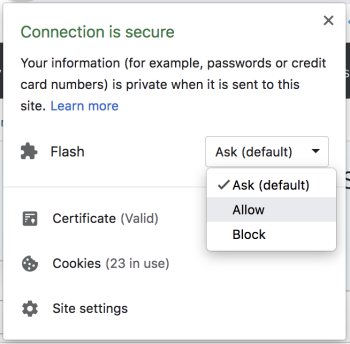
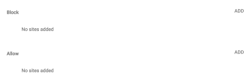

# Allow Adobe Workfront to run flash on Google Chrome

Chrome has recently changed the way Flash is set up. Unfortunately, this means that even if you allowed Flash to run in the past, your setting will have reverted back to default, which can cause issues within Adobe Workfront. If you have pages that do not load, allowing Flash to run will likely resolve your issue.

## If you have the most recent version of Chrome

1. From the website that needs to allow Flash, click the lock icon in the URL next to the URL.  
     

1. Under Flash, select **Allow** from the drop-down list.  
     
   OR   
   Click **Site settings**. Then u nder Flash, select **Allow** from the drop-down list.&nbsp; 

1. Refresh the settings page.&nbsp; 
1. Return to the original website and reload the page.  
   

## If you have an older version of Chrome

1. Open your Chrome browser and click the three-dot icon next to your URL bar.  
   

1. Select **Settings**.
1. Scroll to the bottom of the page and click **Advanced**.  

1. Locate the **Privacy and Security**&nbsp;section and click **Content settings**.  
     

1. Click **Flash**.  
     

1. Toggle the switch from **Block sites from running Flash** to **Ask first (recommended)**.  
     
   

1. To manage your exceptions, click **ADD** under the **Allow** section.  
   

1. Add&nbsp;exceptions for&nbsp;**[&#42;.]workfront.com** and &nbsp;for**[&#42;.]proofhq.com**.

  * You may also want to add exceptions for your sandbox environments:

    * Preview:&nbsp;**[&#42;.]preview.workfront.com**
    * SB01: **[&#42;.]sb01.workfront.com** 
      

