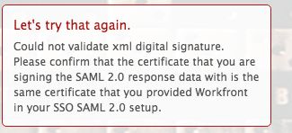

# Error message: Couldn't validate XML digital signature

## Problem

You are unable to establish a successful connection to ADFS.

>[!NOTE]
>
>If you establish a successful test connection and you are still experiencing issues, you might have incorrect attribute mappings or issues with the federation IDs. Contact customer support with questions.

## Access requirements

+++ Expand to view access requirements for the functionality in this article.

<table style="table-layout:auto"> 
 <col> 
 <col> 
 <tbody> 
  <tr> 
   <td>[!DNL Adobe Workfront] package</td> 
   <td>
Any
</td> 
  </tr> 
  <tr> 
   <td>[!DNL Adobe Workfront] license</td> 
   <td>
Standard

       
Plan
</td>
  </tr> 
  <tr> 
   <td>Access level configurations</td> 
   <td>[!UICONTROL System Administrator]</td> 
  </tr> 
 </tbody> 
</table>

For information, see [Access requirements in Workfront documentation](/help/quicksilver/administration-and-setup/add-users/access-levels-and-object-permissions/access-level-requirements-in-documentation.md).

+++

## Cause 1: The certificate is incorrect

### Solution

Manually retrieve the Signing Certificate from the ADFS Server:

1. In [!DNL Windows], click **[!UICONTROL Start]** > **[!UICONTROL Administration]** > **[!UICONTROL ADFS 2.0 Management]**.\
   The ADFS 2.0 Management dialog box is displayed.

1. Select **[!UICONTROL Trust Relationship]** > **[!UICONTROL Relying Party Trusts]** in the left-hand pane.

1. Right-click on **[!UICONTROL Relying Party Trust]**, and select **[!UICONTROL Properties]**.

1. Click on the **[!UICONTROL Signature]** tab.
1. Click on the name of the Signing Certificate, and click **[!UICONTROL View]**.
1. Click Copy to **[!UICONTROL File]**..., and select **[!UICONTROL Next]**.

1. Select **[!UICONTROL Base-64 encoded x.509 (CER)]**, and click **[!UICONTROL Next]**.

1. Specify the file name, and click **[!UICONTROL Next]**.
1. Click **[!UICONTROL Finish]**.
1. In [!DNL Adobe Workfront], navigate to **[!UICONTROL Setup]** > **[!UICONTROL System]** > **[!UICONTROL Single Sign-On (SSO)]** and manually upload the Signing Certificate.

## Cause 2: The certificate is signed using DSA when [!DNL Workfront] is expecting an RSA signature

### Solution

Recreate the certificate and use the RSA signature instead of the DSA.

## Cause 3: XML Data is incorrect

### Solution

Re-export and re-import the XML metadata from the ADFS management system.

## Cause 4: The request could not be performed due to an error on the SAML side

### Solution

Contact your SAML provider.
