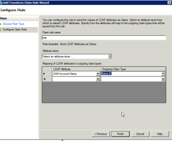

# Error message: SAML 2.0 error: Primary StatusCode

## Problem

You are unable to establish a successful connection to ADFS.

>[!NOTE]
>
>If you establish a successful test connection and you are still experiencing issues, you might have incorrect attribute mappings or issues with the federation IDs. Contact customer support with questions.

## Access requirements

You must have the following access to perform the steps in this article:

+++ Expand to view access requirements for the functionality in this article.

You must have the following access to perform the steps in this article:

<table style="table-layout:auto"> 
 <col> 
 <col> 
 <tbody> 
  <tr> 
   <td role="rowheader">[!DNL Adobe Workfront] plan</td> 
   <td>Any</td> 
  </tr> 
  <tr> 
   <td role="rowheader">[!DNL Adobe Workfront] license</td> 
   <td>
   
New: Standard

   
or

   
Current: Plan
</td> 
  </tr> 
  <tr> 
   <td role="rowheader">Access level configurations</td> 
   <td>You must be a [!DNL Workfront] administrator. </td> 
  </tr> 
 </tbody> 
</table>

For more detail about the information in this table, see [Access requirements in Workfront documentation](/help/quicksilver/administration-and-setup/add-users/access-levels-and-object-permissions/access-level-requirements-in-documentation.md).

+++

## Cause 1: Secure hash algorithm is set to SHA-256

### Solution

1. In Windows, click **[!UICONTROL Start]** > **[!UICONTROL Administration]** > **[!UICONTROL ADFS 2.0 Management]**.\
   The ADFS 2.0 Management dialog box is displayed.

1. Select **[!UICONTROL Trust Relationship]** > **[!UICONTROL Relying Party Trusts]** in the left-hand pane.

1. Right-click on the relying party trust related to [!DNL Adobe Workfront], then select **[!UICONTROL Properties]**.
1. Click on the **[!UICONTROL Advanced]** tab, then select **[!UICONTROL SHA-1]** from the **[!UICONTROL Secure hash algorithm]** drop-down menu.\
   

## Cause 2: ADFS Signing Certificate is about to expire and has been replaced by a new Certificate with overlapping dates

### Solution

The [!DNL Workfront] SSO Setup Page lists the certificate expiration date. If the certificate is about to expire, you need to manually pull the New Signing Certificate from the ADFS Server:

1. In Windows, click **[!UICONTROL Start]** > **[!UICONTROL Administration]** > **[!UICONTROL ADFS 2.0 Management]**.\
   The ADFS 2.0 Management dialog box is displayed.

1. Select **[!UICONTROL Trust Relationship]** > **[!UICONTROL Relying Party Trusts]** in the left-hand pane.

1. Right-click on the relying party trust related to [!DNL Workfront], and select **[!UICONTROL Properties]**.
1. Click on the **[!UICONTROL Signature]** tab.
1. Click on the name of the Signing Certificate, and click **[!UICONTROL View]**.
1. Click Copy to **[!UICONTROL File]**..., and select **[!UICONTROL Next]**.

1. Select **[!UICONTROL Base-64 encoded x.509 (CER)]**, and click **[!UICONTROL Next]**.

1. Specify the file name, and click **[!UICONTROL Next]**.
1. Click **[!UICONTROL Finish]**.
1. In [!DNL Workfront], navigate to **[!UICONTROL Setup]** > **[!UICONTROL System]** > **[!UICONTROL Single Sign-On (SSO)]** and manually upload the Signing Certificate.

## Cause 3: Certificate revocation check is failing

The solution for this depends on the version of [!DNL Microsoft] ADFS that you are using. Consult [!DNL Microsoft]'s documentation to obtain the appropriate commands for your version.
