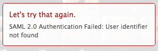

# Error Message: SAML 2.0 Error: User Identifier Not Found

## Problem

You are unable to establish a successful connection to ADFS.

>[!NOTE]
>
>If you establish a successful test connection and you are still experiencing issues, you might have incorrect attribute mappings or issues with the federation IDs. Contact customer support with questions.

## Cause:

Claims on the ADFS server are incorrect.

## Access requirements

+++ Expand to view access requirements for the functionality in this article.

<table style="table-layout:auto"> 
 <col> 
 <col> 
 <tbody> 
  <tr> 
   <td>[!DNL Adobe Workfront] package</td> 
   <td>
Any
</td> 
  </tr> 
  <tr> 
   <td>[!DNL Adobe Workfront] license</td> 
   <td>
Standard

       
Plan
</td>
  </tr> 
  <tr> 
   <td>Access level configurations</td> 
   <td>[!UICONTROL System Administrator]</td> 
  </tr> 
 </tbody> 
</table>

For information, see [Access requirements in Workfront documentation](/help/quicksilver/administration-and-setup/add-users/access-levels-and-object-permissions/access-level-requirements-in-documentation.md).

+++

## Solution

On the ADFS server, make sure there is a claim for name ID:

1. In Windows, click **[!UICONTROL Start]** > **[!UICONTROL Administration]** > **[!UICONTROL ADFS 2.0 Management]**.\
   The ADFS 2.0 Management dialog box is displayed.

1. Select **[!UICONTROL Trust Relationship]** > **[!UICONTROL Relying Party Trusts]** in the left-hand pane.

1. Right-click on the relying party trust related to Adobe Workfront, and select **[!UICONTROL Edit Claim Rules]**.
1. Verify the claim has an **[!UICONTROL Outgoing Claim Type]** of **[!UICONTROL Name ID]**.

