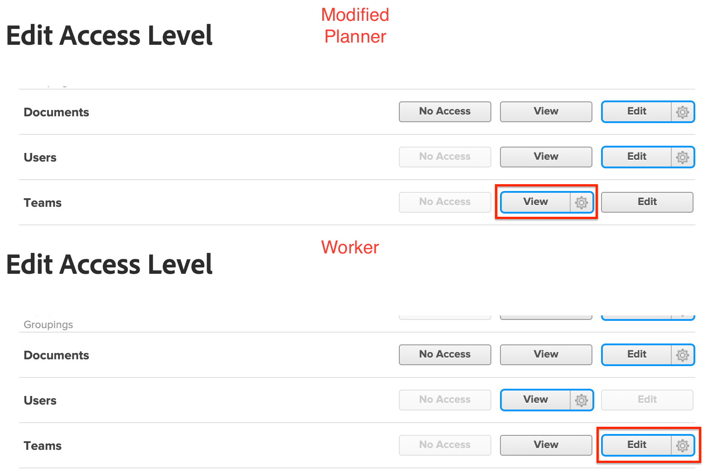
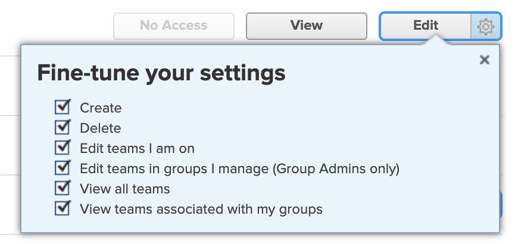

# Group admins must have higher access than those they manage

If a group administrator has permissions in their Access Level lower than those they manage, they will not be able to view, modify, or assign lower access levels.  

## Problem

If a group administrator is assigned a modified Planner access level with View permissions for Teams, but certain users are assigned a Worker access level with Edit permissions for Teams, the group administrator will not be able to interact with the modified Worker access level.

>[!NOTE]
>
>This logic also applies to the Fine-tune your settings drop-down menu. Both access levels can have Edit access, but settings in the Fine-tune your settings drop-down menu must be higher for the group admin.
> 

## Solution

Group admins must have higher permissions in all areas in the access level than those they manage. 