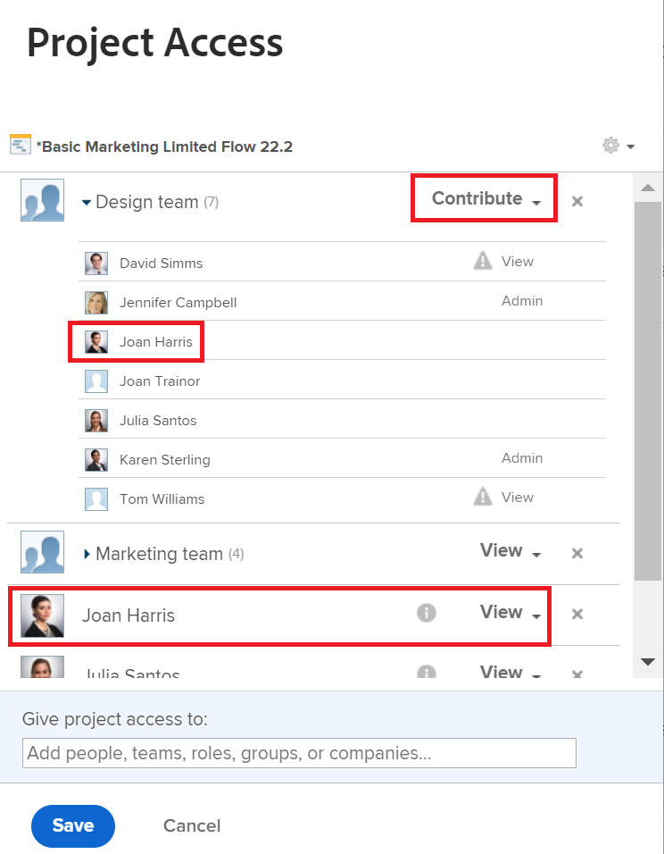

# Sharing shows more than one permission

## Question

The Sharing window shows two different permissions for one user. Which one is being used?

## Answer

Users have the highest permission shown on the sharing screen. For more information about permissions, see the article [Overview of sharing permissions on objects](../../workfront-basics/grant-and-request-access-to-objects/sharing-permissions-on-objects-overview.md).

