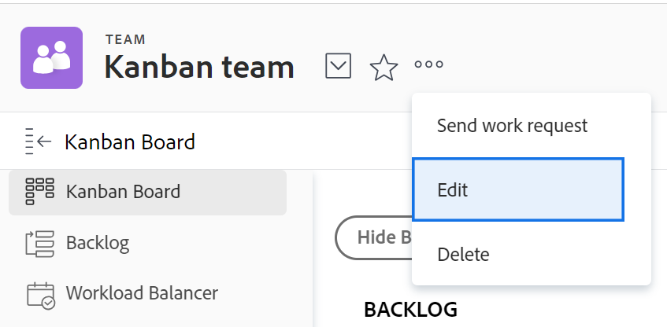
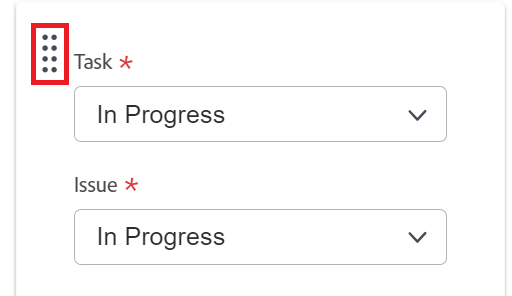
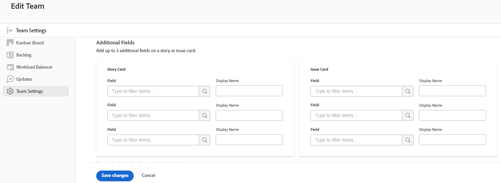
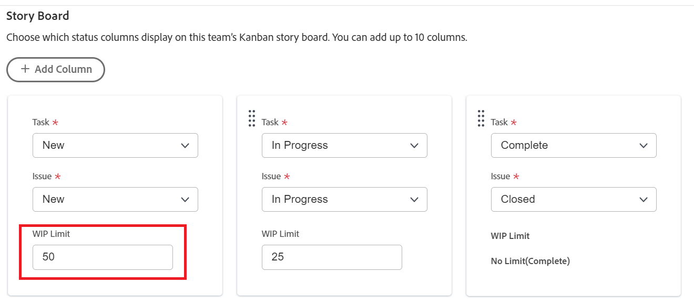

# Configure [!UICONTROL Kanban]

You can create an agile team in [!DNL Adobe Workfront] as described in [Create an agile team](../../agile/get-started-with-agile-in-workfront/create-an-agile-team.md). While creating an agile team you can choose the methodology that the team uses to complete their work. You can choose from the following options:

* Scrum
* Kanban

This article describes how to configure the settings for a Kanban team. After you create an agile team and choose the Kanban methodology, you can refer to this article to update the following settings:

* Whether stories are estimated in points or hours
* The status columns on the agile story board
* Additional fields to display on story cards on the agile story board
* The work in progress (WIP) limit
* How to automatically add stories from the backlog
* How long cards stay on the Kanban board

For information about configuring a Scrum team, see [Configure Scrum](../get-started-with-agile-in-workfront/configure-scrum.md).

## Access requirements

You must have the following access to perform the steps in this article:

<table style="table-layout:auto"> 
 <col> 
 </col> 
 <col> 
 </col> 
 <tbody> 
  <tr> 
   <td role="rowheader">[!DNL Adobe Workfront] plan*</td> 
   <td> 
Any
 </td> 
  </tr> 
  
  <tr> 
   <td role="rowheader">[!DNL Adobe Workfront] license*</td> 
   <td> 
New: [!UICONTROL Standard]
 
   or
   
Current: [!UICONTROL Work] or higher
 </td> 
  </tr>

  <tr> 
   <td role="rowheader">Access level</td> 
   <td> 
Edit access to Teams
  </td> 
  </tr> 

 </tbody> 
</table>

*To find out what plan or license type you have, contact your [!DNL Workfront] administrator.

## Configure whether stories are estimated in points or hours

You can configure stories to be estimated either using points or hours.

To configure how stories are estimated for your agile team:

{{step1-to-team}}

1. Click the **[!UICONTROL Switch Teams]** icon , then either select a new team from the drop-down menu or search for a team in the search box.
1. Select the agile team that you want to manage.
1. Click the **[!UICONTROL More]** menu  , then select **[!UICONTROL Edit]**.

   

1. In the **[!UICONTROL Agile]** section, in the **[!UICONTROL Estimate Stories in]** area, select whether you want to use points or hours for estimating the size (work load) of stories. If you select Points, specify how many hours are equal to 1 point. (The default is 1 point = 8 hours.) This is the number of Planned Hours that are added to the story.

   **Example:** If you have selected to estimate stories in points and 1 point equals 8 hours, and a story is estimated at 3 points, 24 Planned Hours are added to the story.

1. Click **[!UICONTROL Save Changes]**.

## Configure status columns on the agile story board

You can define the statuses that exist on the story board for the agile team. These are the only statuses that display on the story board.

To define the statuses that are available for the story board associated with the agile team:

{{step1-to-team}}

1. Click the **[!UICONTROL Switch Teams]** icon , then either select a new team from the drop-down menu or search for a team in the search bar.

1. Select the agile team that you want to manage.
1. Click the **[!UICONTROL More]** menu, then select **[!UICONTROL Edit]**.

   

1. In the **[!UICONTROL Agile]** section, locate the **[!UICONTROL Story Board]** area.

1. (Optional) Click **[!UICONTROL Add Column]** to add an additional status column to the story board.
1. (Optional) Drag any status column using the drag-and-drop indicator to reorder the status columns on the story board. The first column can't be moved, and you cannot drag another column in front of the first column.

   

1. Select task statuses.

   >[!IMPORTANT]
   >
   >Only locked system-wide statuses are available to select. You cannot select group-specific statuses. The status of the first column always corresponds to **[!UICONTROL New]**.

   You can add custom statuses if your [!DNL Workfront] administrator has configured them. For more information, see [Create or edit a status](../../administration-and-setup/customize-workfront/creating-custom-status-and-priority-labels/create-or-edit-a-status.md).

1. Click **[!UICONTROL Save Changes]**.

## Configure additional fields to display on story cards on the agile story board

When you add fields to story cards, fields are view-only and display only when the field is populated.

By default, the following types of data displays on the story card for tasks and issues:

* Story name with a link directly to the task or issue
* The project name with a link directly to the project
* This link is displayed only for stories, not for subtasks
* The task or issue description
* Current commitment
* View and edit the percent complete either by adjusting the percent complete itself or by adjusting the number of points or hours that are completed
* Assigned users

You can display additional data (including custom data) on story cards. You might want to display additional fields on story cards for any number of reasons. For example, you might want to display the Customer ID if you are working on stories for multiple customers within the iteration, or you might want to display the Project Start Date or Project Completion Date.

>[!NOTE]
>
>If you use a custom field on a story card, it cannot contain a period (or dot) in the name.

To configure story cards that are assigned to the agile team to display additional fields:

{{step1-to-team}}

1. Click the **[!UICONTROL Switch Teams]** icon , then either select a new team from the drop-down menu or search for a team in the search bar.

1. Select the agile team that you want to manage.
1. Click the **[!UICONTROL More]** menu, then select **[!UICONTROL Edit]**.\
   
   

1. In the **[!UICONTROL Agile]** section, type a field name to locate it.

   

1. Select the name of the field you'd like to add.
1. Type the **[!UICONTROL Display name]** for the field to show on the story or issue card.
1. Click **[!UICONTROL Save Changes]**.

## Configure the work in progress (WIP) limit

When you define the WIP limit of a Kanban team, you can control the number of items the team is currently working on by limiting the number of tasks that can appear in the [!UICONTROL New] or the [!UICONTROL In Progress] column on the [!UICONTROL Kanban] board.

After you configure the WIP limit for a Kanban team, you can view the WIP limit and update it from the [!UICONTROL Kanban] agile story board, as described in [Manage the work in progress (WIP) limit on the [!UICONTROL Kanban] board](../../agile/use-kanban-in-an-agile-team/work-in-progress-limit-on-the-kanban-board.md).

To limit WIP for your Kanban team:

{{step1-to-team}}

1. Click the **[!UICONTROL Switch Teams]** icon , then either select a new team from the drop-down menu or search for a team in the search bar.

1. Select the Kanban team that you want to manage.
1. Click the **[!UICONTROL More]** menu , then select **[!UICONTROL Edit]**.

   

1. In the **[!UICONTROL Agile]** section, in the **[!UICONTROL Methodology]** section, ensure Kanban is selected.

1. In the **[!UICONTROL Story Board]** section, in the **[!UICONTROL WIP Limit]** field, specify the maximum number of items allowed in each column of the [!UICONTROL Kanban] agile story board. You can set a different limit for each column. The maximum limit you can set for each column is 100.\
   When set, the WIP limit displays a warning message on the [!UICONTROL Kanban] agile story board any time the limit is exceeded for any column on the story board. This warning message is displayed only the first time the WIP limit is exceeded. This warning message does not display on any columns that have a status that equates with [!UICONTROL Complete].\
   The WIP limit is simply a visual warning and does not restrict your team from having more items in a single column than the limit you set.

   

1. Click **Save Changes**.

## Configure automatically adding stories from the backlog

<!-- this functionality needs to be verified-->

You can configure stories from the backlog to be automatically added to the first column on the [!UICONTROL Kanban] board immediately after an item is moved from that column.

{{step1-to-team}}

1. Click the **[!UICONTROL Switch Teams]** icon , then either select a new team from the drop-down menu or search for a team in the search bar.

1. Select the Kanban team that you want to manage.
1. Click the **[!UICONTROL More]** menu , then select **[!UICONTROL Edit]**.

   

1. Select **[!UICONTROL Automatically add next story from backlog]** to configure that the next item from the backlog to be automatically added to the **[!UICONTROL New]** column when an item is moved out of the **[!UICONTROL In Progress]** column.

   Users must enable the **Show Backlog** setting on the [!UICONTROL Kanban] board for this functionality to take effect. When users enable the [!UICONTROL Show Backlog] setting on the [!UICONTROL Kanban Board], the following functionality takes place: 

   Any time a story is moved from the [!UICONTROL In Progress] column into a column on the story board that represents a [!UICONTROL Complete] status (or a status that equates with [!UICONTROL Complete]), a story from the Backlog column automatically moves to the [!UICONTROL New] column of the [!UICONTROL Kanban Board]. 
   When added from the backlog, the story with the highest priority is added to the story board. 

1. Click **[!UICONTROL Save Changes]**.

## Configure how long cards stay on the [!UICONTROL Kanban] board

You can choose how long completed cards stay on the [!UICONTROL Kanban] board. Tasks that fall off the [!UICONTROL Kanban] board can still be accessed in their original project.

{{step1-to-team}}

1. (Optional) Click the **[!UICONTROL Switch Teams]** icon , then either select a new Kanban team from the drop-down menu or search for a team in the search bar.
1. Select the Kanban team.
1. Click the **[!UICONTROL More]** menu  , then select **[!UICONTROL Edit]**.

   

1. In the **[!UICONTROL Number of days Completed cards stay on the Kanban board]** drop-down menu, select a value.

   You can choose a number from 1 to 30 days. 
1. Click **[!UICONTROL Save Changes]**.
