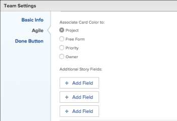

# Configure Kanban

You can configure the following options for agile teams during or after the team is created. You create an agile team (Kanban or Scrum) in Adobe Workfront as described in [Create an agile team](../../agile/get-started-with-agile-in-workfront/create-an-agile-team.md).

## Access requirements

You must have the following access to perform the steps in this article:

<table style="table-layout:auto"> 
 <col> 
 </col> 
 <col> 
 </col> 
 <tbody> 
  <tr> 
   <td role="rowheader"><strong>Adobe Workfront plan*</strong></td> 
   <td> 
Any
 </td> 
  </tr> 
  <tr> 
   <td role="rowheader"><strong>Adobe Workfront license*</strong></td> 
   <td> 
Work or higher
 </td> 
  </tr> 
 </tbody> 
</table>

&#42;To find out what plan or license type you have, contact your Workfront administrator.

## Configure whether stories are estimated in points or hours

You can configure stories to be estimated either using points or hours.

To configure how stories are estimated for your agile team:

1. Click the **Main Menu** icon  in the upper-right corner of Workfront, then click **Teams**.

1. Click the **Switch team** icon, then either select a new team from the drop-down menu or search for a team in the search bar.
1. Select the agile team that you want to manage.
1. Click the **More** menu, then select **Edit**.

   Only team members with either a Plan or Work license see this option.  
   

1. In the **Agile** section, in the **Estimate Stories** in area, select whether you want to use points or hours for estimating the size (work load) of stories. If you select Points, specify how many hours are equal to 1 point. (The default is 1 point = 8 hours.) This is the number of Planned Hours that are added to the story.

   **Example:** If you have selected to estimate stories in points and 1 point equals 8 hours, and a story is estimated at 3 points, 24 Planned Hours are added to the story.

1. Click&nbsp;**Save Changes**.

## Configure status columns on the agile story board

You can define the statuses that exist on the story board for the agile team. These are the only statuses that display on the story board.

To define the statuses that are available for the story board associated with the agile team:

1. Click the **Main Menu** icon  in the upper-right corner of Workfront, then click **Teams**.

1. Click the **Switch team** icon , then either select a new team from the drop-down menu or search for a team in the search bar.

1. Select the agile team that you want to manage.
1. Click the **More** menu, then select **Edit**.

   Only team members with either a Plan or Work license see this option.

   

1. In the **Agile** section, locate the **Story Board** area.

1. (Optional) Click **Add Column** to add an additional status column to the story board.
1. (Optional) Drag any status column using the drag-and-drop indicator to reorder the status columns on the story board. The first column can't be moved, and you cannot drag another column in front of the first column.

   

1. Select task statuses.

   >[!IMPORTANT]
   >
   >Only locked system-wide statuses are available to select; you cannot select group-specific statuses. Also, the status of the first column always corresponds to **New**.

   You can add custom statuses if your Workfront administrator has configured them; custom statuses can be configured as described in [Create or edit a status](../../administration-and-setup/customize-workfront/creating-custom-status-and-priority-labels/create-or-edit-a-status.md).

1. Click **Save Changes**.

## Configure additional fields to display on story cards on the agile story board

>[!NOTE]
>
>This setting is temporarily unavailable in the new Workfront Experience while in beta.

When you add fields to story cards, fields are view-only and display-only when the field is populated.

By default, the following types of data is displayed on the story card for tasks and issues:

* Story name with a link directly to the task or issue
* The project name with a link directly to the project
* This link is displayed only for stories, not for subtasks
* The task or issue description
* Current commitment
* View and edit the percent complete either by adjusting the percent complete itself or by adjusting the number of points or hours that are complete
* Assigned Users

You can display additional data (including custom data) on story cards. You might want to display additional fields on story cards for any number of reasons. For example, you might want to display the Customer ID if you are working on stories for multiple customers within the iteration, or you might want to display the Project Start Date or Project Completion Date.

To configure story cards that are assigned to the agile team to display additional fields:

1. Click the **Main Menu** icon  in the upper-right corner of Workfront, then click **Teams**.

1. Click the **Switch team** icon , then either select a new team from the drop-down menu or search for a team in the search bar.

1. Select the agile team that you want to manage.
1. Click the **More** menu, then select **Edit**.  
   Only team members with either a Plan or Work license see this option.

   

1. In the **Agile** section, click **Add Field**.

1. Select the name of the field you'd like to add.

   

1. Click **Save Changes**.

## Configure the work in progress (WIP) limit

Kanban in Workfront allows you to control the amount of work the team is currently working on by limiting the number of tasks that can appear in the In Progress column on the Kanban board.

When the WIP limit is configured, you can view the WIP limit or even update it from the Kanban agile story board, as described in [Manage the work in progress (WIP) limit on the Kanban board](../../agile/use-kanban-in-an-agile-team/work-in-progress-limit-on-the-kanban-board.md).

To limit WIP for your Kanban team:

1. Click the **Main Menu** icon  in the upper-right corner of Adobe Workfront, then click **Teams**.

1. Click the **Switch team** icon , then either select a new team from the drop-down menu or search for a team in the search bar.

1. Select the Kanban team that you want to manage.
1. Click the **More** menu, then select **Edit**.

   Only team members with either a Plan or Work license see this option.

   

1. In the **Agile** section, in the **Methodology** section, ensure Kanban is selected.

1. In the **Story Board** section, in the **WIP LIMIT** field, specify the maximum number of items allowed in each column of the Kanban agile story board. You can set a different limit for each column. The maximum limit you can set for each column is 100.  
   When set, the WIP limit displays a warning message on the Kanban agile story board any time the limit is exceeded for any column on the story board. This warning message is displayed only the first time the WIP limit is exceeded. This warning message is not displayed on any columns that have a status that equates with Complete.  
   The WIP limit is simply a visual warning and does not restrict your team from having more items in a single column than the limit you set.  
  
   

1. Click **Save Changes**.

## Configure stories to be automatically added from the backlog

You can configure stories from the backlog to be automatically added to the first column on the Kanban board immediately after an item is moved from that column.

1. Click the **Main Menu** icon  in the upper-right corner of Adobe Workfront, then click **Teams**.

1. Click the **Switch team** icon , then either select a new team from the drop-down menu or search for a team in the search bar.

1. Select the Kanban&nbsp;team that you want to manage.
1. Click the **More** menu, then select **Edit**.

   Only team members with either a Plan or Work license see this option.

   

1. Select&nbsp;**Automatically add next story from backlog**&nbsp;to configure stories to be automatically added from the backlog to the first column on the Kanban story board.

   This occurs any time a story is moved into a column on the story board that represents a Complete status (a status that equates with Complete). When added from the backlog, the story with the highest priority is added to the story board.select this option to configure the next item from the backlog to be automatically added to the **In Progress** column when an item is moved out of the **In Progress** column.

1. Click **Save Changes**.

## Configure how long cards stay on the Kanban board

You can choose how long completed cards stay on the Kanban board. Tasks that fall off the Kanban board can still be accessed in their original project.

1. Click the **Main Menu** icon  in the upper-right corner of Adobe Workfront, then click **Teams**.

1. (Optional) Click the **Switch team** icon , then either select a new Kanban team from the drop-down menu or search for a team in the search bar.
1. Select the Kanban team.
1. Click the **More** menu, then select **Edit**.

   Only team members with either a Plan or Work license see this option.

   

1. In the **Number of days Completed cards stay on the Kanban board** drop-down menu, select a value.
1. Click **Save Changes**.

