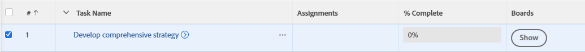
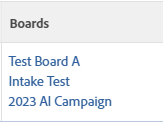

# Add existing tasks or issues to an [!DNL Adobe Workfront] board or workstream

{{highlighted-preview-article-level}}

You can add any task or issue to a board or a workstream in [!DNL Adobe Workfront] from a list or report view.

## Access requirements

You must have the following access to perform the steps in this article:

<table style="table-layout:auto">
 <col>
 <col>
 <tbody>
  <tr>
   <td role="rowheader"><strong>[!DNL Adobe Workfront] plan*</strong></td>
   <td> 
Any
 </td>
  </tr>
  <tr>
   <td role="rowheader"><strong>[!DNL Adobe Workfront] license*</strong></td>
   <td> 
[!UICONTROL Work] or higher
 </td>
  </tr>
  <tr>
   <td role="rowheader"><strong>Object permissions</strong></td>
   <td> 
[!UICONTROL View] or higher permissions to the task or issue
 
For information on requesting additional access, see <a href="/help/quicksilver/workfront-basics/grant-and-request-access-to-objects/request-access.md" class="MCXref xref">Request access to objects </a>.
 </td>
  </tr>
 </tbody>
</table>

&#42;To find out what plan, license type, or access you have, contact your [!DNL Workfront] administrator.

## Add existing tasks or issues to a board

1. Click the **[!UICONTROL Main Menu]** icon  in the upper-right corner of [!DNL Adobe Workfront].
1. Choose one of the following: **[!UICONTROL Projects]**, **[!UICONTROL Reporting]**, or **[!UICONTROL Dashboards]**.
1. Go to the project, report, or dashboard that contains the task or issue you want to add to the board.
1. Select one or more tasks or issues.
1. Click [!UICONTROL **More**] > [!UICONTROL **Add to Boards**].
1. In the [!UICONTROL Add To] dialog box, select the board to add the items to.

   Only standalone boards are available with this option, not boards that are part of workstreams.

1. Click [!UICONTROL **Add**].
   
   The task or issue is added to the board. If the board has column policies applied for status, the card is added in the column corresponding to its status. Otherwise, it appears in the first column on the left, not including the intake column.

## Add existing tasks or issues to a workstream

1. Click the **[!UICONTROL Main Menu]** icon  in the upper-right corner of [!DNL Adobe Workfront].
1. Choose one of the following: **[!UICONTROL Projects]**, **[!UICONTROL Reporting]**, or **[!UICONTROL Dashboards]**.
1. Go to the project, report, or dashboard that contains the task or issue you want to add to the workstream.
1. Select one or more tasks or issues.
1. Click [!UICONTROL **More**] > [!UICONTROL **Add to Workstream**].
1. In the [!UICONTROL Add To] dialog box, select the workstream to add the items to.
1. Click [!UICONTROL **Add**].

   The task or issue is added to the workstream's card list as an unplanned card.

## Show the boards associated to a task or issue

1. Go to the project, report, or dashboard that contains the task or issue you want to see boards information for.
1. Select a view that includes the Boards column, or create a new view with the Boards column.
For information on views, see [Create or edit views in Adobe Workfront](/help/quicksilver/reports-and-dashboards/reports/reporting-elements/create-edit-views.md).
1. Click [!UICONTROL **Show**] in the column to display the list of boards the task or issue is on.

   

1. Click a board name to open the connected task or issue on the board.

   
