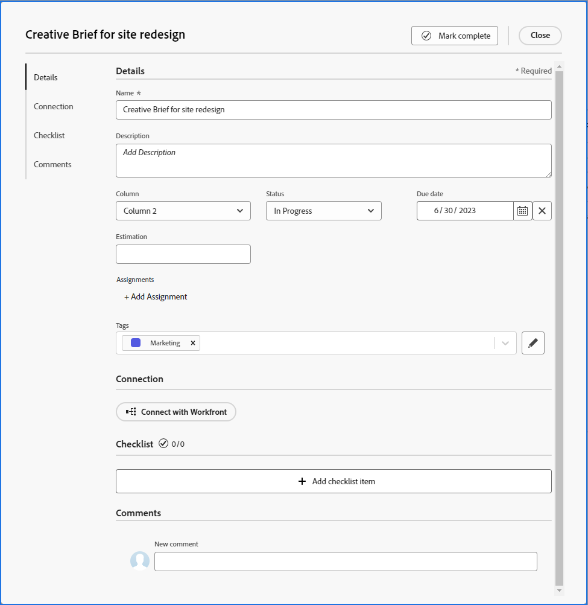

# Add an ad hoc card to a board

You can quickly add a card to a board and assign it to a member on the board. The card can represent a task, issue, person, group, or any type of item that you want to include on the board.

>[!NOTE]
>
>The ad hoc cards on a board are not connected to work items in [!DNL Adobe Workfront]. For details about connected cards, see [Use connected cards on boards](/help/quicksilver/agile/get-started-with-boards/connected-cards.md).

## Access requirements

+++ Expand to view access requirements for the functionality in this article.

You must have the following access to perform the steps in this article:

<table style="table-layout:auto"> 
 <col> 
 <col> 
 <tbody> 
  <tr> 
   <td role="rowheader">[!DNL Adobe Workfront]</td> 
   <td> 
Any
 </td> 
  </tr> 
  <tr> 
   <td role="rowheader">[!DNL Adobe Workfront] license</td> 
   <td> 
   
New: [!UICONTROL Contributor] or higher
 
   
or

   
Current: [!UICONTROL Request] or higher

   </td> 
  </tr> 
 </tbody> 
</table>

For more detail about the information in this table, see [Access requirements in Workfront documentation](/help/quicksilver/administration-and-setup/add-users/access-levels-and-object-permissions/access-level-requirements-in-documentation.md).

+++

## Add an ad hoc card with full details

An ad hoc card is not connected to a work item in [!DNL Adobe Workfront].

{{step1-to-boards}}

1. Access a board. For information, see [Create or edit a board](../../agile/get-started-with-boards/create-edit-board.md).
1. Click **[!UICONTROL Add card] &gt; [!UICONTROL New card]**.

   The [!UICONTROL Card Details] box appears.

   >[!NOTE]
   >
   >If you click outside of the Name field, the ad hoc card is automatically saved as "Untitled" at the bottom of the left-most column. To exit without saving the card, you must click [!UICONTROL **Cancel**] without clicking anywhere else in the [!UICONTROL Card Details] box.

1. In the **[!UICONTROL Card Details]** box, add the following information:

   <table style="table-layout:auto"> 
    <col> 
    <col> 
    <tbody> 
     <tr> 
      <td role="rowheader"><strong>[!UICONTROL Name]</strong> </td> 
      <td>The name of the card.</td> 
     </tr> 
     <tr> 
      <td role="rowheader"><strong>[!UICONTROL Description]</strong> </td> 
      <td>A description of the card. You can add URLs in the description and they will become clickable links when the card is saved.</td>
     </tr>
     <tr> 
      <td role="rowheader"><strong>[!UICONTROL Column]</strong> </td> 
      <td>Select the column for the card. If you leave the <strong>[!UICONTROL Column]</strong> field blank, the card is placed in the first column on the left of the board.</td>
     </tr>
     <tr> 
      <td role="rowheader"><strong>[!UICONTROL Status]</strong> </td> 
      <td>Select a status for the card. If you click <strong>[!UICONTROL Mark Complete]</strong> at the top of the card, the status automatically changes to [!UICONTROL Complete].</td> 
     </tr>
     <tr> 
      <td role="rowheader"><strong>[!UICONTROL Due date]</strong></td> 
      <td>Select a due date for the card. </td>
     </tr>
     <tr> 
      <td role="rowheader"><strong>[!UICONTROL Estimation]</strong></td> 
      <td>Type the estimated number of hours for the card to be completed. This is a manual entry only.</td>
     </tr>
     <tr> 
      <td role="rowheader"><strong>[!UICONTROL Assignments]</strong> </td> 
      <td>To assign the card, click <strong>[!UICONTROL Add Assignment]</strong> and start typing a name in the search field. Then, select it when it displays in the list of results. You can add both individuals and teams, and you can assign more than one person or team to a card.</td>
     </tr>     
     <tr> 
      <td role="rowheader"><strong>[!UICONTROL Tags]</strong></td> 
      <td>Search for and select tags for the card. For information on creating new tags, see <a href="../../agile/get-started-with-boards/add-tags.md" class="MCXref xref">Add tags</a>.</td> 
     </tr>
     <tr>
      <td role="rowheader"><strong>[!UICONTROL Connection]</strong> </td>
      <td>You can connect an ad hoc card to a [!DNL Workfront] task or issue. For more information, see "Convert an ad hoc card to a connected card" in the article <a href="/help/quicksilver/agile/get-started-with-boards/connected-cards.md">Use connected cards on boards</a>.</td>
     </tr>
     <tr> 
      <td role="rowheader"><strong>[!UICONTROL Checklist]</strong> </td> 
      <td> 
Click <strong>[!UICONTROL Add checklist item]</strong>. Then, type the title of the item and press Enter. Another item is automatically added. Continue entering titles to add more items.
 
The counter at the top of the checklist shows the number of completed items and the total number of items.
 
For more information about checklist items, see <a href="/help/quicksilver/agile/get-started-with-boards/manage-checklist-items.md">Manage checklist items on cards</a>.
 </td> 
     </tr>
     <tr>
      <td role="rowheader"><strong>[!UICONTROL Comments]</strong></td>
      <td>
Click in the <strong>[!UICONTROL New comment]</strong> field and type your comment. Use the formatting tools to format the text. (Images are not available in comments on ad hoc cards.) To tag a person or team, use the search box at the bottom of the commenting area. The user does not have to be a member on the board.

<strong>NOTE:</strong> At this time, users tagged in comments on ad hoc cards do not receive an email notification.
      

Click <strong>[!UICONTROL Submit]</strong> to add the comment to the card.

      
For more information on commenting, see <a href="/help/quicksilver/workfront-basics/updating-work-items-and-viewing-updates/update-work.md">Update work</a>.
</td>
     </tr>
    </tbody> 
   </table>

   

   Use the left navigation panel to move between sections of fields on the card details.

1. Click **[!UICONTROL Close]** to add the card to the board.

   The assignees, tags, due date, checklist counter, estimated hours, and status are displayed on the card.

## Quick add an ad hoc card

You can add ad hoc cards with only a title to quickly populate your board.

1. Access the board you want to add cards to.
1. Click the **[!UICONTROL Add]** icon  on the column where you want to add the card.
1. Type the card name and press Enter.

   Another card is automatically added below the new card.

1. Continue entering card names to add more cards.
1. To stop adding cards, click outside of the column.
1. To add more details, you must edit the card. For information, see [Edit an existing card](#edit-an-existing-card) in this article.

## Edit an existing card {#edit-an-existing-card}

1. Access the board.
1. Click on the card name to edit the name.
1. To edit the card details, click on the card (not in the card name).

   Or

   Click the **[!UICONTROL More]** menu ![[!UICONTROL More menu]](assets/more-icon-spectrum.png) on the card and select **[!UICONTROL Edit]**.

1. In the [!UICONTROL Card Details] box, update the information as needed, and click **[!UICONTROL Close]** to return to the board.

   If you have column policies enabled for updating field values, changing the status on the card automatically moves the card to the corresponding column. For more information, see "Define column settings and policies" in the article [Manage board columns](/help/quicksilver/agile/get-started-with-boards/manage-board-columns.md).
