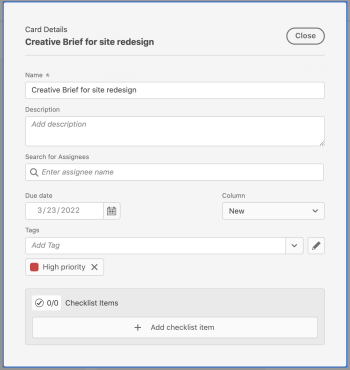
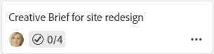

# Add a card to a board

The highlighted information on this page refers to functionality not yet generally available. It is available only in the Preview Sandbox environment.

You can quickly add a card to a board and assign it to a member on the board. The card can represent a task, issue, person, group, or any type of item that you want to include on the board.

Using a checklist on a card allows you to break down work into smaller increments or add notes to the card.

>[!NOTE]
>
>The cards on a board are not connected to work items in Adobe Workfront.

## Access requirements

You must have the following access to perform the steps in this article:

<table cellspacing="0"> 
 <col> 
 </col> 
 <col> 
 </col> 
 <tbody> 
  <tr> 
   <td role="rowheader">Adobe Workfront plan*</td> 
   <td> 
Any
 </td> 
  </tr> 
  <tr> 
   <td role="rowheader">Adobe Workfront license*</td> 
   <td> 
Request or higher
 </td> 
  </tr> 
 </tbody> 
</table>

&#42;To find out what plan, license type, or access you have, contact your Workfront administrator.

## Add a

<!--
<MadCap:conditionalText data-mc-conditions="QuicksilverOrClassic.Draft mode">
n ad hoc
</MadCap:conditionalText>
-->

card with full details

<!--

An ad hoc card is not connected to a work item in Adobe Workfront.

-->

1. Click the **Main Menu** icon  in the upper-right corner of Adobe Workfront, then click **Boards**.
1. Access a board. For information, see [Create or edit a board](../../agile/get-started-with-boards/create-edit-board.md).
1. Click **Add card****> New card**.
1. In the **Card Details** box, add the following information:

   <table cellspacing="0"> 
    <col> 
    <col> 
    <tbody> 
     <tr> 
      <td role="rowheader"><strong>Name</strong> </td> 
      <td>The name of the card.</td> 
     </tr> 
     <tr> 
      <td role="rowheader"><strong>Description</strong> </td> 
      <td>A description of the card.</td> 
     </tr> 
     <tr> 
      <td role="rowheader"><strong>Assignees</strong> </td> 
      <td> 
To assign the card, start typing a name in the search field, then select it when it displays in the list. You can assign more than one person to a card.
 
Assignees must be members on the board or they will not appear in the selection list.
 </td> 
     </tr> 
     <tr data-mc-conditions=""> 
      <td role="rowheader">Tags</td> 
      <td>Search for and select tags for the card. For information on creating new tags, see <a href="../../agile/get-started-with-boards/add-tags.md" class="MCXref xref">Add tags</a>.</td> 
     </tr> 
     <tr data-mc-conditions=""> 
      <td role="rowheader">Due date</td> 
      <td>Select a due date for the card. </td> 
     </tr> 
     <tr> 
      <td role="rowheader"><strong>Column</strong> </td> 
      <td>Select the column for the card. If you leave the <strong>Column</strong> field blank, the card is placed in the first column on the left of the board.</td> 
     </tr> 
     <tr> 
      <td role="rowheader"><strong>Checklist Items</strong> </td> 
      <td> 
Click <strong>Add checklist item</strong>. Then, type the title of the item and press Enter. Another item is automatically added. Continue entering titles to add more items.
 
The counter at the top of the checklist shows the number of completed items and the total number of items.
 
To delete an item, click the <strong>Delete</strong> icon .
 </td> 
     </tr> 
    </tbody> 
   </table>

   

1. Click **Close** to add the card to the board.

   The assignees, tags, due date, and checklist counter are displayed on the card.

   

## Quick add a card

You can add cards with only a title to quickly populate your board.

1. Access the board you want to add cards to.
1. Click the **Add** icon  on the column where you want to add the card.
1. Type the card name and press Enter.

   Another card is automatically added below the new card.

1. Continue entering card names to add more cards.
1. To stop adding cards, click outside of the column.
1. To add more details, you must edit the card. For information, see [Edit an existing card](#edit-an-existing-card) in this article.

<!--
<h2 data-mc-conditions="QuicksilverOrClassic.Draft mode">Add a connected card</h2>
-->

<!--

You can add a card connected to existing tasks and issues in Workfront.

-->

<!--
<ol data-mc-conditions="QuicksilverOrClassic.Draft mode">
<li value="1"> 
Access the board you want to add a card to.
 </li>
<li value="2"> 
Click <strong>Add card > Connected card</strong>.
 </li>
<li value="3"> 
Choose a project, then choose a task or issue to add as a card on the board.
 <note type="note">
Only objects that you have permissions to are available in the search results.
</note> </li>
<li value="4"> 
Click <strong>Add</strong>.
 
  
 </li>
</ol>
-->

## Edit an existing card {#edit-an-existing-card}

1. Access the board.
1. Click on the card name to edit the name.
1. To edit the card details, click on the card (not in the card name).

   Or

   Click the **More** menu  on the card and select **Edit**.

1. In the Card Details box, update the information as needed, and click **Close** to return to the board.

## Complete checklist items

1. Access the board and locate the card the checklist is on.
1. Click the card to open the Card Details box.

   Or

   Click the **More** menu  on the card, and select **Edit**.

1. Select the check box next to the item that is complete.

   The counter updates to show the completed items.

   You can clear the check box if you need to add the item back to the list.

   

1. Click **Close** to return to the board.

   The counter on the card is also updated.

