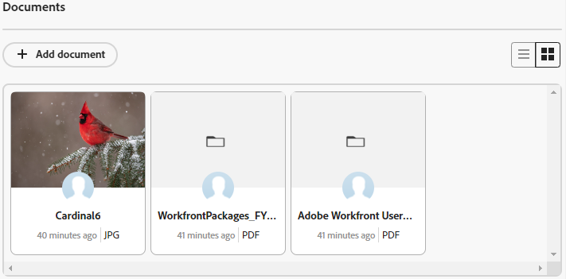

# Add documents on cards

You can add documents to connected cards on Adobe Workfront Boards. Any documents you add on the card become available on the Documents tab of the connected task or issue, and documents added on the task or issue are visible on the card. The same file types are supported in both areas. For more information on documents in Workfront, see [Add documents to Adobe Workfront from your file system](/help/quicksilver/documents/adding-documents-to-workfront/add-documents-from-file-system.md).

>[!NOTE]
>
>Documents are only available on connected cards. For more information, see [Use connected cards on boards](/help/quicksilver/agile/get-started-with-boards/connected-cards.md).

## Access requirements

+++ Expand to view access requirements for the functionality in this article.

You must have the following access to perform the steps in this article:

<table style="table-layout:auto"> 
 <col> 
 <col> 
 <tbody> 
  <tr> 
   <td role="rowheader">[!DNL Adobe Workfront]</td> 
   <td> 
Any
 </td> 
  </tr> 
  <tr> 
   <td role="rowheader">[!DNL Adobe Workfront] license</td> 
   <td> 
   
New: [!UICONTROL Contributor] or higher
 
   
or

   
Current: [!UICONTROL Request] or higher

   </td> 
  </tr> 
   <tr>
   <td role="rowheader">Access level configurations</td>
   <td>[!UICONTROL Edit] access to Documents</td>
  </tr>
 </tbody> 
</table>

For more detail about the information in this table, see [Access requirements in Workfront documentation](/help/quicksilver/administration-and-setup/add-users/access-levels-and-object-permissions/access-level-requirements-in-documentation.md).

+++

## Add a document to a card

{{step1-to-boards}}

1. Open the connected card you want to add a document to.
1. Drag and drop the file into the [!UICONTROL Documents] area, or click [!UICONTROL **Add document**] to select a file.

   The file appears in the [!UICONTROL Documents] area.

   

## View an existing document from the card

1. On the card, locate the [!UICONTROL Documents] area. Click  to view all documents in a list, or click  to view the documents in a gallery.
1. Hover over the document thumbnail, and click [!UICONTROL **Preview**] to view the file in the browser or [!UICONTROL **Download**] to download the file to your computer.

   >[!NOTE]
   >
   >PDFs do not show a thumbnail image.
