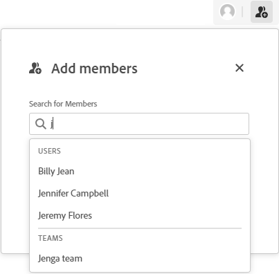

# Add or remove members from a board

People and teams must be added to the board as members before they can view the board.

## Access requirements

+++ Expand to view access requirements for the functionality in this article.

You must have the following access to perform the steps in this article:

<table style="table-layout:auto"> 
 <col> 
 <col> 
 <tbody> 
  <tr> 
   <td role="rowheader">[!DNL Adobe Workfront]</td> 
   <td> 
Any
 </td> 
  </tr> 
  <tr> 
   <td role="rowheader">[!DNL Adobe Workfront] license</td> 
   <td> 
   
New: [!UICONTROL Contributor] or higher
 
   
or

   
Current: [!UICONTROL Request] or higher

   </td> 
  </tr> 
 </tbody> 
</table>

For more detail about the information in this table, see [Access requirements in Workfront documentation](/help/quicksilver/administration-and-setup/add-users/access-levels-and-object-permissions/access-level-requirements-in-documentation.md).

+++

## Add members to a board

{{step1-to-boards}}

1. Create a new board or edit an existing board. For information, see [Create or edit a board](../../agile/get-started-with-boards/create-edit-board.md).
1. Click the **[!UICONTROL Add member]** icon .
1. In the **[!UICONTROL Add members]** box, start typing a name, then select it when it displays in the list.

   You can select an individual member or a team. If you choose a team, the team itself is added to the board.

   >[!NOTE]
   >
   >An individual user must have the **[!UICONTROL View]** or **[!UICONTROL Edit]** option set in their access level for teams, or they will not be able to view the board.

   

## Remove members from a board

{{step1-to-boards}}

1. Create a new board or edit an existing board. For information, see [Create or edit a board](../../agile/get-started-with-boards/create-edit-board.md).
1. Click the **[!UICONTROL Add member]** icon .
1. In the **[!UICONTROL Add members]** box, click the X next to a person or team name to remove them from the board.

   

   When you remove a member from a board, they are not removed from any cards they are assigned to. For connected cards, the assignments are also updated on the [!DNL Workfront] task or issue.

   Members are only removed from this board. They are not removed from other boards they belong to.

   >[!NOTE]
   >
   >You can't remove the board owner.
