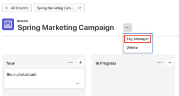
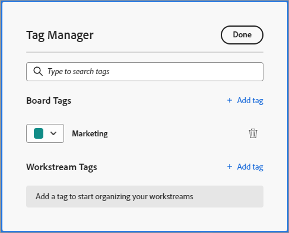
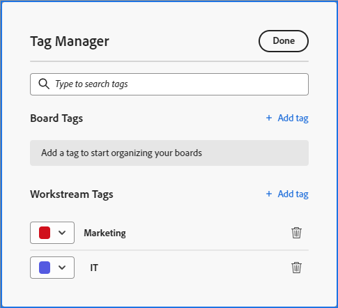

# Add tags

You can add tags to cards to visually show that they are similar. Then you can filter by those tags to display related cards. Board tags are not shared between boards, but workstream tags are available on all boards in a workstream.

## Access requirements

You must have the following access to perform the steps in this article:

<table style="table-layout:auto"> 
 <col> 
 </col> 
 <col> 
 </col> 
 <tbody> 
  <tr> 
   <td role="rowheader"><strong>[!DNL Adobe Workfront] plan*</strong></td> 
   <td> 
Any
 </td> 
  </tr> 
  <tr> 
   <td role="rowheader"><strong>[!DNL Adobe Workfront] license*</strong></td> 
   <td> 
[!UICONTROL Request] or higher
 </td> 
  </tr> 
 </tbody> 
</table>

&#42;To find out what plan, license type, or access you have, contact your [!DNL Workfront] administrator.

## Create tags for a board

{{step1-to-boards}}

1. Access a board. For information, see [Create or edit a board](../../agile/get-started-with-boards/create-edit-board.md).
1. Click the **[!UICONTROL More]** menu  next to the board name, then choose **[!UICONTROL Tag Manager]**.

   

1. In the [!UICONTROL Tag Manager] dialog box, select [!UICONTROL **Add tag**] in the [!UICONTROL Board Tags] section.
1. Type the tag name in the highlighted box, then choose a color for this tag from the drop-down menu. The tag is saved automatically.
1. (Conditional) Repeat steps 4-5 to create additional tags.
1. Click **[!UICONTROL Done]** in the top-right corner of the box.

   

## Create tags for a workstream

{{step1-to-boards}}

1. On the dashboard, click [!UICONTROL **View workstream**] to open a workstream.
1. Open a board. Click the **[!UICONTROL More]** menu  next to the board name, then choose **[!UICONTROL Tag Manager]**.

   Or

   Click [!UICONTROL **Configure**] to open the [!UICONTROL Configure Workstream] panel. Then, click **[!UICONTROL Tag Manager]**.

1. In the [!UICONTROL Tag Manager] dialog box, select [!UICONTROL **Add tag**] in the Workstream Tags section.
1. Type the tag name in the highlighted box, then choose a color for this tag from the drop-down menu. The tag is saved automatically.
1. (Conditional) Repeat steps 4-5 to create additional tags.
1. Click **[!UICONTROL Done]** in the top-right corner of the box.

   

## Add a tag to a card

1. Access a board.
1. To edit the card details, click on the card (not in the card name).

   Or

   Click the **[!UICONTROL More]** menu ![[!UICONTROL More menu]](assets/more-icon-spectrum.png) on the card and select **[!UICONTROL Edit]**.

1. In the **[!UICONTROL Tags]** box, type the name of an existing tag and select it from the search results.\
   Or\
   Click the **[!UICONTROL Edit]**&#x200B;icon  and create a new tag in the Tag Manager. Click **Done** to return to the card, then select the tag on the card.
1. Click **Close**.

## Edit a tag

1. Access a board.
1. Click the **[!UICONTROL More]** menu  next to the board name, then choose **[!UICONTROL Tag Manager]**.

   

1. (Conditional) Click on the tag name to edit the text.
1. (Conditional) Click the [!UICONTROL color] drop-down menu to change the tag color.
1. Click **[!UICONTROL Done]**.

## Remove a tag from a card

1. Access a board.
1. To edit the card details, click on the card (not in the card name).

   Or

   Click the **[!UICONTROL More]** menu ![[!UICONTROL More menu]](assets/more-icon-spectrum.png) on the card and select **[!UICONTROL Edit]**.

1. Find the tag you want to remove from the card, then click the **[!UICONTROL Remove]** icon .
1. Click **[!UICONTROL Close]**.

## Delete a tag

1. Access a board.
1. Click the **[!UICONTROL More]** menu ![[!UICONTROL More menu]](assets/more-icon-spectrum.png) next to the board name, then choose **[!UICONTROL Tag Manager]**.

   

1. Find the tag you want to delete, then click the **[!UICONTROL Delete]** icon .
1. Click **[!UICONTROL Done]**.
