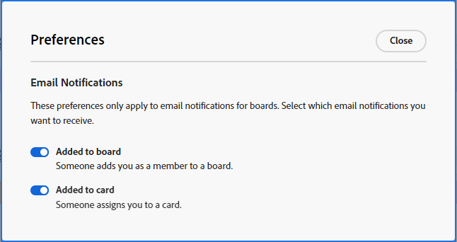

# Boards email notifications and preferences

{{highlighted-preview}}

[!DNL Adobe Workfront] [!UICONTROL Boards] sends you an email when you are added to a board and when a card is assigned to you. The notifications are turned on by default and you can select in your Boards preferences which emails you want to receive.

>[!NOTE]
>
>Email notifications are available only through the early feature opt-in for Workfront Boards.

Additional preferences allow you to enable dark mode for all of your boards and workstreams.

## Access requirements

You must have the following access to perform the steps in this article:

<table style="table-layout:auto"> 
 <col> 
 </col> 
 <col> 
 </col> 
 <tbody> 
  <tr> 
   <td role="rowheader"><strong>[!DNL Adobe Workfront] plan*</strong></td> 
   <td> 
Any
 </td> 
  </tr> 
  <tr> 
   <td role="rowheader"><strong>[!DNL Adobe Workfront] license*</strong></td> 
   <td> 
[!UICONTROL Request] or higher
 </td> 
  </tr> 
 </tbody> 
</table>

&#42;To find out what plan, license type, or access you have, contact your [!DNL Workfront] administrator.

## Set preferences for Boards emails

{{step1-to-boards}}

1. Click [!UICONTROL **Preferences**] on the boards dashboard.
1. Select whether you want to receive emails for being added to a board and assigned to a card.

   

   The preferences you set for emails apply to all of your boards.

## Set the dark mode preference

>[!NOTE]
>
>If your organization's instance of Workfront has been onboarded to the Adobe Unified Experience, you can enable dark theme formatting for all of Adobe Experience Cloud through your preferences menu (your profile picture), and you will not see a separate dark mode option for Workfront Boards. For more information, see [Adobe Unified Experience for Workfront](/help/quicksilver/workfront-basics/navigate-workfront/workfront-navigation/adobe-unified-experience.md).

{{step1-to-boards}}

1. Click [!UICONTROL **Preferences**] on the boards dashboard.
1. In the Themes area, enable or disable Dark mode.

   The preference you set for dark mode applies to all of your boards and workstreams, and the dashboard.

