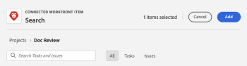
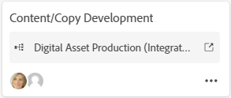
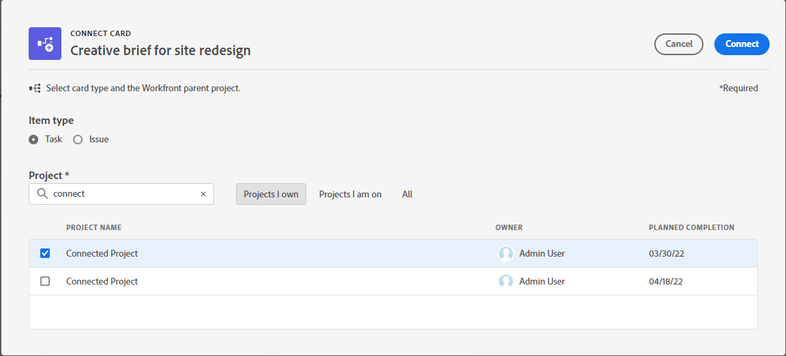
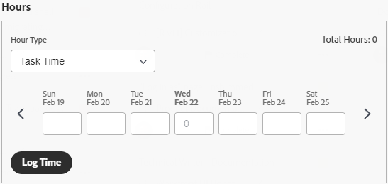

# Use connected cards on boards

You can add a card on your board that is connected to existing tasks and issues in [!DNL Workfront].

When any one of the following details is updated for the card in one location, it is automatically updated in the other location:

* [!UICONTROL Name]
* [!UICONTROL Description]
* [!UICONTROL Assignees]
* [!UICONTROL Status]
* [!UICONTROL Planned completion date]
* [!UICONTROL Estimation] / [!UICONTROL Story Points]

>[!NOTE]
>A single connected task or issue can only be added once per board. The same task or issue can be connected to multiple boards.

## Access requirements

You must have the following access to perform the steps in this article:

<table style="table-layout:auto"> 
 <tbody> 
  <tr> 
   <td role="rowheader"><strong>[!DNL Adobe Workfront] plan*</strong></td> 
   <td> 
Any
 </td> 
  </tr> 
  <tr> 
   <td role="rowheader"><strong>[!DNL Adobe Workfront] license*</strong></td> 
   <td> 
[!UICONTROL Request] or higher
 </td> 
  </tr> 
  <tr>
   <td role="rowheader"><strong>Access level configurations*</strong></td>
   <td>
[!UICONTROL View] or higher access to tasks and issues
</td>
  </tr>
  <tr>
   <td role="rowheader"><strong>Object permissions</strong></td>
   <td>
[!UICONTROL View] or higher permissions to the Workfront task or issue
</td>
  </tr>
 </tbody> 
</table>

&#42;To find out what plan, license type, or access you have, contact your [!DNL Workfront] administrator.

## Add a connected card

1. Click the **[!UICONTROL Main Menu]** icon  in the upper-right corner of Adobe Workfront, then click **[!UICONTROL Boards]**.
1. Access a board. For information, see [Create or edit a board](../../agile/get-started-with-boards/create-edit-board.md).
1. Click **[!UICONTROL Add card] &gt; [!UICONTROL Connected card]**.
1. Choose a project, then choose a task or issue to add as a card on the board.

   You can select multiple objects and they will all be added as separate cards.

   >[!NOTE]
   >
   >* Only objects that you have permissions to are available in the search results. If an item is dimmed, it has already been added to the board.
   >* When you filter by **[!UICONTROL Projects I Own]** or **[!UICONTROL Projects I'm On]**, projects that equate to a Complete, Dead, or Rejected status are not included. You can still search for those projects with the **[!UICONTROL All]** filter.

1. Click **[!UICONTROL Add]**.

   

   The card is added at the bottom of the left-most column. The connected [!DNL Workfront] object and its assignees are displayed on the card.

   >[!NOTE]
   >
   >If an assignee on the [!DNL Workfront] task or issue is not a member on the board, they are not assigned to the card.
   
   

1. Click  to open the [!DNL Workfront] task or issue in a new browser tab.
1. To edit the card details, click on the card (not in the card name).
   
   Or
   
   Click the **[!UICONTROL More]** menu  on the card and select **[!UICONTROL Edit]**.

1. In the **[!UICONTROL Card Details]** box, add or update the following information:

   <table style="table-layout:auto"> 
    <tbody> 
     <tr> 
      <td role="rowheader"><strong>[!UICONTROL Name]</strong></td> 
      <td>Changing the name also changes the name on the connected [!DNL Workfront] object.</td> 
     </tr> 
     <tr> 
      <td role="rowheader"><strong>[!UICONTROL Description]</strong></td> 
      <td>Changing the description also changes the description on the connected [!DNL Workfront] object. You can add URLs in the description and they will become clickable links when the card is saved.</td> 
     </tr>
     <tr>
      <td role="rowheader"><strong>[!UICONTROL Column]</strong></td>
      <td>Select the column for the card.</td>
     </tr>
     <tr>
      <td role="rowheader"><strong>[!UICONTROL Status]</strong></td>
      <td>
Select a status for the card. The defaults are [!UICONTROL New], [!UICONTROL In Progress], and [!UICONTROL Complete], but any custom statuses defined for the item in [!DNL Workfront] are also available.

      
If you have column policies enabled for updating field values, changing the status on the card automatically moves the card to the corresponding column. For more information, see "Define column settings and policies" in the article <a href="/help/quicksilver/agile/get-started-with-boards/manage-board-columns.md" class="MCXref xref">Manage board columns</a>.

      
If you click <strong>[!UICONTROL Mark Complete]</strong> at the top of the card, the status automatically changes to Complete.
</td>
     </tr>
     <tr>
      <td role="rowheader"><strong>[!UICONTROL Planned Completion]</strong></td>
      <td>Changing this date also changes the planned completion date on the connected [!DNL Workfront] object.</td>
     </tr>
      <tr>
      <td role="rowheader"><strong>[!UICONTROL Estimation]</strong></td>
      <td>
The number of hours for the card to be completed.

Changing the estimation also changes the story points value on the connected [!DNL Workfront] object.
</td>
     </tr>
     <tr>
      <td role="rowheader"><strong>[!UICONTROL Assignees]</strong></td>
      <td>
To assign more people or a team to the card, start typing a name in the search field, then select it when it displays in the list. You can add both individuals and teams. Only one team assignment is allowed on a connected card.

      
Assignees must be members on the board or they will not appear in the selection list. When a team is a member on the board, then the individual team members can be assigned to the card.

      
Any assignees you select are also assigned to the task or issue in [!DNL Workfront].
</td>
     </tr>
     <tr>
      <td role="rowheader"><strong>[!UICONTROL Tags]</strong></td>
      <td>
Search for and select tags for the card.

      
For information on creating new tags, see <a href="../../agile/get-started-with-boards/add-tags.md" class="MCXref xref">Add tags</a>.
</td>
     </tr>
     <tr>
      <td role="rowheader"><strong>[!UICONTROL Custom fields]</strong></td>
      <td>
Any custom fields you add are displayed in this area.

      
For more information, see <a href="/help/quicksilver/agile/get-started-with-boards/customize-fields-on-card.md">Customize which fields are displayed on a card</a>.
</td>
     </tr>
     <tr> 
      <td role="rowheader"><strong>[!UICONTROL Checklist]</strong> </td> 
      <td> 
Click <strong>[!UICONTROL Add checklist item]</strong>. Then, type the title of the item and press Enter. Another item is automatically added. Continue entering titles to add more items.
 
The counter at the top of the checklist shows the number of completed items and the total number of items.
 
For more information about checklist items, see <a href="/help/quicksilver/agile/get-started-with-boards/manage-checklist-items.md">Manage checklist items on cards</a>.
</td>
     </tr>
     <tr>
      <td role="rowheader"><strong>[!UICONTROL Hours]</strong></td>
      <td>See "Log hours on a connected card," below.</td>
     </tr>
     <tr>
      <td role="rowheader"><strong>[!UICONTROL Comments]</strong></td>
      <td>
Click in the <strong>[!UICONTROL New comment]</strong> field and type your comment. Use the formatting tools to format the text, and click the <strong>Add attachment</strong> icon  to attach a file to the comment. To tag a person or team, use the search box at the bottom of the commenting area. The user does not have to be a member on the board. Tagged users on connected cards will receive email notifications.

Click <strong>[!UICONTROL Submit]</strong> to add the comment to the card.

      
<strong>NOTE:</strong> The commenting area on cards uses the new Adobe Workfront commenting experience. For more information, see <a href="/help/quicksilver/workfront-basics/updating-work-items-and-viewing-updates/update-work.md">Update work</a>.
</td>
     </tr>
     <tr> 
      <td role="rowheader"><strong>[!UICONTROL System activity]</strong></td> 
      <td>
If you have <strong>System activity</strong> enabled as a card section, the activity is displayed in this area.
 
For more information, see <a href="/help/quicksilver/agile/get-started-with-boards/customize-fields-on-card.md">Customize which fields are displayed on a card</a> and <a href="/help/quicksilver/administration-and-setup/set-up-workfront/system-tracked-update-feeds/system-tracked-update-feeds.md">System-tracked updates</a>.
</td>
     </tr>     
    </tbody> 
   </table>

   Use the left navigation panel to move between sections of fields on the card details.

1. Click **[!UICONTROL Close]** to return to the board.
   The connected object, assignees, tags, due date, checklist counter, estimated hours, and status are displayed on the card.
   
   

## Disconnect a connected card

You can disconnect a connected card from its Workfront object, and the card remains on the board as an ad hoc card that you can edit.

To disconnect at the board level:

1. Access the board.
1. Click the **[!UICONTROL More]** menu  on the connected card and select **[!UICONTROL Disconnect]**.
1. Click **[!UICONTROL Disconnect]** on the confirmation message.

To disconnect at the card level:

1. Access the board and open the connected card.
1. Click the **[!UICONTROL More]** menu  in the Connection area of the card details, and select **[!UICONTROL Disconnect]**.
1. Click **[!UICONTROL Disconnect]** on the confirmation message.

## Convert an ad hoc card to a connected card

After you have created an ad hoc card, you can convert it to a connected card. For details about ad hoc cards, see [Add an ad hoc card to a board](/help/quicksilver/agile/get-started-with-boards/add-card-to-board.md).

1. Access the board and open the ad hoc card.
1. Verify the name and description on the card. They will be added to the task or issue you create in [!DNL Workfront].
1. In the [!UICONTROL Connection] area of the card details, click **[!UICONTROL Connect with Workfront]**.
1. On the [!UICONTROL Connect Card] window, select whether you are creating a task or an issue.
1. Search for and select a project to add the task or issue to.

   >[!NOTE]
   >
   >* Only objects that you have permissions to are available in the search results.
   >* When you filter by **[!UICONTROL Projects I Own]** or **[!UICONTROL Projects I'm On]**, projects that equate to a [!UICONTROL Complete], [!UICONTROL Dead], or [!UICONTROL Rejected] status are not included. You can still search for those projects with the **[!UICONTROL All]** filter.

1. Click **[!UICONTROL Connect]**.

   

   The project name displays in the Connection area on the card details.

1. Click **[!UICONTROL Close]** to return to the board.

## Log hours on a connected card

You must have the correct permissions to log hours on the connected task or issue.

The time logging fields are not displayed on connected cards by default. You must enable [!UICONTROL **Hours**] in the [!UICONTROL Configure] area under [!UICONTROL Cards]. For more information, see [Customize which fields are displayed on a card](/help/quicksilver/agile/get-started-with-boards/customize-fields-on-card.md).

1. Enter the number of hours for the task or issue.
1. Select an [!UICONTROL Hour Type] from the drop-down menu, if it is different than the default.
1. Click [!UICONTROL **Log Time**].
   
   

   The time logged on the card is also saved on the connected task or issue.

Logging time on the card is the same as logging time on a task or issue. For more information, see "Log time on a project, task, or issue" in the article [Log time](/help/quicksilver/timesheets/create-and-manage-timesheets/log-time.md).

