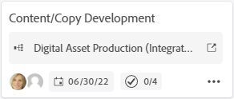
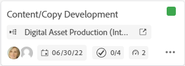

# Connected cards on boards

You can add a card on your board that is connected to existing tasks and issues in Workfront.

When any one of the following details is updated for the card in one location, it is automatically updated in the other location:

* Name
* Description
* Assignees
* Status

>[!NOTE]
>A single connected task or issue can only be added once per board. The same task or issue can be connected to multiple boards.

## Access requirements

You must have the following access to perform the steps in this article:

<table style="table-layout:auto"> 
 <tbody> 
  <tr> 
   <td role="rowheader"><strong>Adobe Workfront plan*</strong></td> 
   <td> 
Any
 </td> 
  </tr> 
  <tr> 
   <td role="rowheader"><strong>Adobe Workfront license*</strong></td> 
   <td> 
Request or higher
 </td> 
  </tr> 
  <tr>
   <td role="rowheader"><strong>Access level configurations*</strong></td>
   <td>
View or higher access to tasks and issues
</td>
  </tr>
  <tr>
   <td role="rowheader"><strong>Object permissions</strong></td>
   <td>
View or higher permissions to the Workfront task or issue
</td>
  </tr>
 </tbody> 
</table>

&#42;To find out what plan, license type, or access you have, contact your Workfront administrator.

## Add a connected card

1. Click the **Main Menu** icon  in the upper-right corner of Adobe Workfront, then click **Boards**.
1. Access a board. For information, see [Create or edit a board](../../agile/get-started-with-boards/create-edit-board.md).
1. Click **Add card &gt; Connected card**.
1. Choose a project, then choose a task or issue to add as a card on the board.

   You can select multiple objects and they will all be added as separate cards.

   >[!NOTE]
   >
   >Only objects that you have permissions to are available in the search results. If an item is dimmed, it has already been added to the board.

1. Click **Add**.

   

   The card is added at the bottom of the left-most column. The connected Workfront object and its assignees are displayed on the card.

   >[!NOTE]
   >
   >If an assignee on the Workfront task or issue is not a member on the board, they are not assigned to the card.
   
   

1. Click  to open the Workfront task or issue in a new browser tab.
1. To edit the card details, click on the card (not in the card name).
   
   Or
   
   Click the **More** menu  on the card and select **Edit**.

1. In the **Card Details** box, add or update the following information:

   <table style="table-layout:auto"> 
    <tbody> 
     <tr> 
      <td role="rowheader"><strong>Name</strong></td> 
      <td> 
Changing the name also changes the name on the connected Workfront object.
 </td> 
     </tr> 
     <tr> 
      <td role="rowheader"><strong>Description</strong></td> 
      <td> 
Changing the description also changes the description on the connected Workfront object.
 </td> 
     </tr> 
     <tr>
      <td role="rowheader"><strong>Assignees</strong></td>
      <td>
To assign more people to the card, start typing a name in the search field, then select it when it displays in the list.

      
Assignees must be members on the board or they will not appear in the selection list.

      
Any assignees you select are also assigned to the task or issue in Workfront.
</td>
     </tr>
     <tr>
      <td role="rowheader"><strong>Column</strong></td>
      <td>
Select the column for the card.
</td>
     </tr>
     <tr>
      <td role="rowheader"><strong>Status</strong></td>
      <td>
Select a status for the card. The defaults are New, In Progress, and Complete, but any custom statuses defined for the item in Workfront are also available.

      
If you have column policies enabled for updating field values, changing the status on the card automatically moves the card to the corresponding column. For more information, see "Define column settings and policies" in the article <a href="/help/quicksilver/agile/get-started-with-boards/manage-board-columns.md" class="MCXref xref">Manage board columns</a>.

      
If you click <strong>Mark Complete</strong> at the top of the card, the status automatically changes to Complete.
</td>
     </tr>
     <tr>
      <td role="rowheader"><strong>Due date</strong></td>
      <td>
Select a due date for the card.
</td>
     </tr>
      <tr>
      <td role="rowheader"><strong>Estimation</strong></td>
      <td>
Type the estimated number of hours for the card to be completed. This is a manual entry only and cannot be more than 99.
 
This field is available only via the early feature opt-in. For details, see <a href="/help/quicksilver/agile/get-started-with-boards/boards-early-feature-opt-in.md">Early feature opt-in for Adobe Workfront Boards</a>.
</td>
     </tr>
     <tr>
      <td role="rowheader"><strong>Tags</strong></td>
      <td>
Search for and select tags for the card.

      
For information on creating new tags, see <a href="../../agile/get-started-with-boards/add-tags.md" class="MCXref xref">Add tags</a>.
</td>
     </tr>
     <tr> 
      <td role="rowheader"><strong>Checklist Items</strong> </td> 
      <td> 
Click <strong>Add checklist item</strong>. Then, type the title of the item and press Enter. Another item is automatically added. Continue entering titles to add more items.
 
The counter at the top of the checklist shows the number of completed items and the total number of items.
 
To delete an item, click the <strong>Delete</strong> icon .

For information about completing checklist items, see "Complete checklist items" in the article <a href="../../agile/get-started-with-boards/add-tags.md" class="MCXref xref">Add an ad hoc card to a board</a>.
</td> 
     </tr> 
    </tbody> 
   </table>

1. Click **Close** to return to the board.
   The connected object, assignees, tags, due date, checklist counter, and estimated hours are displayed on the card.
   
   Sample card on a board in the Production environment:
   

   Sample card on a board in the Preview environment:
   

## Disconnect a connected card

You can disconnect a connected card from its Workfront object, and the card remains on the board as an ad hoc card that you can edit.

To disconnect at the board level:

1. Access the board.
1. Click the **More** menu  on the connected card and select **Disconnect**.
1. Click **Disconnect** on the confirmation message.

To disconnect at the card level:

1. Access the board and open the connected card.
1. Click the **More** menu  in the Connection area of the card details, and select **Disconnect**.
1. Click **Disconnect** on the confirmation message.

## Convert an ad hoc card to a connected card

After you have created an ad hoc card, you can convert it to a connected card. For details about ad hoc cards, see [Add an ad hoc card to a board](/help/quicksilver/agile/get-started-with-boards/add-card-to-board.md).

1. Access the board and open the ad hoc card.
1. Verify the name and description on the card. They will be added to the task or issue you create in Workfront.
1. In the Connection area of the card details, click **Connect with Workfront**.
1. On the Connect Card window, select whether you are creating a task or an issue.
1. Search for and select a project to add the task or issue to.

   >[!NOTE]
   >
   >Only objects that you have permissions to are available in the search results.

1. Click **Connect**.

   

   The project name displays in the Connection area on the card details.

1. Click **Close** to return to the board.
