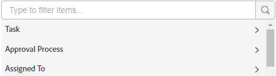
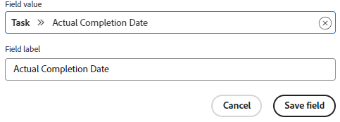

# Customize which fields are displayed on a card

By default, all available fields are displayed on a card, both in the the full view when the card is open, and in the condensed card view on the board. You can customize which fields are displayed by:

* Disabling a field so it is not displayed in either view
* Hiding a field on the condensed card view

If a field contains a value and you disable the field, the value is retained if you enable the field again later.

Sections (which appear as the left navigation options on the card details) are also available to display and hide.

You can also display custom fields that were previously created. You can't design and create new custom fields within a board.

>[!NOTE]
>
>Any field customizations you make only apply to the board you are working in.

## Access requirements

You must have the following access to perform the steps in this article:

<table style="table-layout:auto"> 
 <col> 
 </col> 
 <col> 
 </col> 
 <tbody> 
  <tr> 
   <td role="rowheader"><strong>[!DNL Adobe Workfront] plan*</strong></td> 
   <td> 
Any
 </td> 
  </tr> 
  <tr> 
   <td role="rowheader"><strong>[!DNL Adobe Workfront] license*</strong></td> 
   <td> 
[!UICONTROL Request] or higher
 </td> 
  </tr>
   </tbody> 
</table>

&#42;To find out what plan, license type, or access you have, contact your [!DNL Workfront] administrator.

## Configure cards {#configure-cards}

1. Click the **[!UICONTROL Main Menu]** icon  in the upper-right corner of [!DNL Adobe Workfront], then click **[!UICONTROL Boards]**.
1. Access a board. For information, see [Create or edit a board](../../agile/get-started-with-boards/create-edit-board.md).
1. Click [!UICONTROL **Configure**] on the right of the board to open the Configure panel.
1. Expand [!UICONTROL **Cards**].

   Most fields and sections are enabled by default.

1. Turn off a field or section to disable it in both card views.
1. Click the Hide icon  next to a field or section to hide it on the condensed view.
1. To display all of the fields and sections in both views, click [!UICONTROL **Restore all fields to default**].
1. Click [!UICONTROL **Hide configure**] to close the Configure panel.

## Add custom fields to cards

Custom fields are available on connected cards. They are only visible on the full card view, not the condensed view on the board.

The data on custom fields is editable on the card, though certain custom elements might only be available to edit on the original field and not on the card.

1. Access a board and click [!UICONTROL **Configure**] to open the Configure panel.
1. Expand [!UICONTROL **Cards**].
1. Under [!UICONTROL Card Fields], click [!UICONTROL **Add custom field**].
1. Select [!UICONTROL **Task**] or [!UICONTROL **Issue**].

   The categories of available fields for tasks or issues appear. Expand a category to see all of the fields. You can also search for a field.

   

   >[!NOTE]
   >
   >The following field types are not available to add to cards: Adobe XD, Image, PDF, Video.

1. Select the field name.
1. (Optional) Click in the **[!UICONTROL Field value]** field to change this custom field to a different one.
1. (Optional) Change the **[!UICONTROL Field label]** to the field name you want to appear on cards.
1. When you are finished making changes, click [!UICONTROL **Save field**].

   

   The custom field is added to the list of available fields and is enabled by default. You can disable the custom field following the steps in the [Configure cards](customize-fields-on-card.md#configure-cards) section above, edit the field, or delete it from all cards.

>[!NOTE]
>
>If you later rename the custom field in Workfront, you must edit the field label on the Configure panel to match, or the field will not display on the cards.

## Display or hide archived cards

You must turn on a configuration setting to display archived cards on a board.

1. Access a board and click [!UICONTROL **Configure**] to open the Configure panel.
1. Expand [!UICONTROL **Cards**].
1. Turn on [!UICONTROL **Display archived cards on the board**].

   Now, you can filter the board to show any cards that have been archived. For details, see [Filter and search in a board](/help/quicksilver/agile/get-started-with-boards/filter-search-in-board.md).

1. Click [!UICONTROL **Hide configure**] to close the Configure panel.

## Configure card falloff

To automatically remove cards from the board after a period of time, see [Configure card falloff](/help/quicksilver/agile/use-boards-agile-planning-tools/configure-card-falloff.md).
