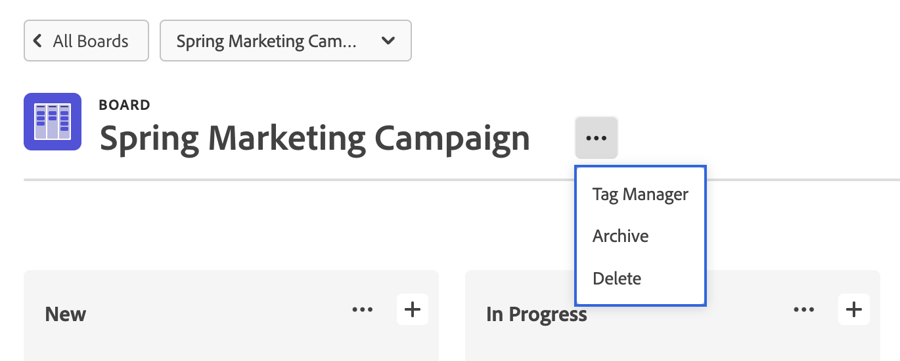

# Delete or archive a board

You can delete or archive a board in [!DNL Workfront]. Deleting a board permanently removes it from [!DNL Workfront], while archiving a board retains all cards and allows it to be restored at a later time.

## Access requirements

+++ Expand to view access requirements for the functionality in this article.

You must have the following access to perform the steps in this article:

<table style="table-layout:auto"> 
 <col> 
 <col> 
 <tbody> 
  <tr> 
   <td role="rowheader">[!DNL Adobe Workfront]</td> 
   <td> 
Any
 </td> 
  </tr> 
  <tr> 
   <td role="rowheader">[!DNL Adobe Workfront] license</td> 
   <td> 
   
New: [!UICONTROL Contributor] or higher
 
   
or

   
Current: [!UICONTROL Request] or higher

   </td> 
  </tr> 
 </tbody> 
</table>

For more detail about the information in this table, see [Access requirements in Workfront documentation](/help/quicksilver/administration-and-setup/add-users/access-levels-and-object-permissions/access-level-requirements-in-documentation.md).

+++

## Delete a board

When you delete a board, it is permanently removed from [!DNL Workfront] and can't be restored. Any cards on the board are also deleted along with the board.

{{step1-to-boards}}

1. On the dashboard, select the board to open.
1. Click the **[!UICONTROL More]** menu ![[!UICONTROL More menu]](assets/more-icon-spectrum.png) next to the board name and select **[!UICONTROL Delete]**. Then, click **[!UICONTROL Delete board]** on the confirmation message.

   >[!NOTE]
   >
   >You can only delete boards that you created, not boards that you were added to.

   

## Archive a board

Archived boards retain all cards and assignments. Any user can archive or restore a board at any time.

{{step1-to-boards}}

1. On the dashboard, select the board to open.
1. Click the **[!UICONTROL More]** menu ![[!UICONTROL More menu]](assets/more-icon-spectrum.png) next to the board name and select **[!UICONTROL Archive]**.

   

## Restore a board

An archived board can be restored at any time. Any user can restore an archived board.

{{step1-to-boards}}

1. On the dashboard, click the filter icon  and select **[!UICONTROL Archived Boards]**.
1. Find the board you want to restore, click the **[!UICONTROL More]** menu  next to the board name, and select **[!UICONTROL Restore]**.

   
