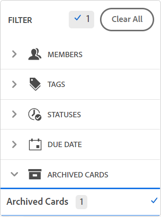

# Delete or archive a card from a board

When you delete a card from a board, it is permanently deleted and can't be restored. Archiving a card sends it to the archive and you can restore it to the board later.

## Access requirements

You must have the following access to perform the steps in this article:

<table style="table-layout:auto"> 
 <col> 
 <col> 
 <tbody> 
  <tr> 
   <td role="rowheader"><strong>Adobe Workfront plan*</strong></td> 
   <td> 
Any
 </td> 
  </tr> 
  <tr> 
   <td role="rowheader"><strong>Adobe Workfront license*</strong></td> 
   <td> 
Request or higher
 </td> 
  </tr> 
 </tbody> 
</table>

&#42;To find out what plan, license type, or access you have, contact your Workfront administrator.

## Delete a card from a board

1. Click the **Main Menu** icon  in the upper-right corner of Adobe Workfront, then click **Boards**.
1. Access a board. For information, see [Create or edit a board](../../agile/get-started-with-boards/create-edit-board.md).
1. Click the **More** menu  on the card, and select **Delete**.
1. Click **Delete** on the confirmation message.

## Archive a card from a board

1. Access the board.
1. Click the **More** menu  on the card, and select **Archive**.

   Archived cards are hidden from the board unless you apply a filter to display them. For more information, see [Filter a board to show archived cards](#filter-a-board-to-show-archived-cards) in this article.

   An Archive icon  appears on archived cards. You can't edit an archived card, but you can delete it or move it to another column.

1. To restore an archived card, click the **More** menu  on the card and select **Restore**.

## Filter a board to show archived cards {#filter-a-board-to-show-archived-cards}

By default, only active cards are displayed on a board. You can filter the board to also display any archived cards.

1. Access the board.
1. Click the filter icon , expand the Archived Cards section, and select **Archived cards** to display any archived cards.

   The filter shows the number of archived cards.

   

1. Select **Archived cards** again to clear the option and display only active cards.

