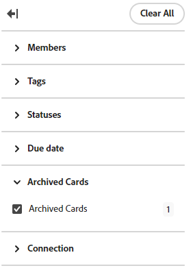

# Delete or archive a card from a board

When you delete an ad hoc card from a board, it is permanently deleted and can't be restored. Connected cards can be manually added back to a board after they are deleted.

If you delete a connected card from a dynamic board, it will reappear when you refresh the board because this board type pulls in all tasks and issues from a specific project. To delete the card, you must delete the connected task or issue from the Workfront project.

When you delete a connected card from any other board type that has an intake column, the card will reappear in the intake column when you refresh the board if the connected task or issue is not yet marked complete. For more information on intake columns, see [Add an intake column to a board](/help/quicksilver/agile/use-boards-agile-planning-tools/add-intake-column-to-board.md).

Archiving a card sends it to the archive and you can restore it to the board later.

## Access requirements

+++ Expand to view access requirements for the functionality in this article.

You must have the following access to perform the steps in this article:

<table style="table-layout:auto"> 
 <col> 
 <col> 
 <tbody> 
  <tr> 
   <td role="rowheader">[!DNL Adobe Workfront]</td> 
   <td> 
Any
 </td> 
  </tr> 
  <tr> 
   <td role="rowheader">[!DNL Adobe Workfront] license</td> 
   <td> 
   
New: [!UICONTROL Contributor] or higher
 
   
or

   
Current: [!UICONTROL Request] or higher

   </td> 
  </tr> 
 </tbody> 
</table>

For more detail about the information in this table, see [Access requirements in Workfront documentation](/help/quicksilver/administration-and-setup/add-users/access-levels-and-object-permissions/access-level-requirements-in-documentation.md).

+++

## Delete a card from a board

{{step1-to-boards}}

1. Access a board. For information, see [Create or edit a board](../../agile/get-started-with-boards/create-edit-board.md).
1. Click the **[!UICONTROL More]** menu  on the card, and select **[!UICONTROL Delete]**.
1. Click **[!UICONTROL Delete]** on the confirmation message.

## Archive a card from a board

1. Access the board.
1. Click the **[!UICONTROL More]** menu  on the card, and select **[!UICONTROL Archive]**.

   Archived cards are hidden from the board unless you apply a filter to display them. For more information, see [Filter a board to show archived cards](#filter-a-board-to-show-archived-cards) in this article.

   An [!UICONTROL Archive] icon  appears on archived cards. You can't edit an archived card, but you can delete it or move it to another column.

1. To restore an archived card, click the **[!UICONTROL More]** menu  on the card and select **[!UICONTROL Restore]**.

## Filter a board to show archived cards {#filter-a-board-to-show-archived-cards}

By default, only active cards are displayed on a board. You can filter the board to also display any archived cards.

1. Access the board.
1. Click [!UICONTROL **Configure**] on the right of the board to open the Configure panel.
1. Expand [!UICONTROL **Cards**].
1. Turn on [!UICONTROL **Display archived cards on the board**].
1. Click [!UICONTROL **Filter**], expand the [!UICONTROL Archived Cards] section, and select **[!UICONTROL Archived cards]** to display any archived cards.

   The filter shows the number of archived cards.

   

   >[!NOTE]
   >
   >The [!UICONTROL Archived Cards] section is not available in the filter if you have not turned on the configuration setting to display archived cards. For more information, see [Customize which fields are displayed on a card](/help/quicksilver/agile/get-started-with-boards/customize-fields-on-card.md).

1. Select **[!UICONTROL Archived cards]** again to clear the option and display only active cards.
