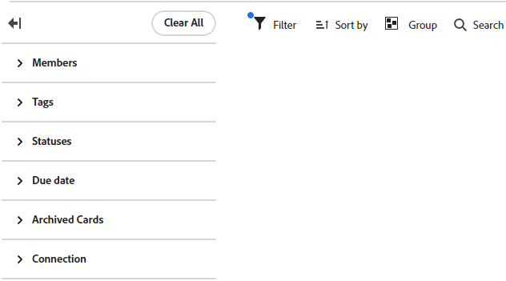
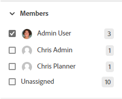
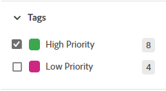
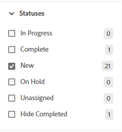
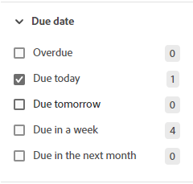
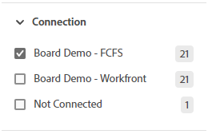
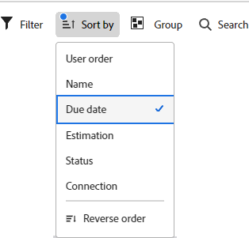
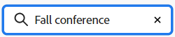

# Filter and search in a board

You can filter a board to display:

* Cards assigned to certain people
* Cards with certain tags
* Cards with a specific status
* Cards due in a certain time frame
* Archived cards
* Cards connected to a specific project

Sorting the board sorts all of the cards in the columns. You can't sort a single column, and the backlog or intake column is not sorted.

Searching also helps you locate a specific card on the board.

When filters are applied, an indicator is displayed on the board . Click **[!UICONTROL Clear All]** to remove all filters from the board, and click the collapse icon to close the filter panel.

## Access requirements

You must have the following access to perform the steps in this article:

<table style="table-layout:auto"> 
 <col> 
 <col> 
 <tbody> 
  <tr> 
   <td role="rowheader"><strong>[!DNL Adobe Workfront] plan*</strong></td> 
   <td> 
Any
 </td> 
  </tr> 
  <tr> 
   <td role="rowheader"><strong>[!DNL Adobe Workfront] license*</strong></td> 
   <td> 
[!UICONTROL Request] or higher
 </td> 
  </tr> 
 </tbody> 
</table>

&#42;To find out what plan, license type, or access you have, contact your [!DNL Workfront] administrator.

## Filter a board by assignees

1. Click the **[!UICONTROL Main Menu]** icon  in the upper-right corner of [!DNL Adobe Workfront], then click **[!UICONTROL Boards]**.
1. Access a board. For information, see [Create or edit a board](../../agile/get-started-with-boards/create-edit-board.md).
1. Click [!UICONTROL **Filter**], expand the [!UICONTROL Members] section, and select the person or people whose cards you want to see. You can also display unassigned cards.

   

## Filter a board by tags

1. Access the board.
1. Click [!UICONTROL **Filter**], expand the [!UICONTROL Tags] section, and select the tags you want to see.

   

## Filter a board by status

1. Access the board.
1. Click [!UICONTROL **Filter**], expand the [!UICONTROL Statuses] section, and select the status types you want to see.

   You can also hide completed cards.

   

## Filter a board by due date

1. Access the board.
1. Click [!UICONTROL **Filter**], expand the [!UICONTROL Due Date] section, and select the date options you want to see.

   Only cards in the selected date ranges are displayed.

   

## Filter a board to show archived cards

By default, only active cards are displayed on a board. You can filter the board to also display any archived cards.

1. Access the board.
1. Click [!UICONTROL **Configure**] on the right of the board to open the Configure panel.
1. Expand [!UICONTROL **Cards**].
1. Turn on [!UICONTROL **Display archived cards on the board**].
1. Click [!UICONTROL **Filter**], expand the [!UICONTROL Archived Cards] section, and select **[!UICONTROL Archived cards]** to display any archived cards.

   The filter shows the number of archived cards.

   

   >[!NOTE]
   >
   >The [!UICONTROL Archived Cards] section is not available in the filter if you have not turned on the configuration setting to display archived cards. For more information, see [Customize which fields are displayed on a card](/help/quicksilver/agile/get-started-with-boards/customize-fields-on-card.md).

1. Select **[!UICONTROL Archived cards]** again to clear the option and display only active cards.

## Filter a board by connection

1. Access the board.
1. Click [!UICONTROL **Filter**], expand the [!UICONTROL Connection] section, and select the [!DNL Workfront] projects for the connected cards you want to see.

   You can also display cards that are not connected to a project.

   

## Sort on a board

When you select an option to sort by, all columns are sorted. You can't sort a single column, and the backlog or intake column is not sorted.

1. Access the board.
1. Click [!UICONTROL **Sort by**] and select [!UICONTROL **Name**], [!UICONTROL **Due date**], [!UICONTROL **Estimation**], [!UICONTROL **Status**], or [!UICONTROL **Connection**].

   Connection (project name) applies to connected cards only, and the other options will sort both connected and ad hoc cards in the columns.

   The "user order" option returns the cards to the order they were manually set, before any other sort options were applied. This is the default sort for the columns.

1. Select [!UICONTROL **Reverse order**] to sort the columns in reverse order of the sort option.

   The arrow on the sort icon indicates whether the columns are sorted in ascending or descending order.

   When a sort other than the default is applied, an indicator is displayed on the sort icon .

   

## Search in a board

1. Access the board.
1. Click [!UICONTROL **Search**] and type a search term. Then, press Enter.

   All cards that contain the search term are displayed.

   Click the X to clear the search.

   
